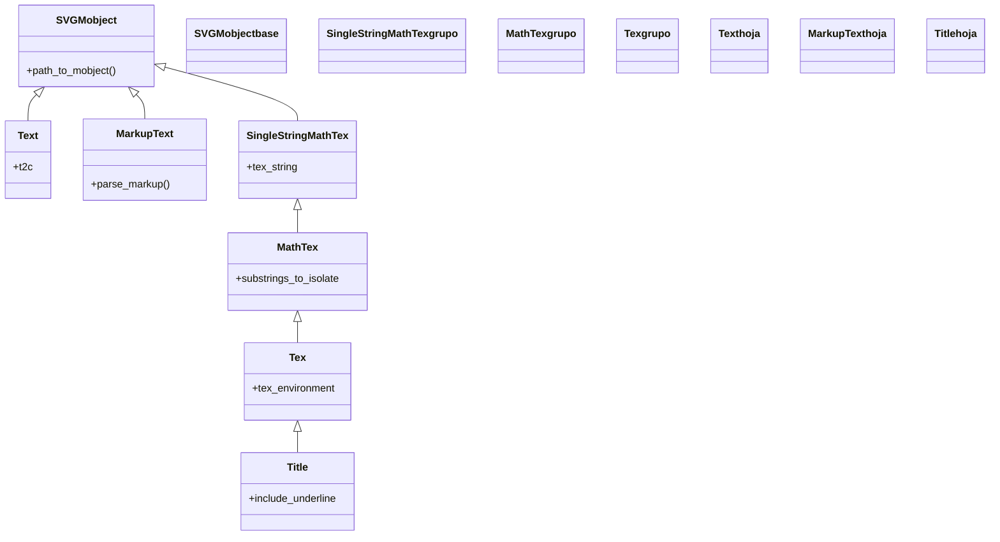

# texto — rótulos y fórmulas (las dos familias Pango y LaTeX)

Esta carpeta reúne los Mobjects que ponen **texto y fórmulas** en una escena, y lo primero que hay que entender es que se dividen en **dos familias** según cómo se renderizan. La familia **Pango** ([[Text]] y [[MarkupText]]) dibuja texto con las **fuentes del sistema** y **NO necesita LaTeX**: es la opción para rótulos, etiquetas de UI, leyendas y nombres, lista para usar nada más instalar Manim. La familia **LaTeX** ([[MathTex]], [[Tex]] y [[Title]]) compone **matemáticas de verdad** —fracciones, superíndices, integrales, símbolos— pero **REQUIERE una instalación de LaTeX** en el sistema. Elegir bien la clase es, sobre todo, elegir bien la familia: ¿es una fórmula matemática o un rótulo? Esa pregunta decide casi todo. Por dentro las dos familias terminan siendo VMobjects normales (se colorean, posicionan y animan igual que un [[Circle]]); lo que cambia es el motor que convierte la cadena en glifos y, con él, el requisito de tener o no LaTeX.

## En accion

Una escena que combina las dos familias: un [[Text]] (rótulo Pango, sin LaTeX) como encabezado y un `MathTex` (fórmula LaTeX) como cuerpo, cada uno escrito con [[Write]]. Requiere LaTeX para el `MathTex`.

```python
from manim import *

class TextoYFormula(Scene):
    def construct(self):
        rotulo = Text("La identidad de Euler", font_size=42).to_edge(UP)  # Pango, sin LaTeX
        formula = MathTex("e^{i\\pi} + 1 = 0").scale(2)                   # LaTeX

        self.play(Write(rotulo))      # 1. el rotulo de arriba
        self.play(Write(formula))     # 2. la formula en el centro
        self.wait()
```

```bash
manim -pql archivo.py TextoYFormula      # -p reproduce, -ql = calidad baja (rapido)
```

## Herencia

Las dos familias arrancan en `SVGMobject` (porque ambas acaban siendo un dibujo vectorial), pero por caminos distintos. La rama **Pango** cuelga directa de `SVGMobject` (`Text`, `MarkupText`). La rama **LaTeX** es una cadena más larga: `SingleStringMathTex` -> `MathTex` -> `Tex` -> `Title`, donde cada eslabón añade una capa (modo matemático, varios trozos, prosa con math, y finalmente el título con subrayado).



## Clases que aporta

Las cinco clases de la carpeta, con su padre, su familia y su uso. La columna **Pango/LaTeX** es la que decide si necesitas LaTeX instalado.

| Clase | Hereda de | Pango/LaTeX | Para que |
|-------|-----------|-------------|----------|
| [[Text]] | `SVGMobject` | Pango (sin LaTeX) | rótulos, etiquetas, nombres; colorear palabras con `t2c` |
| [[MarkupText]] | `SVGMobject` | Pango (sin LaTeX) | texto con formato fino por trozos via etiquetas de marcado |
| [[MathTex]] | `SingleStringMathTex` | LaTeX | una **fórmula** matemática (modo math) |
| [[Tex]] | `MathTex` | LaTeX | prosa (texto normal) con fragmentos matemáticos en línea |
| [[Title]] | `Tex` | LaTeX | un **título** con línea de subrayado (encabezado de lámina) |

## Como elegir

La decisión es casi siempre la misma pregunta encadenada: primero si hay matemáticas (eso obliga a LaTeX), luego el caso concreto.

| ¿Qué quieres mostrar? | Clase | Familia |
|-----------------------|-------|---------|
| Una **fórmula** matemática (`e^{i\pi}+1=0`) | `MathTex` | LaTeX |
| **Prosa con math en línea** ("el valor de $x$ es...") | `Tex` | LaTeX |
| Un **rótulo / etiqueta / UI** sin matemáticas | `Text` | Pango |
| Texto con **formato fino por trozos** (color, negrita mezclados) | `MarkupText` | Pango |
| Un **título** con subrayado | `Title` | LaTeX |

> [!important] El requisito de LaTeX
> Todo lo de la familia **LaTeX** ([[MathTex]], [[Tex]], [[Title]]) **falla con un error de LaTeX si no tienes una distribución instalada** (TeX Live, MiKTeX...). La familia **Pango** ([[Text]], [[MarkupText]]) funciona sin nada extra. Si solo necesitas texto y no quieres depender de LaTeX, quédate en Pango: para un encabezado, `Text(...).to_edge(UP)` sustituye a `Title`.

El árbol de decisión, en una sola línea de lógica: **¿es una fórmula? -> `MathTex`. ¿Texto con math en línea? -> `Tex`. ¿Rótulo/UI sin LaTeX? -> `Text`. ¿Formato fino por trozos? -> `MarkupText`. ¿Título? -> `Title`.**

## Patrones y recetas

Tres recetas que se repiten al trabajar con texto y fórmulas: escribir una fórmula, resaltar partes de ella por índice, y colorear palabras de un rótulo.

### Escribir una formula con Write

La animación natural del texto y las fórmulas es [[Write]], que las traza como si una mano las escribiera. Sirve igual para Pango y para LaTeX. Requiere LaTeX para el `MathTex`.

```python
from manim import *

class EscribirFormula(Scene):
    def construct(self):
        formula = MathTex("\\int_0^1 x^2 \\, dx = \\frac{1}{3}").scale(1.5)
        self.play(Write(formula))     # la traza de izquierda a derecha
        self.wait()
```

```bash
manim -pql archivo.py EscribirFormula
```

### Colorear partes de un MathTex por indice

Un `MathTex` es un VMobject cuyos trozos son submobjects: se accede a ellos por índice (`formula[0]`, `formula[1]`...) para colorearlos o animarlos por separado. Es la forma de resaltar un término de una ecuación. Requiere LaTeX.

```python
from manim import *

class ColorearFormula(Scene):
    def construct(self):
        # cada argumento es un "trozo" indexable:
        ec = MathTex("a^2", "+", "b^2", "=", "c^2").scale(2)
        ec[0].set_color(BLUE)     # a^2 en azul
        ec[2].set_color(GREEN)    # b^2 en verde
        ec[4].set_color(YELLOW)   # c^2 en amarillo

        self.play(Write(ec))
        self.wait()
```

```bash
manim -pql archivo.py ColorearFormula
```

### Un rotulo con palabras coloreadas (t2c)

Para resaltar palabras en un rótulo **sin LaTeX**, [[Text]] tiene `t2c` (*text-to-color*): un diccionario que tiñe subcadenas. Cero trozos a mano.

```python
from manim import *

class RotuloColoreado(Scene):
    def construct(self):
        t = Text(
            "Pango no necesita LaTeX",
            t2c={"Pango": YELLOW, "LaTeX": RED},   # colorea esas dos palabras
            font_size=48,
        )
        self.play(Write(t))
        self.wait()
```

```bash
manim -pql archivo.py RotuloColoreado
```

## Notas relacionadas

- [[Text]] — el rótulo Pango (sin LaTeX), con `t2c` para colorear palabras
- [[MarkupText]] — texto Pango con etiquetas de formato fino por trozos
- [[MathTex]] · [[Tex]] · [[Title]] — la familia LaTeX (fórmulas, prosa con math, título)
- [[Write]] — la animación que escribe el texto/fórmula trazo a trazo
- [[concepto_mobject]] — qué es un Mobject/VMobject y los métodos que todas las clases comparten
- [[posicionamiento]] — colocar los rótulos y fórmulas (`to_edge`, `next_to`, `shift`)
- [[Manim/mobjects/index | mobjects]] — la carpeta padre con todos los objetos dibujables
- [[Manim/index | Manim]] — el índice raíz con el `classDiagram` global
