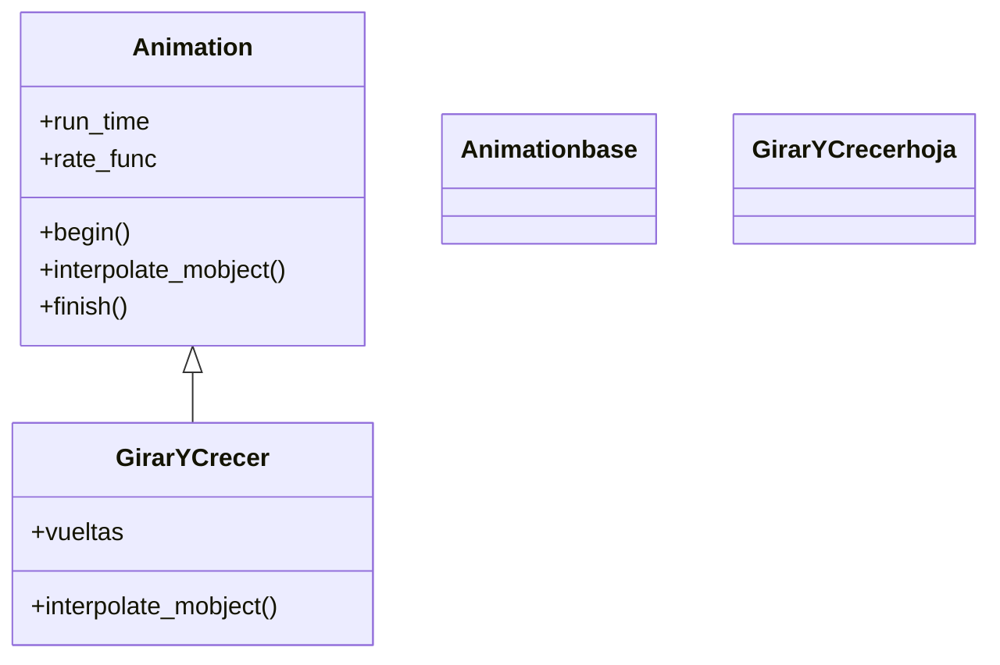

# animación personalizada — crear una Animation propia subclaseando Animation

Esta receta resuelve cómo crear un movimiento a medida cuando ninguna animación de fábrica (`Create`, `Transform`, `Rotate`...) hace lo que quieres. La clave es **subclasear [[Animation]]** y redefinir `interpolate_mobject(self, alpha)`: un método que, dado el progreso `alpha` de 0 a 1, describe cómo se ve el mobject en ese instante. Manim te llama a ese método muchas veces por segundo y compone los fotogramas con lo que dibujes; a cambio, heredas gratis `run_time`, `rate_func` y todo el ciclo de reproducción. Úsala cuando quieras combinar transformaciones de forma no estándar (girar y crecer a la vez, recorrer una trayectoria propia, un efecto que dependa del tiempo de un modo particular).

## El problema

Quieres un efecto que las animaciones existentes no cubren —por ejemplo, un objeto que aparece girando dos vueltas mientras crece desde un punto— y no quieres pelearte encadenando varias animaciones que nunca quedan exactamente sincronizadas. Lo que necesitas es **decir directamente cómo se ve el objeto en cada instante** del progreso, y dejar que Manim se encargue del reloj, los FPS y la curva de velocidad. Eso es exactamente lo que ofrece subclasear `Animation`: defines la foto en el instante `alpha` y heredas toda la maquinaria temporal.

## La receta

Una animación propia, `GirarYCrecer`, que hace aparecer un mobject girando y escalándolo a la vez, gobernado por un único `alpha`. Hereda de `Animation`, guarda sus parámetros en `__init__`, llama a `super().__init__(mobject, ...)` y redefine `interpolate_mobject`.

```python
from manim import *

class GirarYCrecer(Animation):
    def __init__(self, mobject, vueltas=2, escala_final=2.0, **kwargs):
        self.vueltas = vueltas                 # parametros propios, antes de super()
        self.escala_final = escala_final
        super().__init__(mobject, **kwargs)    # OBLIGATORIO: pasa el mobject a la base

    def interpolate_mobject(self, alpha):
        # Manim llama esto cada fotograma con alpha de 0 a 1 (ya pasado por la rate_func).
        self.mobject.become(self.starting_mobject.copy())   # 1. parte SIEMPRE del estado inicial
        self.mobject.rotate(alpha * self.vueltas * TAU)      # 2. gira proporcional a alpha
        factor = 1 + alpha * (self.escala_final - 1)         # 3. escala de 1 a escala_final
        self.mobject.scale(factor)

class UsoCustom(Scene):
    def construct(self):
        estrella = Star(color=YELLOW, fill_opacity=1)
        self.play(GirarYCrecer(estrella, vueltas=2, escala_final=2.5), run_time=3)  # run_time: heredado
        self.wait()
```

```bash
manim -pql archivo.py UsoCustom      # -p reproduce, -ql = calidad baja (rapido)
```

## Como funciona

La receta vive sobre tres ideas: el `alpha`, el ciclo begin/interpolate/finish, y la `rate_func` que reparte el tiempo. Tu clase encaja así en la jerarquía:



### El alpha de 0 a 1

Una animación en Manim es, en el fondo, una función del **progreso** `alpha`, que va de `0.0` (primer fotograma) a `1.0` (último). Tu `interpolate_mobject(alpha)` recibe ese número y debe dejar el mobject en el estado que le corresponde: con `alpha = 0`, el estado inicial; con `alpha = 0.5`, justo a medias; con `alpha = 1`, el final. No piensas en segundos ni en fotogramas: solo en "cómo se ve cuando el progreso es `alpha`". Por eso el giro es `alpha * vueltas * TAU` (en `alpha = 1` ha dado todas las vueltas) y la escala interpola de 1 a `escala_final`.

### Reconstruir desde starting_mobject cada fotograma

El punto más delicado: `interpolate_mobject` se llama una vez por fotograma, y si modificas el mobject **ya modificado** del fotograma anterior, los efectos se **acumulan** (girarías un poco más sobre lo ya girado, y el objeto se descontrola). La solución es partir siempre del estado inicial: `self.mobject.become(self.starting_mobject.copy())` restaura el mobject a como estaba al empezar, y sobre esa base limpia aplicas la transformación correspondiente a `alpha`. `starting_mobject` lo guarda Manim por ti en la fase `begin()`.

### El ciclo begin / interpolate / finish y la rate_func

Cuando `self.play` recibe tu animación, la recorre en tres fases que **no llamas tú**:

| Fase | Cuándo | Qué hace |
|------|--------|----------|
| `begin()` | al empezar | guarda el estado inicial en `self.starting_mobject` y prepara la animación |
| `interpolate_mobject(alpha)` | en cada fotograma | coloca el mobject en el estado de ese `alpha` — **lo único que rediseñas** |
| `finish()` | al terminar | deja el mobject en su estado final exacto |

La `rate_func` se interpone antes de que llegue tu `alpha`: remapea el avance del tiempo a un avance de progreso. Con `smooth` (defecto) el `alpha` que recibes no crece lineal, sino con arranque y frenado suaves; con `linear`, a velocidad constante. Tú escribes `interpolate_mobject` pensando en un `alpha` de 0 a 1 y la sensación del movimiento la decide quien reproduce, sin tocar tu código.

## Variaciones

Dos ajustes habituales: parametrizar más el constructor, y el atajo de subclasear `Transform`.

### Parámetros propios en el constructor

Como en cualquier clase, el `__init__` acepta los parámetros que necesites para que la animación sea configurable. Aquí, una que mueve el mobject por una trayectoria senoidal cuya amplitud y número de ondas se eligen al crearla.

```python
from manim import *
import numpy as np

class OndaHorizontal(Animation):
    def __init__(self, mobject, amplitud=1.0, ondas=2, ancho=6.0, **kwargs):
        self.amplitud = amplitud
        self.ondas = ondas
        self.ancho = ancho
        self.inicio = mobject.get_center()
        super().__init__(mobject, **kwargs)

    def interpolate_mobject(self, alpha):
        x = -self.ancho / 2 + alpha * self.ancho                 # recorre de izquierda a derecha
        y = self.amplitud * np.sin(self.ondas * TAU * alpha)     # oscila en vertical
        self.mobject.move_to(self.inicio + np.array([x, y, 0]))

class UsarOnda(Scene):
    def construct(self):
        d = Dot(color=BLUE)
        self.play(OndaHorizontal(d, amplitud=1.5, ondas=3), run_time=4)
        self.wait()
```

```bash
manim -pql archivo.py UsarOnda
```

### Subclasear Transform en vez de Animation

Para casos sencillos donde solo quieres interpolar **entre dos estados**, suele bastar con subclasear `Transform`, que ya hace toda la interpolación; tú solo defines el estado destino en `create_target`. Es menos código que `interpolate_mobject` cuando el efecto es "convertir A en una versión modificada de A".

```python
from manim import *

class CrecerYRojo(Transform):
    def create_target(self):                  # Transform interpola del mobject a este objetivo
        objetivo = self.mobject.copy()
        objetivo.scale(2).set_color(RED)
        return objetivo

class UsarTransform(Scene):
    def construct(self):
        s = Square(color=BLUE)
        self.play(CrecerYRojo(s), run_time=2)
        self.wait()
```

```bash
manim -pql archivo.py UsarTransform
```

## Errores comunes

| Error | Causa | Solución |
|-------|-------|----------|
| El objeto "salta" o se descontrola | en `interpolate_mobject` modificas el estado ya modificado del fotograma anterior | reconstruye desde `self.starting_mobject.copy()` (con `become`) cada fotograma |
| `TypeError` o error al construir la animación | olvidaste pasar el mobject: `super().__init__(...)` sin `mobject` | una `Animation` siempre se inicializa con `super().__init__(mobject, **kwargs)` |
| No se ve nada | creaste la animación pero no la reprodujiste | pásala a `self.play(...)` |
| El `run_time` no tiene efecto | lo pasaste al constructor del Mobject, no al de la animación | va en la animación: `self.play(MiAnim(m), run_time=2)` |
| `scale(0)` deja el objeto invisible para siempre | escalar exactamente a 0 es degenerado | arranca desde un mínimo (`alpha if alpha > 0 else 0.001`) |
| El movimiento se ve mecánico | `rate_func=linear` (o lo cambiaste sin querer) | usa `smooth` (defecto) para arranque y frenado suaves |

## Notas relacionadas

- [[Animation]] — la clase base: el ciclo begin/interpolate/finish, los parámetros comunes (`run_time`, `rate_func`) y la sección de personalizar
- [[concepto_herencia_mobjects]] — el concepto base: subclasear como mecanismo de extensión, con la regla de oro de `interpolate_mobject`
- [[Transform]] — la subclase que interpola entre dos estados; base del atajo de la última variación
- [[rate_functions]] — las curvas de velocidad (`smooth`, `linear`, `there_and_back`) que remapean el `alpha`
- [[mobject_personalizado]] — la receta hermana: subclasear `VMobject` para crear un objeto propio
- [[Manim/patrones/index | patrones]] — el índice de las recetas
