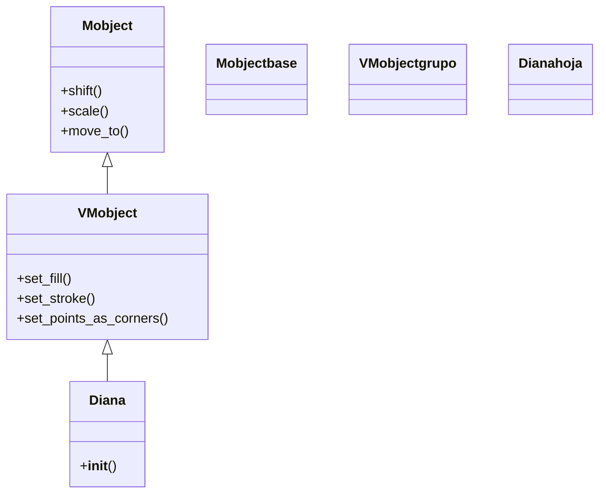

# mobject personalizado — crear un Mobject propio subclaseando VMobject

Esta receta resuelve cómo fabricar un objeto dibujable **propio y reutilizable** —una diana, una estrella a medida, una caja con etiqueta— en vez de repetir las mismas formas sueltas cada vez. La clave es no escribir una función que devuelve figuras, sino **subclasear [[VMobject]]** y construir la geometría dentro de su `__init__`. Al heredar de `VMobject`, tu clase *es* un Mobject de pleno derecho: se posiciona, colorea, escala y anima con `Create(...)` sin que escribas una línea para ello. Úsala cuando una composición de formas se repita, merezca un nombre y un constructor con parámetros, o cuando quieras una forma nueva trazada punto a punto.

## El problema

Necesitas un objeto que no viene de fábrica —pongamos una flecha doble, o una diana de anillos concéntricos— y lo quieres usar muchas veces, moverlo, escalarlo y animarlo como a cualquier `Circle`. Si lo montas como una función que devuelve un `VGroup` de piezas, pierdes la identidad de clase: no tiene nombre propio, no encaja limpio en la jerarquía y cada comportamiento estándar hay que cablearlo. Lo que quieres es **insertar tu clase en la jerarquía de Mobjects** para que Manim la trate como a una figura nativa. Eso se consigue heredando de `VMobject` y definiendo la geometría en el constructor.

## La receta

Un Mobject propio, `Diana`, que compone tres anillos concéntricos. Hereda de `VMobject`, llama primero a `super().__init__()` y luego añade sus piezas con `self.add(...)`. La Scene de abajo lo usa exactamente como usaría un `Circle`.

```python
from manim import *

class Diana(VMobject):
    def __init__(self, radio=1.2, color_exterior=RED, **kwargs):
        super().__init__(**kwargs)            # PRIMERO: inicializa la maquinaria heredada
        anillos = [                           # (radio, color) de fuera hacia dentro
            (radio,        color_exterior),
            (radio * 0.66, WHITE),
            (radio * 0.33, color_exterior),
        ]
        for r, col in anillos:
            self.add(Circle(radius=r, color=col, fill_opacity=1, stroke_width=2))  # cada anillo, un submobject

class UsarDiana(Scene):
    def construct(self):
        d = Diana()                           # se construye como cualquier figura
        self.play(Create(d))                  # Create funciona GRATIS: Diana ES un VMobject
        self.play(d.animate.scale(0.6).to_edge(LEFT))  # scale/to_edge: heredados, sin escribir nada
        self.wait()
```

```bash
manim -pql archivo.py UsarDiana      # -p reproduce, -ql = calidad baja (rapido)
```

## Como funciona

La receta descansa en tres decisiones: heredar de `VMobject`, llamar a `super().__init__()` lo primero, y elegir cómo se define la geometría.

### Por qué VMobject (y no Mobject)

`VMobject` es el Mobject **vectorizado**: el que tiene contorno y relleno, y el que las animaciones de creación saben trazar. Si heredas de `Mobject` a secas, tu objeto no tiene puntos ni trazo, y `Create(MiObjeto())` no anima nada. Para cualquier objeto con forma —líneas, curvas, polígonos, composiciones de figuras— se hereda de `VMobject`. La jerarquía aparece así:



De `Mobject` llegan posición y escala; de `VMobject`, el color y el trazo; tu clase solo aporta el `__init__` que dice **qué forma tiene**.

### super().__init__() siempre lo primero

La primera línea de tu `__init__` debe ser `super().__init__(**kwargs)`. Esa llamada monta la estructura interna del mobject —su lista de puntos, sus submobjects, su estilo— sobre la que luego añades tu geometría. Si construyes las piezas **antes** de llamarla, `super().__init__` las borra o no las registra, y obtienes un objeto vacío. El `**kwargs` que recibes y reenvías es lo que permite a quien use tu clase pasarle `color=...`, `stroke_width=...` y demás estilo estándar: viaja hasta la base sin que tú lo gestiones.

### Añadir submobjects vs definir puntos

Hay dos formas de dar geometría a tu clase dentro de `__init__`, según si tu objeto es un *conjunto de piezas* o una *forma nueva*.

| Técnica | Cómo | Cuándo |
|---------|------|--------|
| **Componer** otros mobjects | `self.add(Circle(), Line(), ...)` | tu objeto es un conjunto de figuras ya existentes (lo más común; es lo que hace `Diana`) |
| **Fijar puntos** a mano | `self.set_points_as_corners([p0, p1, ...])` o `self.start_new_path(p)` + `self.add_line_to(q)` | tu objeto es una forma nueva, trazada vértice a vértice |

Componer es lo habitual: agrupas figuras de fábrica. Fijar puntos se usa cuando ninguna figura existente sirve y quieres trazar el contorno tú mismo, como en la primera variación.

## Variaciones

Dos ajustes frecuentes: trazar una forma a mano y componer con un `VGroup` interno.

### Una forma nueva con set_points_as_corners

Cuando no compones figuras sino que defines el contorno por sus vértices, `set_points_as_corners` une una lista de puntos con segmentos rectos. Aquí, un rayo (zigzag) cerrado.

```python
from manim import *
import numpy as np

class Rayo(VMobject):
    def __init__(self, **kwargs):
        super().__init__(**kwargs)
        vertices = [
            np.array([0, 2, 0]), np.array([-0.6, 0.2, 0]), np.array([0.2, 0.2, 0]),
            np.array([-0.4, -2, 0]), np.array([0.7, 0.4, 0]), np.array([-0.1, 0.4, 0]),
        ]
        self.set_points_as_corners(vertices)     # une los vertices con segmentos
        self.set_fill(YELLOW, opacity=1)
        self.set_stroke(YELLOW, width=2)

class UsarRayo(Scene):
    def construct(self):
        self.play(Create(Rayo()))
        self.wait()
```

```bash
manim -pql archivo.py UsarRayo
```

### Parámetros propios y un VGroup interno con etiqueta

El constructor puede aceptar los parámetros que quieras (texto, tamaños, colores) y usar un [[VGroup]] interno para ordenar las piezas antes de añadirlas. Aquí, una "caja etiquetada" reutilizable.

```python
from manim import *

class CajaEtiquetada(VMobject):
    def __init__(self, texto, color=BLUE, **kwargs):
        super().__init__(**kwargs)
        caja = Rectangle(width=2.5, height=1, color=color, fill_opacity=0.3)
        rotulo = Text(texto).scale(0.5).move_to(caja.get_center())
        grupo = VGroup(caja, rotulo)              # se ordenan/posicionan juntos
        self.add(grupo)                           # el grupo entero queda dentro de la clase

class Diagrama(Scene):
    def construct(self):
        a = CajaEtiquetada("entrada", color=GREEN).shift(LEFT * 3)
        b = CajaEtiquetada("salida", color=RED).shift(RIGHT * 3)
        flecha = Arrow(a.get_right(), b.get_left(), color=YELLOW)
        self.play(Create(a), Create(b))
        self.play(GrowArrow(flecha))
        self.wait()
```

```bash
manim -pql archivo.py Diagrama
```

## Errores comunes

| Error | Causa | Solución |
|-------|-------|----------|
| El objeto sale vacío o no aparece | construiste la geometría **antes** de `super().__init__()`, que la borró | `super().__init__(**kwargs)` como **primera** línea de `__init__` |
| `Create(MiObjeto())` no anima nada | heredaste de `Mobject` (sin puntos ni trazo) en vez de `VMobject` | hereda de `VMobject` para objetos con contorno o relleno |
| `TypeError: __init__() got an unexpected keyword argument 'color'` | no recibes ni reenvías `**kwargs`, y el estilo estándar no llega a la base | firma `def __init__(self, ..., **kwargs)` y `super().__init__(**kwargs)` |
| Las piezas no se ven | las creaste pero olvidaste `self.add(...)` para meterlas en el mobject | añade cada submobject con `self.add(pieza)` |
| El contorno trazado a mano sale abierto o raro | la lista de puntos no cierra o no son arrays 3D | usa puntos `np.array([x, y, 0])` y cierra la figura repitiendo el primero si hace falta |

## Notas relacionadas

- [[concepto_herencia_mobjects]] — el concepto base: por qué se subclasea en Manim y la regla de oro de `super().__init__()`
- [[VMobject]] — la clase padre: el Mobject vectorizado con contorno y relleno que tu objeto extiende
- [[VGroup]] — el contenedor para componer piezas sin crear una clase; cuándo basta y cuándo conviene subclasear
- [[animacion_personalizada]] — la receta hermana: subclasear `Animation` para crear una animación propia
- [[Manim/patrones/index | patrones]] — el índice de las recetas
