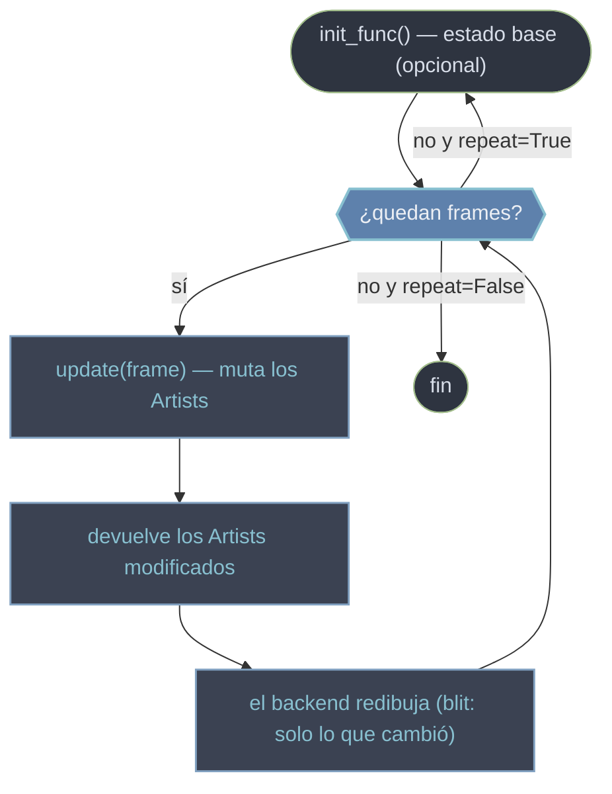

# animation — Animaciones por re-dibujado de Artists

El módulo `matplotlib.animation` produce **animaciones sin recrear el gráfico en cada cuadro**. La idea central encaja con el modelo de objetos de Matplotlib: una figura ya existe con sus [[concepto_artist|Artists]] (líneas, puntos, textos) creados **una sola vez**, y la animación se limita a **mutar sus datos** cuadro a cuadro (`set_ydata`, `set_offsets`, `set_text`) y pedir al [[concepto_backend|backend]] que redibuje. La herramienta principal es [[FuncAnimation]]: le pasas una función `update(frame)` y ella la llama repetidamente. Lo que se anima no es el dibujo entero, sino las **propiedades** de unos Artists que persisten.

## En acción

Animación mínima de una onda que se desplaza. Fíjate en el patrón clave: la `Line2D` se crea **fuera** de `update`, y dentro solo se reasignan sus datos `y`.

```python
import numpy as np
import matplotlib.pyplot as plt
from matplotlib.animation import FuncAnimation

fig, ax = plt.subplots()
x = np.linspace(0, 2 * np.pi, 200)
(linea,) = ax.plot(x, np.sin(x))        # el Artist se crea UNA vez

def update(frame):                       # se llama por cada cuadro
    linea.set_ydata(np.sin(x + frame / 10))   # muta el Artist, no lo recrea
    return (linea,)                            # tupla obligatoria con blit=True

anim = FuncAnimation(fig, update, frames=120, interval=50, blit=True)
plt.show()                               # backend interactivo: la ventana anima
# anim DEBE guardarse en una variable o el GC la elimina y nada se mueve
```

## El ciclo de animación

`FuncAnimation` orquesta un bucle fijo: prepara el estado base una vez, y por cada cuadro llama a `update`, recoge los Artists modificados y los hace renderizar por el backend.



> [!warning] El error número uno
> Si no guardas la instancia en una variable (`anim = FuncAnimation(...)`), el recolector de basura la destruye y la animación nunca corre. Y si llamas a `ax.plot()` **dentro** de `update`, cada cuadro acumula un gráfico nuevo en lugar de moverse: crea el Artist fuera y muta sus datos dentro.

## Qué hay en esta carpeta

| Nota | Para qué |
|------|----------|
| [[FuncAnimation]] | La clase principal: firma, parámetros (`frames`, `interval`, `blit`, `repeat`), exportar a GIF/MP4 con `save`, y los errores comunes. |

La salida puede ser una **ventana interactiva** (`plt.show()` con backend de pantalla) o un **archivo** (`anim.save("salida.gif", writer="pillow")` / `.mp4` con `ffmpeg`). Para exportar en un servidor sin pantalla, combina con el backend `Agg` (ver [[concepto_backend]]).

## Notas relacionadas

- [[concepto_artist]] — por qué animar es mutar Artists, no redibujar todo
- [[concepto_backend]] — dónde se renderiza: ventana vs archivo
- [[Matplotlib/index\|Matplotlib]] — el índice raíz
