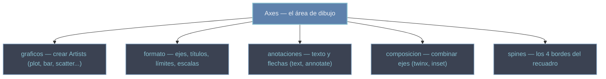

# Axes — el área de dibujo y el objeto central de Matplotlib

El `Axes` es **la región de ploteo individual**: el sistema de coordenadas rectangular donde realmente se dibujan los datos. Es el objeto **más importante** de Matplotlib, porque ahí ocurre el 95% del trabajo —trazar curvas, formatear ejes, poner títulos, anotar y combinar escalas—. Una `Figure` es el lienzo y contiene N `Axes`; cada `Axes` es un subgráfico autónomo con sus propios datos, límites, ticks, leyenda y bordes. No debe confundirse con un `Axis` (singular): un `Axes` **contiene** los dos `Axis` (el eje X y el eje Y), pero el `Axes` es la región completa.

## En acción

```python
import matplotlib.pyplot as plt
import numpy as np

x = np.linspace(0, 2 * np.pi, 200)

fig, ax = plt.subplots(figsize=(6, 4))   # Figure + un Axes
ax.plot(x, np.sin(x), label="sin")       # método gráfico: crea un Line2D
ax.plot(x, np.cos(x), label="cos")
ax.set_title("Funciones trigonométricas")  # método de formato
ax.set_xlabel("x [rad]")
ax.legend()                              # leyenda a partir de los label
plt.show()
```

Fíjate en el patrón: **siempre se trabaja sobre `ax`**. Primero los métodos gráficos (`plot`), luego los de formato (`set_title`, `legend`). Esa es la interfaz orientada a objetos, la recomendada.

## Las familias de métodos del Axes



Casi todo lo que quieras hacer con un gráfico es **llamar a un método del `Axes`**. Por eso conviene agrupar esos métodos por intención: lo que dibuja datos (`graficos`), lo que configura el aspecto (`formato`), lo que escribe sobre el gráfico (`anotaciones`), lo que mezcla escalas o incrusta paneles (`composicion`) y lo que controla los bordes (`spines`).

## Qué encontrarás aquí

- **[[Axes]]** — la nota de referencia de la clase: cómo se obtiene (`plt.subplots`), sus métodos clave, sus atributos (`ax.lines`, `ax.patches`...) y el ciclo de vida típico.
- **[[Matplotlib/axes/metodos/index\|metodos]]** — el agrupador de todos los métodos del `Axes`, organizados en cinco familias temáticas.

## Cómo navegar

| Quiero… | Ir a |
|---------|------|
| Entender el objeto `Axes` en profundidad | [[Axes]] |
| El catálogo completo de métodos | [[Matplotlib/axes/metodos/index\|metodos]] |
| Dibujar datos (líneas, barras, scatter...) | [[Matplotlib/axes/metodos/graficos/index\|graficos]] |
| Formatear ejes, títulos, límites y escalas | [[Matplotlib/axes/metodos/formato/index\|formato]] |
| Escribir texto o señalar puntos con flechas | [[Matplotlib/axes/metodos/anotaciones/index\|anotaciones]] |
| Combinar ejes: doble Y, eje secundario, inset | [[Matplotlib/axes/metodos/composicion/index\|composicion]] |
| Controlar los bordes del recuadro | [[Matplotlib/axes/metodos/spines/index\|spines]] |

## Notas relacionadas

- [[plt.subplots]] — el punto de entrada habitual (`fig, ax = ...`)
- [[concepto_figure_axes]] — la jerarquía Figure → Axes → Axis
- [[concepto_artist]] — la clase base de todo lo dibujable
