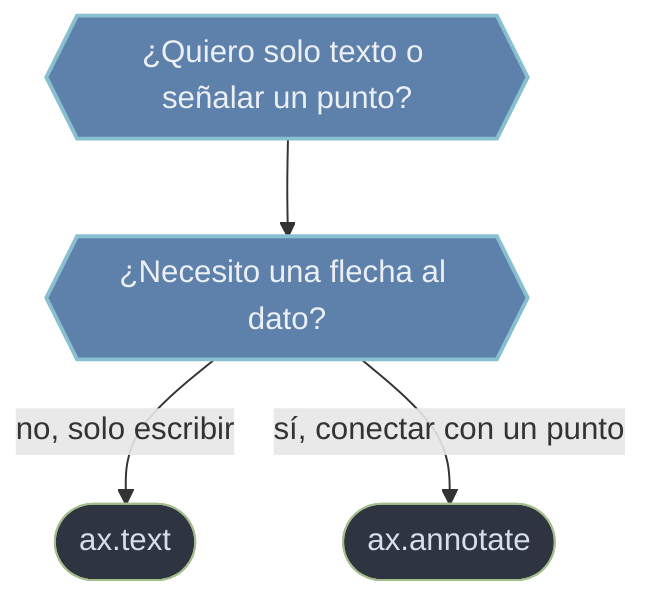

# Anotaciones del Axes — texto y flechas sobre el gráfico

Una **anotación** es cualquier texto que escribes **encima** del gráfico para explicarlo: etiquetar un valor, nombrar una región o señalar un punto concreto con una flecha. Matplotlib lo resuelve con dos métodos del `Axes` que conviene no confundir: `ax.text`, que coloca **texto plano** en una posición, y `ax.annotate`, que añade **texto más una flecha** que apunta a un punto. La diferencia es la intención: `text` solo escribe; `annotate` además **conecta** el texto con un dato.

## En acción

```python
import matplotlib.pyplot as plt
import numpy as np

x = np.linspace(0, 10, 200)
y = np.sin(x)
fig, ax = plt.subplots()
ax.plot(x, y)

# Señalar el máximo con una flecha
xmax = x[y.argmax()]; ymax = y.max()
ax.annotate(f"máx = {ymax:.2f}",
            xy=(xmax, ymax), xytext=(xmax + 1.5, ymax - 0.4),
            arrowprops=dict(arrowstyle="->"))

# Texto plano fijo en una esquina (coordenadas del Axes 0–1)
ax.text(0.02, 0.95, "señal de prueba",
        transform=ax.transAxes, va="top")
plt.show()
```

La flecha de `annotate` nace en el **texto** (`xytext`) y termina en el **punto señalado** (`xy`); `text` simplemente escribe en `(x, y)` sin conector.

## Los dos métodos



- **[[ax.text]]** — coloca una cadena en `(x, y)`, por defecto en **coordenadas de datos** (el mismo sistema que los puntos ploteados). Con `transform=ax.transAxes` pasas a coordenadas relativas del Axes (0–1) para fijar el texto en una esquina sin importar los límites. Controlas la alineación con `ha` (`left`/`center`/`right`) y `va` (`top`/`center`/`bottom`/`baseline`), admite LaTeX entre `$...$` y una caja de fondo con `bbox=`. Devuelve un objeto `Text`.
- **[[ax.annotate]]** — escribe un texto **y traza una flecha** hacia un punto. Recibe el texto, el punto señalado `xy` (la punta de la flecha), la posición del texto `xytext` (la cola) y el estilo de la flecha en `arrowprops` (`arrowstyle`, `color`, `connectionstyle`). Sin `arrowprops` no hay flecha y equivale a un `ax.text`. Permite mezclar sistemas con `xycoords`/`textcoords`. Devuelve un objeto `Annotation`.

## Cómo navegar

| Quiero… | Método |
|---------|--------|
| Escribir texto en una posición (datos o esquina) | [[ax.text]] |
| Señalar un punto con una flecha y un rótulo | [[ax.annotate]] |
| Fórmula matemática en el texto | [[ax.text]] (`r"$...$"`) |
| Conector curvo entre texto y dato | [[ax.annotate]] (`connectionstyle="arc3,rad=..."`) |

## Notas relacionadas

- [[Axes]] — el objeto sobre el que se anota
- [[concepto_anatomia_figura]] — los nombres de cada parte del gráfico
- [[ax.set_title]] — el título es otra forma de texto del Axes
