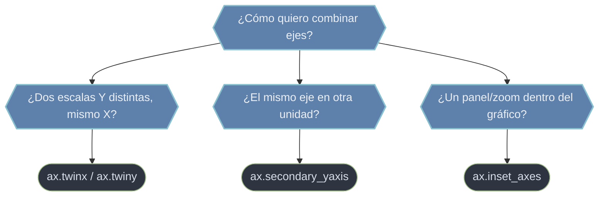

# Composición de ejes — combinar y superponer Axes

A veces un solo `Axes` no basta: quieres dibujar **dos magnitudes con escalas distintas** en el mismo gráfico, mostrar el **mismo eje en otras unidades** o incrustar un **panel de detalle**. La composición de ejes resuelve esos casos creando o derivando `Axes` ligados al original: `ax.twinx` (segundo eje Y que comparte el X), `ax.secondary_yaxis`/`secondary_xaxis` (eje derivado por una transformación) y `ax.inset_axes` (un `Axes` pequeño dibujado dentro del padre). Todos comparten una idea: **no abandonas el gráfico**, lo amplías.

## En acción

```python
import matplotlib.pyplot as plt
import numpy as np

t = np.linspace(0, 10, 200)
fig, ax1 = plt.subplots()

# Eje Y izquierdo: temperatura
ax1.plot(t, 20 + 5 * np.sin(t), color="tab:red")
ax1.set_ylabel("Temperatura [°C]", color="tab:red")
ax1.tick_params(axis="y", labelcolor="tab:red")

# Segundo eje Y (comparte el eje X) : presión
ax2 = ax1.twinx()
ax2.plot(t, 1000 + 50 * np.cos(t), color="tab:blue")
ax2.set_ylabel("Presión [hPa]", color="tab:blue")
ax2.tick_params(axis="y", labelcolor="tab:blue")

plt.show()
```

`ax1.twinx()` devuelve un **nuevo Axes** (`ax2`) que **comparte el eje X** pero tiene su propio eje Y a la derecha. Cada serie conserva su escala, su color y sus ticks; solo el eje horizontal es común.

## Qué herramienta de composición uso



## Las herramientas

- **`ax.twinx()` / `ax.twiny()`** — crean un **segundo Axes** que comparte uno de los ejes. `twinx` comparte el eje X y añade un eje Y a la derecha (dos magnitudes, dos escalas); `twiny` comparte el Y y añade un eje X arriba. Devuelven el nuevo `Axes`, sobre el que ploteas la segunda serie. Conviene colorear cada eje y sus ticks para distinguir qué curva pertenece a cuál.
- **`ax.secondary_yaxis(location, functions=(fwd, inv))` / `secondary_xaxis`** — añaden un eje **derivado** del original por una transformación (p. ej. °C ↔ °F, o radianes ↔ grados). No dibujan datos nuevos: solo muestran la **misma escala en otra unidad**, manteniéndose sincronizados con el eje base.
- **[[ax.inset_axes]]** — crea un `Axes` **pequeño dentro** del padre (un *inset*): un zoom de una región, un mini-mapa o un panel de detalle. Por defecto sus `bounds` `[x, y, w, h]` van en coordenadas del Axes padre (0–1), así que el inset se reubica solo si el padre cambia de tamaño. Combínalo con `ax.indicate_inset_zoom(axins)` para dibujar el recuadro y las líneas guía.

## Cómo navegar

| Quiero… | Herramienta |
|---------|-------------|
| Dos magnitudes con escalas Y diferentes | `ax.twinx()` |
| Dos magnitudes con escalas X diferentes | `ax.twiny()` |
| El eje en otra unidad (°C/°F, rad/°) | `ax.secondary_yaxis` / `secondary_xaxis` |
| Un zoom o panel incrustado en el gráfico | [[ax.inset_axes]] |

## Notas relacionadas

- [[ax.inset_axes]] — el panel incrustado en detalle
- [[Axes]] — el objeto del que parten estos métodos
- [[plt.subplots]] — la alternativa cuando quieres subgráficos separados, no superpuestos
- [[concepto_figure_axes]] — la jerarquía Figure → Axes
