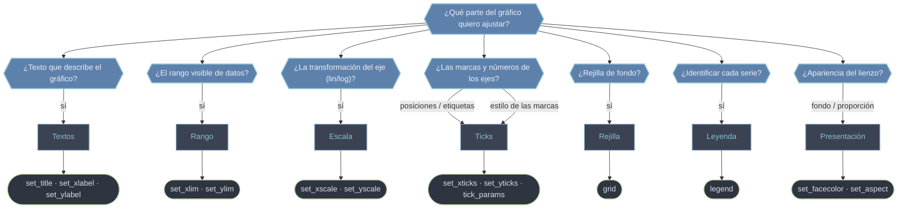

# Formato del Axes — afinar el gráfico una vez dibujados los datos

Una vez que un método de [[Matplotlib/axes/metodos/graficos/index|gráficos]] ha dibujado los datos, estos métodos **afinan cómo se ven**: ponen título y etiquetas, ajustan el rango visible, cambian la escala a logarítmica, controlan los ticks, añaden rejilla y leyenda, o retocan el fondo y la proporción. Casi todos son *setters* sobre el `Axes` (`set_*`) que mutan su estado y se llaman al final, después de graficar. Saber cuál usar es cuestión de identificar **qué parte del gráfico quieres tocar**: el texto, el rango, la escala, los ticks, la rejilla, la leyenda o la presentación.

## En acción

```python
import matplotlib.pyplot as plt
import numpy as np

x = np.logspace(0, 3, 100)        # 1 .. 1000
y = x**1.5

fig, ax = plt.subplots(figsize=(7, 4.5))
ax.plot(x, y, label="y = x^1.5")

# textos
ax.set_title("Crecimiento en escala log-log", pad=12)
ax.set_xlabel("entrada x")
ax.set_ylabel("salida y")

# escala y rango
ax.set_xscale("log")
ax.set_yscale("log")
ax.set_xlim(1, 1000)

# ticks y rejilla
ax.set_xticks([1, 10, 100, 1000])
ax.tick_params(axis="both", labelsize=9, direction="in")
ax.grid(True, which="both", linestyle=":", alpha=0.6)

# leyenda y fondo
ax.legend(loc="upper left")
ax.set_facecolor("#f7f7f5")

fig.tight_layout()
plt.show()
```

## Qué método elijo



## Los métodos por familia

### Textos — describir qué se ve

El mínimo imprescindible para que un gráfico se entienda solo: qué representa y qué hay en cada eje.

- [[ax.set_title]] — título del Axes. Acepta `loc=` (`'left'`/`'center'`/`'right'`) y `pad=` para separarlo del área.
- [[ax.set_xlabel]] — etiqueta del eje X. Devuelve el objeto `Text`, así que puedes seguir ajustando color, tamaño o peso.
- [[ax.set_ylabel]] — etiqueta del eje Y. Misma interfaz que su gemelo en X.

### Rango — qué tramo de datos se ve

- [[ax.set_xlim]] — fija el rango horizontal visible. Es el *zoom* manual: fuerza un origen en cero, recorta una región o (invirtiendo los límites) da la vuelta al eje.
- [[ax.set_ylim]] — la versión vertical. Útil para anclar el cero en altura o invertir el eje (profundidad).

### Escala — cómo se transforma el eje

- [[ax.set_xscale]] — cambia la transformación del eje X: `'linear'`, `'log'`, `'symlog'` (admite ceros y negativos) o `'logit'`. La herramienta cuando los datos abarcan varios órdenes de magnitud.
- [[ax.set_yscale]] — lo mismo en vertical. Esencial para concentraciones, intensidades o poblaciones.

### Ticks — las marcas de los ejes

- [[ax.set_xticks]] — fija **dónde** van las marcas del eje X y, opcionalmente, sus etiquetas de texto. Devuelve la lista de `Text`.
- [[ax.set_yticks]] — la versión vertical, misma firma.
- [[ax.tick_params]] — controla el **estilo** de las marcas (tamaño, dirección, color, tamaño de fuente) sin tocar sus posiciones. Aplica a `'x'`, `'y'` o `'both'`.

### Rejilla — guías de fondo

- [[ax.grid]] — activa la cuadrícula. Con `which=` (`'major'`/`'minor'`/`'both'`) y `axis=` eliges a qué líneas afecta; los `**kwargs` (`linestyle`, `alpha`…) definen su aspecto.

### Leyenda — identificar las series

- [[ax.legend]] — construye la leyenda a partir de los `label=` que pasaste al graficar. Controla posición (`loc`, `bbox_to_anchor`) y disposición (`ncol`).

### Presentación — el aspecto del área

- [[ax.set_facecolor]] — color de fondo del área de ploteo (solo el rectángulo interior del Axes, no el lienzo entero de la figura).
- [[ax.set_aspect]] — relación de aspecto entre ejes: `'equal'` para que una unidad en X mida lo mismo que en Y (imprescindible en mapas, círculos o geometría).

## Tabla de decisión

| Quiero ajustar… | Método | Familia |
|-----------------|--------|---------|
| El título del gráfico | [[ax.set_title]] | textos |
| La etiqueta del eje X \| Y | [[ax.set_xlabel]] · [[ax.set_ylabel]] | textos |
| El rango visible en X \| Y | [[ax.set_xlim]] · [[ax.set_ylim]] | rango |
| La escala (lineal / log) en X \| Y | [[ax.set_xscale]] · [[ax.set_yscale]] | escala |
| Dónde van las marcas en X \| Y | [[ax.set_xticks]] · [[ax.set_yticks]] | ticks |
| El estilo de las marcas | [[ax.tick_params]] | ticks |
| La cuadrícula de fondo | [[ax.grid]] | rejilla |
| Mostrar la leyenda de series | [[ax.legend]] | leyenda |
| El color de fondo del área | [[ax.set_facecolor]] | presentación |
| La proporción entre ejes | [[ax.set_aspect]] | presentación |

> [!tip] Orden de trabajo
> Dibuja primero los datos (con `label=` en cada serie), y aplica el formato al final. La leyenda y el autoescalado dependen de lo ya dibujado: `legend()` lee los `label`, y `set_xlim`/`set_xscale` solo tienen sentido sobre datos ya presentes.

## Notas relacionadas

- [[Matplotlib/axes/metodos/graficos/index|gráficos]] — los métodos que dibujan los datos que aquí damos formato
- [[Matplotlib/axes/index|axes]] — el objeto `Axes` completo
- [[Matplotlib/ticker/index|ticker]] — formateadores y localizadores avanzados de ticks
- [[Personalizacion_Leyendas]] — opciones detalladas de `legend`
