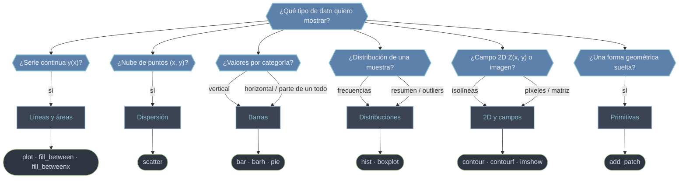

# Gráficos del Axes — elegir el método según el dato

Aquí viven los métodos que **dibujan datos** dentro de un `Axes`: cada uno traduce un tipo de información (una serie continua, una nube de puntos, categorías, una distribución, un campo 2D) en un tipo de Artist concreto. La pregunta no es "qué función de Matplotlib uso", sino **qué quiero mostrar**: respondida esa pregunta, el método casi se elige solo. Todos comparten el mismo patrón —`ax.<metodo>(datos, **kwargs)`— y devuelven el Artist (o la colección) que crean, para que puedas modificarlo después.

## En acción

```python
import matplotlib.pyplot as plt
import numpy as np

rng = np.random.default_rng(0)
x = np.linspace(0, 10, 200)

fig, (ax1, ax2, ax3) = plt.subplots(1, 3, figsize=(13, 4))

# 1) serie continua -> plot
ax1.plot(x, np.sin(x), label="sin(x)")
ax1.plot(x, np.cos(x), "--", label="cos(x)")
ax1.set_title("Serie continua · plot")
ax1.legend()

# 2) nube de puntos -> scatter (color y tamaño codifican variables)
px, py = rng.normal(size=(2, 80))
ax2.scatter(px, py, s=rng.uniform(20, 200, 80), c=px + py, cmap="viridis", alpha=0.7)
ax2.set_title("Nube de puntos · scatter")

# 3) categorías -> bar
cat = ["A", "B", "C", "D"]
val = [23, 45, 12, 38]
ax3.bar(cat, val, color="#5e81ac")
ax3.set_title("Categorías · bar")

fig.tight_layout()
plt.show()
```

## Qué método elijo



## Los métodos por familia

### Líneas y áreas — series continuas `y(x)`

Para datos ordenados donde el orden importa (señales, funciones, evolución temporal). La línea sugiere continuidad entre puntos.

- [[ax.plot]] — el método central: dibuja líneas y marcadores. Acepta el formato compacto `'ro--'` (color + marcador + estilo) y devuelve una lista de `Line2D`. Es el punto de partida de casi cualquier gráfico.
- [[ax.fill_between]] — rellena la banda vertical entre dos curvas `y1` e `y2`. La herramienta para bandas de confianza, incertidumbre o sombreado condicional con `where=`.
- [[ax.fill_betweenx]] — la versión horizontal: rellena entre `x1` y `x2` para un mismo `y`. Útil en perfiles verticales (profundidad, altura).

### Dispersión — relaciones entre variables

- [[ax.scatter]] — una marca por punto, sin conectar. Más que `plot(..., 'o')`: permite **codificar variables extra** en el tamaño (`s`) y el color (`c` + `cmap`), así que cada punto puede transmitir hasta cuatro dimensiones.

### Barras y sectores — datos categóricos

- [[ax.bar]] — barras verticales: altura = valor. Soporta apilado (`bottom=`) y agrupado (desplazando `x`).
- [[ax.barh]] — barras horizontales: ideal cuando las etiquetas de categoría son largas o hay muchas categorías.
- [[ax.pie]] — sectores como proporción de un todo. Útil solo con pocas categorías que suman el 100 %.

### Distribuciones — forma de una muestra

- [[ax.hist]] — histograma: agrupa los datos en intervalos (`bins`) y cuenta frecuencias. Soporta densidad (`density=True`), acumulado y apilado.
- [[ax.boxplot]] — caja y bigotes: resume mediana, cuartiles y outliers. El método para **comparar** varias distribuciones de un vistazo.

### 2D y campos — `Z` sobre una malla o imagen

- [[ax.contour]] — curvas de nivel (isolíneas) de un campo `Z(x, y)`. Requiere una malla, normalmente de `numpy.meshgrid`.
- [[ax.contourf]] — contornos **rellenos**: las mismas regiones pero pintadas con color sólido por nivel.
- [[ax.imshow]] — muestra una matriz como rejilla de píxeles. Para imágenes, mapas de calor y cualquier dato ya rasterizado.

### Primitivas — formas geométricas sueltas

- [[ax.add_patch]] — añade un `Patch` (`Rectangle`, `Circle`, `Polygon`…) al Axes. Crear la forma no la dibuja: este es el paso imprescindible para que aparezca.

## Tabla de decisión

| Quiero mostrar… | Método | Devuelve | Dato típico |
|-----------------|--------|----------|-------------|
| Una serie continua `y(x)` | [[ax.plot]] | lista de `Line2D` | señal, función |
| Una banda entre dos curvas | [[ax.fill_between]] · [[ax.fill_betweenx]] | `PolyCollection` | intervalo de confianza |
| Relación entre variables (nube) | [[ax.scatter]] | `PathCollection` | `(x, y)` + color/tamaño |
| Valores por categoría (vertical) | [[ax.bar]] | `BarContainer` | conteos, comparativas |
| Valores por categoría (horizontal) | [[ax.barh]] | `BarContainer` | etiquetas largas |
| Proporción de un todo | [[ax.pie]] | tupla de artists | porcentajes |
| Frecuencias de una muestra | [[ax.hist]] | `(n, bins, patches)` | distribución |
| Comparar distribuciones / outliers | [[ax.boxplot]] | `dict` de artists | varias muestras |
| Isolíneas de un campo 2D | [[ax.contour]] · [[ax.contourf]] | `QuadContourSet` | `Z(x, y)` en malla |
| Matriz / imagen como píxeles | [[ax.imshow]] | `AxesImage` | mapa de calor, imagen |
| Una forma geométrica suelta | [[ax.add_patch]] | `Patch` | anotación, región |

> [!tip] Regla práctica
> Empieza por el dato, no por el gráfico. Si dudas entre `plot` y `scatter`, pregúntate si el **orden** de los puntos significa algo (sí → `plot`; no → `scatter`). Entre `contour` e `imshow`, si quieres ver **niveles** usa contornos; si quieres ver **valores celda a celda**, usa `imshow`.

## Notas relacionadas

- [[Matplotlib/axes/index|axes]] — el objeto `Axes` y todos sus métodos
- [[Matplotlib/axes/metodos/formato/index|formato]] — dar formato al gráfico una vez dibujados los datos
- [[ax.legend]] — convertir los `label=` de cada método en una leyenda
- [[Colores_Nombres]] · [[marker]] · [[Estilos_Linea]] — códigos de color, marcador y línea
