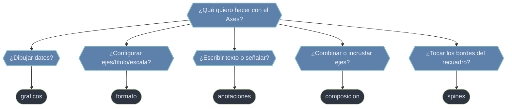

# Métodos del Axes — graficar, formatear, anotar y componer

El `Axes` expone **decenas de métodos**, y dominarlo es saber cuál llamar según lo que quieras conseguir. Para no perderse, este vault los reparte en **cinco familias por intención**: los que **dibujan datos** (`graficos`), los que **configuran el aspecto** del subgráfico (`formato`), los que **escriben sobre** el gráfico (`anotaciones`), los que **mezclan o incrustan ejes** (`composicion`) y los que **controlan los bordes** del recuadro (`spines`). Casi cualquier tarea de graficación se reduce a elegir la familia correcta y, dentro de ella, el método.

## En acción

```python
import matplotlib.pyplot as plt
import numpy as np

x = np.linspace(0, 10, 200)
fig, ax = plt.subplots()

ax.plot(x, np.sin(x), label="sin")                 # graficos
ax.set_xlim(0, 10); ax.set_title("Demo")           # formato
ax.annotate("pico", xy=(1.6, 1), xytext=(4, 0.8),  # anotaciones
            arrowprops=dict(arrowstyle="->"))
ax.spines[["top", "right"]].set_visible(False)     # spines
ax.legend()
```

Un solo gráfico suele tocar **varias familias a la vez**: graficas, luego formateas, anotas y, al final, ajustas los bordes.

## Qué subcarpeta necesito



## Las cinco familias

- **[[Matplotlib/axes/metodos/graficos/index\|graficos]]** — los métodos que **crean Artists** a partir de datos: `ax.plot` (líneas), `ax.scatter` (nube de puntos), `ax.bar`/`ax.barh` (barras), `ax.hist` (histograma), `ax.boxplot`, `ax.contour`/`ax.contourf`, `ax.imshow` (imágenes), `ax.pie`, `ax.fill_between`. Cada uno devuelve el Artist que dibuja.
- **[[Matplotlib/axes/metodos/formato/index\|formato]]** — los `set_*` y compañía que **configuran** el subgráfico sin añadir datos: `set_title`, `set_xlabel`/`set_ylabel`, `set_xlim`/`set_ylim`, `set_xticks`/`set_yticks`, `set_xscale`/`set_yscale` (lineal/log), `legend`, `grid`, `tick_params`, `set_aspect`.
- **[[Matplotlib/axes/metodos/anotaciones/index\|anotaciones]]** — escribir **sobre** el gráfico: `ax.text` (texto plano en una posición) y `ax.annotate` (texto con flecha que señala un punto).
- **[[Matplotlib/axes/metodos/composicion/index\|composicion]]** — **combinar ejes**: `ax.twinx` (segundo eje Y compartiendo X), `ax.secondary_xaxis`/`secondary_yaxis` (eje derivado con otra unidad) y `ax.inset_axes` (panel incrustado / zoom).
- **[[Matplotlib/axes/metodos/spines/index\|spines]]** — los **4 bordes** del recuadro (`ax.spines`): ocultarlos, moverlos al origen o restilizarlos.

## Cómo navegar

| Quiero… | Ir a |
|---------|------|
| Tipos de gráfico (líneas, barras, scatter, hist...) | [[Matplotlib/axes/metodos/graficos/index\|graficos]] |
| Ejes, títulos, límites, escalas, ticks, leyenda | [[Matplotlib/axes/metodos/formato/index\|formato]] |
| Texto y flechas sobre el gráfico | [[Matplotlib/axes/metodos/anotaciones/index\|anotaciones]] |
| Doble eje Y, eje secundario, panel incrustado | [[Matplotlib/axes/metodos/composicion/index\|composicion]] |
| Bordes del recuadro (ocultar, mover, estilizar) | [[Matplotlib/axes/metodos/spines/index\|spines]] |

## Notas relacionadas

- [[Axes]] — la clase contenedora de todos estos métodos
- [[plt.subplots]] — cómo obtener el `ax` sobre el que se llaman
- [[concepto_artist]] — qué devuelven los métodos gráficos
