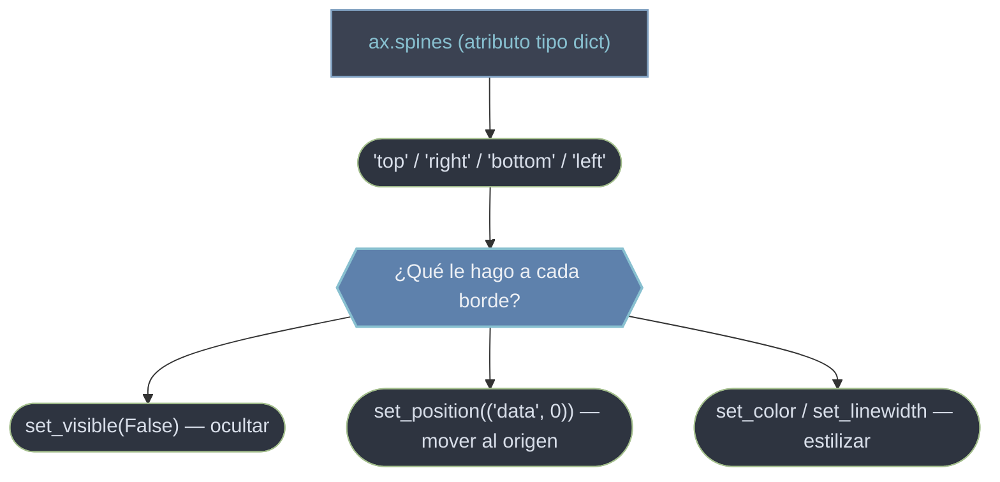

# Spines — los 4 bordes del Axes

Los **spines** son las **cuatro líneas que forman el recuadro** del `Axes`: `'top'`, `'bottom'`, `'left'` y `'right'`. No son meros adornos: cada uno es un objeto `Spine` (un tipo de `Patch`) que puedes ocultar, mover o restilizar. Controlarlos es lo que da a un gráfico su aspecto —desde el recuadro cerrado por defecto hasta el estilo "limpio" sin bordes superiores, o unos ejes cartesianos que se cruzan en el origen—. Se acceden a través de `ax.spines`, que es un **atributo** tipo diccionario, no un método.

## En acción

```python
import matplotlib.pyplot as plt
import numpy as np

x = np.linspace(0, 10, 200)
fig, ax = plt.subplots()
ax.plot(x, np.sin(x))

# Estilo "limpio": ocultar los bordes superior y derecho
ax.spines["top"].set_visible(False)
ax.spines["right"].set_visible(False)
plt.show()
```

`ax.spines["top"]` devuelve el `Spine` de ese borde, y `set_visible(False)` lo oculta. El patrón anterior (quitar `top` y `right`) es el estilo limpio más habitual: deja solo el eje izquierdo e inferior.

## El manejo de los spines



## Cómo se manejan

- **Acceso por clave** — `ax.spines` se direcciona como un diccionario con exactamente cuatro claves: `'top'`, `'bottom'`, `'left'`, `'right'`. `ax.spines["left"]` devuelve un objeto `Spine`. Es un **atributo**: nunca lo llames con `()`.
- **`set_visible(False)` — ocultar** — el caso más común. Para el estilo limpio iteras sobre los bordes a quitar: `for lado in ("top", "right"): ax.spines[lado].set_visible(False)`.
- **`set_position(...)` — mover un borde** — reubica un spine respecto a un sistema: `('data', v)` lo lleva a una coordenada de datos (`('data', 0)` da ejes cruzándose en el origen), `('axes', f)` a una fracción del Axes (0–1) y `'zero'` es el atajo de `('data', 0)`. Es la base de los **ejes cartesianos** clásicos.
- **`set_color` / `set_linewidth` — estilizar** — cambian color y grosor del borde, p. ej. `ax.spines["bottom"].set_linewidth(2)`.

> [!tip] Detalle de versión
> En Matplotlib reciente puedes operar varios bordes a la vez: `ax.spines[["top", "right"]].set_visible(False)`.

## Cómo navegar

| Quiero… | Cómo |
|---------|------|
| Ocultar un borde | `ax.spines["top"].set_visible(False)` |
| Estilo limpio (sin top ni right) | iterar `("top", "right")` y ocultar |
| Ejes que se cruzan en el origen | `set_position(("data", 0))` en `left` y `bottom` |
| Cambiar color o grosor del borde | `set_color(...)` / `set_linewidth(...)` |
| Referencia completa del atributo | [[ax.spines]] |

## Notas relacionadas

- [[ax.spines]] — la nota de referencia del atributo
- [[ax.tick_params]] — mover los ticks junto con los spines
- [[concepto_anatomia_figura]] — el nombre técnico de cada parte del gráfico
