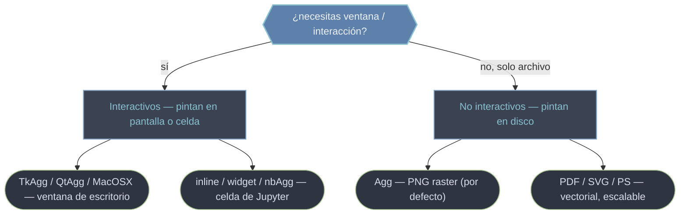

# backend — Motores de render y cómo seleccionarlos

Cuando creas un gráfico, Matplotlib **no lo pinta de inmediato**: construye el árbol de [[concepto_artist|Artists]] en memoria. El **backend** es el motor que finalmente convierte esa estructura en una salida concreta —una ventana, una celda de notebook o un archivo PNG/SVG/PDF—. La consecuencia práctica es enorme: **el mismo código de ploteo produce salidas distintas según el backend activo**, sin tocar una línea del gráfico. Esta carpeta cubre las dos preguntas operativas: *qué backends existen* (interactivos vs de archivo) y *cómo se selecciona el activo* (por código, por magic de Jupyter o por variable de entorno).

## En acción

El caso más común: forzar un backend de archivo en un servidor o script sin pantalla. La regla de oro es que `matplotlib.use(...)` debe ir **antes** de importar `pyplot`, porque el backend queda fijado en el momento de esa importación.

```python
import matplotlib
matplotlib.use("Agg")            # de archivo: NO necesita display. ANTES de pyplot
import matplotlib.pyplot as plt

fig, ax = plt.subplots()
ax.plot([1, 2, 3])
fig.savefig("grafico.png")       # render a archivo vía Agg (sin plt.show)

print(matplotlib.get_backend())  # → 'Agg'  (consultar el backend activo)
```

## Tipos de backend

Hay dos familias según dónde pintan. La elección depende de si necesitas interacción (ventana, zoom) o solo generar imágenes.



| Backend | Familia | Salida | Cuándo |
|---------|---------|--------|--------|
| `Agg` | No interactivo | PNG (raster) | Servidores/CI sin pantalla; por defecto de `savefig` |
| `PDF` / `SVG` / `PS` | No interactivo | Vectorial | Papers, web, impresión escalable |
| `TkAgg` / `QtAgg` / `MacOSX` | Interactivo | Ventana | Escritorio: zoom, paneo |
| `inline` / `widget` / `nbAgg` | Notebook | Celda | Jupyter (estático o interactivo) |

## Qué hay en esta carpeta

| Nota | Para qué |
|------|----------|
| [[backends]] | Catálogo de motores: qué hace cada uno (`Agg`, `PDF`, `SVG`, `TkAgg`, `QtAgg`, `inline`, `widget`...) y cuándo elegirlo. |
| [[cambiar_backend]] | Cómo seleccionar el activo: `matplotlib.use()`, magics `%matplotlib`, la variable `MPLBACKEND` y `get_backend()`. |

> [!tip] Regla de supervivencia en servidores
> Si ves `"no display name and no $DISPLAY"`, estás usando un backend interactivo sin pantalla. Fija `Agg` (por código o `MPLBACKEND=Agg`) y exporta con `savefig` en lugar de `plt.show()`.

## Notas relacionadas

- [[concepto_backend]] — el modelo conceptual: cuándo ocurre el render, `show` vs `savefig`
- [[concepto_artist]] — la estructura en memoria que el backend rasteriza
- [[plt.savefig]] · [[plt.show]] — las dos formas de disparar el render
- [[Matplotlib/index\|Matplotlib]] — el índice raíz
