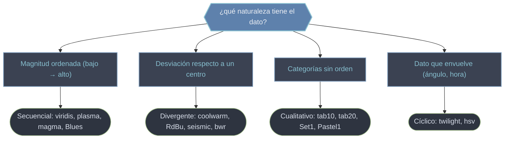

# cm — Mapas de color (colormaps) que traducen valor a color

Un **colormap** es una función que recibe un número normalizado en `[0, 1]` y devuelve un color RGBA. Es la segunda mitad del color cuantitativo: una [[Normalize]] lleva el rango real de tus datos a `[0, 1]`, y el colormap traduce ese `[0, 1]` a color. El módulo `matplotlib.cm` es el registro de colormaps de Matplotlib —`viridis`, `plasma`, `coolwarm`, `tab10`…— a los que se accede por nombre con `plt.get_cmap(...)`. La elección no es estética: cada **tipo** de colormap (secuencial, divergente, cualitativo, cíclico) está pensado para una naturaleza de dato distinta, y elegir mal distorsiona la lectura. Esta carpeta cubre qué colormaps hay, cómo se aplican (con `c=` y `cmap=`) y cómo construir uno discreto a medida.

## En acción

Aplicar un colormap a un `scatter`: el array que pasas a `c=` se mapea a color con el `cmap=`, y la `colorbar` actúa de leyenda del mapeo.

```python
import matplotlib.pyplot as plt
import numpy as np

rng = np.random.default_rng(0)
x = rng.normal(size=300)
y = rng.normal(size=300)
z = np.sqrt(x**2 + y**2)          # 3ª variable: distancia al origen

fig, ax = plt.subplots(figsize=(6, 5))
sc = ax.scatter(x, y, c=z, cmap="viridis", s=25)  # color por valor de z
cb = fig.colorbar(sc, ax=ax)                       # leyenda valor → color
cb.set_label("distancia al origen")
ax.set_title("scatter coloreado por una 3ª variable")
```

Clave: `c=z` debe ser un **array de valores numéricos** (no un color fijo) para que `cmap` tenga efecto; guardar el retorno (`sc`) es lo que alimenta la `colorbar`.

## Tipos de colormap



| Tipo | Cuándo usarlo | Ejemplos |
|------|---------------|----------|
| **Secuencial** | magnitudes ordenadas (densidad, temperatura, altura) | `viridis`, `plasma`, `magma`, `inferno`, `Blues` |
| **Divergente** | dato con centro significativo (cero, media) | `coolwarm`, `RdBu`, `seismic`, `bwr` |
| **Cualitativo** | categorías sin orden (clases, grupos) | `tab10`, `tab20`, `Set1`, `Pastel1` |
| **Cíclico** | dato que se enrolla (fase, ángulo, hora) | `twilight`, `twilight_shifted`, `hsv` |

## Cómo se obtiene y aplica

| Acción | Código | Resultado |
|--------|--------|-----------|
| Obtener por nombre | `plt.get_cmap('plasma')` | objeto `Colormap` |
| Aplicar en scatter | `ax.scatter(x, y, c=z, cmap='viridis')` | color por valor |
| Aplicar en imagen | `ax.imshow(M, cmap='magma')` | imagen coloreada |
| Invertir | `plt.get_cmap('viridis_r')` | el mismo mapa al revés |
| Versión discreta | `plt.get_cmap('viridis', 5)` | 5 niveles discretos |

## Qué hay en esta carpeta

| Nota | Para qué |
|------|----------|
| [[Colormaps]] | El concepto de colormap, sus cuatro categorías y cómo obtenerlos/aplicarlos; por qué `viridis` sobre `jet` (uniformidad perceptual). |
| [[ListedColormap]] | Construir un colormap **discreto** a partir de una lista explícita de colores: clases, máscaras, paletas de marca con bordes nítidos. |

> [!tip] Empareja tipo de colormap con tipo de dato
> Secuencial para magnitudes, divergente para desviaciones respecto a un centro, cualitativo para categorías. Para divergentes, fija `vmin`/`vmax` simétricos para que el color neutro caiga exactamente en el punto de referencia.

## Notas relacionadas

- [[Normalize]] — la otra mitad: lleva el rango de datos a `[0, 1]`
- [[LinearSegmentedColormap]] — construir un colormap **continuo** a medida
- [[plt.colorbar]] — la leyenda que traduce color ↔ valor
- [[concepto_color_mapping]] — el modelo dato → norma → color → leyenda
- [[Matplotlib/index\|Matplotlib]] — el índice raíz
