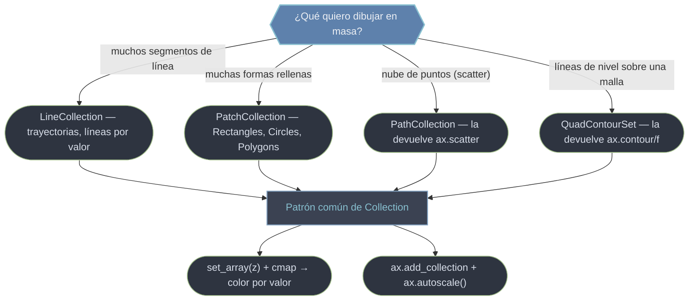

# collections — dibujar muchos objetos como un solo Artist

El módulo `matplotlib.collections` existe por una razón: el **rendimiento**. Añadir miles de `Line2D` o `Patch` sueltos al Axes es lento, porque cada uno es un [[concepto_artist|Artist]] independiente que la figura debe gestionar y redibujar por separado. Una *Collection* agrupa **muchos objetos homogéneos en un único Artist**: un solo objeto que dibuja N segmentos, N formas o N marcadores de golpe. La ventaja no es solo velocidad —también puedes recolorear, reescalar o reposicionar toda la nube con **una sola llamada**, y mapear un array de valores a color mediante un colormap. Como cualquier Artist, exponen `.set_alpha`, `.set_zorder` y el protocolo `set_*` / `get_*`. Detalle común: una colección **no autoescala los ejes**; tras `ax.add_collection` hay que llamar `ax.autoscale()`.

## En acción

```python
import matplotlib.pyplot as plt
import numpy as np
from matplotlib.collections import LineCollection

# una espiral coloreada por su progresión: una sola línea que cambia de color
t = np.linspace(0, 6 * np.pi, 500)
x, y = t * np.cos(t), t * np.sin(t)

# construir los segmentos: array (N, 2, 2) = N segmentos [[x0,y0],[x1,y1]]
points = np.array([x, y]).T.reshape(-1, 1, 2)
segments = np.concatenate([points[:-1], points[1:]], axis=1)

fig, ax = plt.subplots(figsize=(6, 6))
lc = LineCollection(segments, cmap="viridis")
lc.set_array(t)                 # un valor por segmento → color por colormap
ax.add_collection(lc)           # UN solo Artist para ~500 segmentos
ax.autoscale()                  # las colecciones NO ajustan los ejes solas
fig.colorbar(lc, ax=ax, label="t")
plt.show()
```

## ¿Qué colección uso?



El patrón se repite en las cuatro: guardan un **array escalar** (uno por elemento) que un colormap traduce a color, normalizado por [[Normalize]]; `set_array(z)` lo actualiza tras la creación y `plt.colorbar(coleccion)` añade la leyenda. Para color fijo, usas `colors=`/`facecolor=` en lugar de `set_array`.

## Las piezas de este módulo

- [[LineCollection]] — **muchos segmentos de línea**. Ideal para trayectorias coloreadas por valor (velocidad, tiempo, temperatura a lo largo de un recorrido). Construye los segmentos con el patrón `reshape(-1,1,2)` + `concatenate`.
- [[PatchCollection]] — **muchas formas rellenas**. Agrupa `Rectangle`/`Circle`/`Polygon` en un Artist. `match_original=True` conserva el color de cada parche; omítelo para colorear por valor con `set_array`.
- [[PathCollection]] — **la nube de puntos de scatter**. Es lo que **devuelve** `ax.scatter`: una sola `Path` repetida con offsets. Permite `set_offsets` (mover), `set_sizes` (tamaño, en points²) y `set_array` (recolorear) — base de animaciones.
- [[QuadContourSet]] — **líneas y regiones de nivel**. Lo que **devuelven** `ax.contour` y `ax.contourf`. Guarda `levels` y se pasa a `ax.clabel` para etiquetar y a `plt.colorbar` para la escala.

| Quiero… | Ir a |
|---------|------|
| Una trayectoria que cambia de color por tramo | [[LineCollection]] |
| Pintar miles de formas eficientemente | [[PatchCollection]] |
| El objeto que devuelve `scatter` (mover/recolorear puntos) | [[PathCollection]] |
| El objeto que devuelve `contour`/`contourf` | [[QuadContourSet]] |

> [!warning] Las colecciones no autoescalan
> A diferencia de `ax.plot`, añadir una colección **no ajusta los límites del eje**. Si tras `ax.add_collection(...)` ves un gráfico vacío o mal encuadrado, llama `ax.autoscale()` o fija `set_xlim`/`set_ylim` a mano.

## Notas relacionadas

- [[concepto_artist]] — la herencia común (`set_alpha`, `set_zorder`, `set_visible`)
- [[Normalize]] — el mapeo valor → [0,1] que precede al colormap
- [[ax.scatter]] · [[ax.contour]] — los métodos que devuelven colecciones
