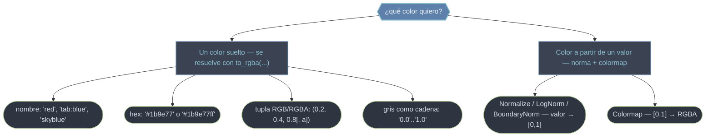

# colors — Especificar colores y mapear valores a color

El módulo `matplotlib.colors` resuelve dos preguntas distintas. La primera es directa: **¿cómo le digo a Matplotlib qué color quiero?** Un color admite muchas formas —un nombre (`'red'`), un hex (`'#1b9e77'`), una tupla RGBA, un gris como cadena (`'0.4'`)—; todas se traducen internamente a la misma tupla `(r, g, b, a)` con `to_rgba`. La segunda es el corazón del color cuantitativo: **¿cómo convierto un array de valores numéricos en colores?** Ahí entra el dúo **norma + colormap**: una `Normalize` lleva el rango real de tus datos a `[0, 1]`, y un colormap traduce ese `[0, 1]` a color. Esta carpeta cubre las normas (lineal, logarítmica, discreta), la construcción de colormaps a medida y la barra de color que cierra el ciclo como leyenda.

## En acción

```python
import matplotlib.colors as mcolors
import matplotlib.pyplot as plt
import numpy as np

# 1) Distintas formas de dar UN color: todas equivalen a una tupla RGBA
mcolors.to_rgba("red")          # → (1.0, 0.0, 0.0, 1.0)   nombre
mcolors.to_rgba("#1b9e77")      # → (0.106, 0.62, 0.467, 1.0)  hex
mcolors.to_rgba((0.2, 0.4, 0.8))  # → (0.2, 0.4, 0.8, 1.0)   RGB → RGBA
mcolors.to_rgba("0.4")          # → (0.4, 0.4, 0.4, 1.0)   gris como cadena
mcolors.to_rgba("tab:blue", alpha=0.5)  # color del ciclo con transparencia

# 2) Normalizar un ARRAY de valores a color: norma → [0,1] → colormap
datos = np.array([0, 25, 50, 100, 200])
norm = mcolors.Normalize(vmin=0, vmax=200)   # rango real → [0, 1]
cmap = plt.get_cmap("viridis")               # [0, 1] → color RGBA
colores = cmap(norm(datos))                  # un color por valor

fig, ax = plt.subplots()
sc = ax.scatter(range(len(datos)), datos, c=datos, cmap="viridis", norm=norm)
fig.colorbar(sc, ax=ax)                       # la barra es la leyenda del mapeo
```

La pareja `norm` + `cmap` define **por completo** el color de un dato: la norma decide *qué valor cae dónde* en `[0, 1]` y el colormap decide *qué color es ese punto*.

## Formas de especificar un color



| Forma | Ejemplo | Notas |
|-------|---------|-------|
| Nombre | `'red'`, `'skyblue'`, `'tab:orange'` | nombres CSS + paleta `tab:` del ciclo por defecto |
| Hex | `'#1b9e77'`, `'#1b9e77cc'` | `#rrggbb` o `#rrggbbaa` con alfa |
| RGB / RGBA | `(0.2, 0.4, 0.8)`, `(0.2, 0.4, 0.8, 0.5)` | floats en `[0, 1]`; el 4º es alfa |
| Gris (cadena) | `'0.0'` (negro) … `'1.0'` (blanco) | escala de gris como string |
| Ciclo | `'C0'`, `'C1'`, … | i-ésimo color del ciclo activo |

## Qué hay en esta carpeta

| Nota | Para qué |
|------|----------|
| [[Normalize]] | Normalización **lineal** `[vmin, vmax] → [0, 1]`: la pieza base del mapeo de color, clase padre del resto de normas. |
| [[LogNorm]] | Normalización **logarítmica** para datos de varios órdenes de magnitud (picos, conteos); recupera contraste en el extremo bajo. |
| [[BoundaryNorm]] | Normalización **discreta por bins**: reparte los valores en bandas según una lista de fronteras; ideal para escalas escalonadas y categorías. |
| [[LinearSegmentedColormap]] | Construir un colormap **continuo** a medida con `from_list(...)`: gradiente interpolado entre colores de anclaje. |
| [[Colorbar]] | El objeto **barra de color**, la leyenda que traduce color ↔ valor; se obtiene de `fig.colorbar(...)` y se rotula con `set_label`. |

> [!tip] La regla del color cuantitativo
> Para colorear por valor necesitas **siempre** dos piezas: una norma (decide qué valor cae dónde) y un colormap (decide el color). Fijar `vmin`/`vmax` explícitos hace comparables varios gráficos: el mismo color significa el mismo valor.

## Notas relacionadas

- [[Colormaps]] — los mapas de color que consumen el `[0, 1]` de la norma
- [[ListedColormap]] — colormap discreto a partir de una lista de colores
- [[plt.colorbar]] — la función que crea el objeto `Colorbar`
- [[concepto_color_mapping]] — el modelo dato → norma → color → leyenda
- [[Matplotlib/index\|Matplotlib]] — el índice raíz
