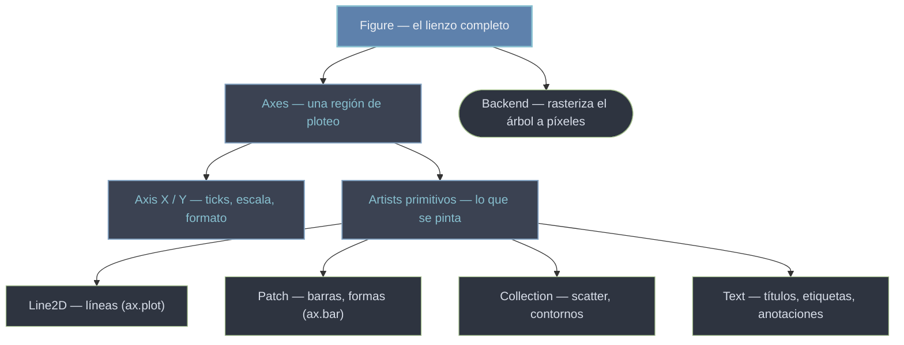

# Conceptos transversales — El modelo mental de Matplotlib

Antes de buscar "qué función dibuja una barra", conviene entender **cómo piensa Matplotlib**. No es una colección de funciones de dibujo: es un **árbol de objetos** (Artists) que se construye en memoria y solo se rasteriza al final. Estos conceptos son transversales porque explican el *porqué* detrás de casi toda la API: por qué hay dos interfaces, por qué cada gráfico es un objeto manipulable, por qué un color se calcula al dibujar y no se guarda, y por qué `(0.5, 0.5)` puede significar tres sitios distintos. Dominar estas ocho ideas convierte la documentación de métodos en algo predecible en lugar de un recetario que hay que memorizar.

## En acción

Un solo bloque ilustra varios conceptos a la vez: la jerarquía `Figure`/`Axes`, que todo lo dibujado es un Artist manipulable, el property cycle que asigna colores solos, y un transform para anclar texto a una esquina sin depender de los datos.

```python
import matplotlib.pyplot as plt
import numpy as np

x = np.linspace(0, 10, 200)

fig, ax = plt.subplots(figsize=(8, 4))      # Figure (lienzo) + un Axes (región)
(linea,) = ax.plot(x, np.sin(x))            # ax.plot DEVUELVE el Artist (Line2D)
ax.plot(x, np.cos(x))                        # 2ª serie: color del property cycle, sin pedirlo

linea.set_linewidth(2.5)                     # el Artist se muta después de crearlo
linea.set_color("C3")                        # 'C3' = 4º color del ciclo, no un color fijo

# Texto anclado a la esquina del Axes (transAxes), no a un punto de datos
ax.text(0.02, 0.95, "demo", transform=ax.transAxes)

ax.set_title("Cuatro conceptos en un gráfico")
plt.show()
```

## El modelo de objetos

Todo cuelga de la `Figure`. Cada concepto de esta carpeta describe un nivel o una dimensión de este árbol:



La idea que unifica todo: **se construye una estructura en memoria y el [[concepto_backend|backend]] la convierte en píxeles solo al final** (`show`/`savefig`). Entre medias, cada nodo es un objeto con el protocolo universal `set_*` / `get_*`.

## Los ocho conceptos

| Eje | Concepto | La idea en una frase |
|-----|----------|----------------------|
| **Estructura** | [[concepto_figure_axes]] | La jerarquía contenedora: un `Figure` agrupa N `Axes`; el 95% del trabajo es sobre el `Axes`. |
| **Estructura** | [[concepto_anatomia_figura]] | El vocabulario visual (spine, tick, gridline): saber el nombre es saber el método. La trampa Axes ≠ Axis. |
| **Modelo de objetos** | [[concepto_artist]] | Todo lo dibujable es un Artist con `set_*`/`get_*`; las funciones de dibujo **devuelven** el Artist para que lo ajustes. |
| **Interfaz** | [[concepto_pyplot_vs_oo]] | Dos formas de hacer lo mismo: `plt.*` (estado implícito) vs `ax.*` (explícito, recomendado). Mezclarlas es el error nº1. |
| **Styling** | [[concepto_property_cycle]] | Por qué dos series salen de colores distintos solas, y qué significan `'C0'..'C9'` (relativos al ciclo, no fijos). |
| **Render** | [[concepto_color_mapping]] | El pipeline norm → cmap → colorbar que convierte un dato numérico en color. `c=` mapea, `color=` fija. |
| **Render** | [[concepto_backend]] | Dónde y cuándo se pinta: interactivo vs de archivo, `show` vs `savefig`, el error "no display". |
| **Estructura** | [[concepto_transforms]] | Los sistemas de coordenadas: `(0.5, 0.5)` en data, axes o figure son tres sitios distintos. Ancla sin depender de los datos. |

> [!tip] Orden de lectura sugerido
> Empieza por [[concepto_figure_axes]] y [[concepto_artist]] (el armazón), sigue con [[concepto_pyplot_vs_oo]] (cómo escribir el código), y deja [[concepto_color_mapping]] y [[concepto_transforms]] para cuando los necesites.

## Notas relacionadas

- [[Matplotlib/index\|Matplotlib]] — el índice raíz con el flujo básico
- [[Matplotlib/pyplot/funciones/index\|pyplot]] — las funciones `plt.*` que materializan estos conceptos
- [[Matplotlib/axes/index\|axes]] — los métodos del `Axes`, el objeto central
