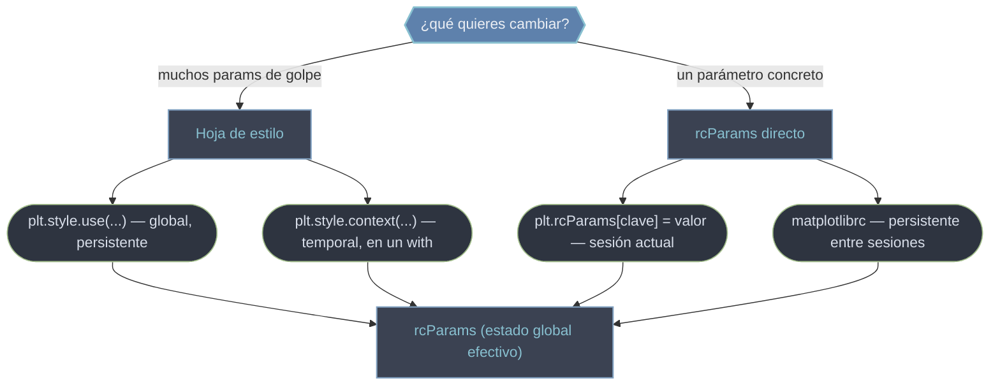

# config — Configuración global: rcParams y estilos

Toda figura nace con un montón de **valores por defecto**: el tamaño, el DPI, el grosor de línea, los colores del [[concepto_property_cycle|ciclo]], si hay rejilla. Esos defaults viven en un único diccionario global, `rcParams`, y esta carpeta trata de cómo **cambiarlos de forma global** para no repetir los mismos ajustes en cada gráfico. Hay dos vías que terminan en el mismo sitio: editar `rcParams` directamente (control fino, parámetro a parámetro) o aplicar una **hoja de estilo** con `plt.style.use(...)` (un paquete coherente de muchos parámetros a la vez, como `'ggplot'` o `'dark_background'`). Bajo el capó, un estilo no es más que un conjunto de entradas de `rcParams` que se sobrescriben de golpe.

## En acción

Las dos vías combinadas: aplicar un estilo como base y luego afinar parámetros sueltos por encima. El orden importa —los cambios afectan a las figuras creadas **después**—.

```python
import matplotlib.pyplot as plt

plt.style.use("ggplot")                      # base: fondo gris, rejilla, paleta del estilo

plt.rcParams.update({                        # ajuste fino ENCIMA del estilo
    "figure.figsize": (8, 4),
    "font.size": 12,
    "lines.linewidth": 2.0,
})

fig, ax = plt.subplots()                     # ya hereda estilo + overrides
ax.plot([1, 2, 3], [1, 4, 9])
plt.show()

# Estilo temporal, sin contaminar el estado global:
with plt.style.context("dark_background"):
    fig, ax = plt.subplots()
    ax.plot([1, 2, 3])                       # solo este gráfico es oscuro
# fuera del with, vuelve a 'ggplot'
```

## Las vías de configuración

Todas convergen en `rcParams`. Se distinguen por su **alcance** (global persistente vs un bloque temporal) y su **granularidad** (un parámetro vs un paquete entero).



| Vía | Alcance | Cuándo usarla |
|-----|---------|---------------|
| `plt.style.use('ggplot')` | Global, persistente | Dar una apariencia coherente a todo el script |
| `plt.style.context('bmh')` | Temporal (bloque `with`) | Un gráfico distinto sin tocar el estado global (ideal en notebooks) |
| `plt.rcParams['clave'] = valor` | Sesión actual | Afinar un parámetro suelto (DPI, figsize, linewidth) |
| `matplotlibrc` | Persistente entre sesiones | Defaults propios de tu máquina/proyecto |

## Qué hay en esta carpeta

| Nota | Para qué |
|------|----------|
| [[rcParams]] | El diccionario global: cómo leer y modificar parámetros, los más comunes (figsize, dpi, grid, linewidth), el archivo `matplotlibrc` y cómo restaurar defaults. |
| [[estilos]] | Las hojas de estilo predefinidas (`ggplot`, `seaborn-v0_8`, `dark_background`, `bmh`...), cómo combinarlas y el uso temporal con `context`. |
| [[plt.style.use]] | La función concreta para aplicar un estilo: firma, combinar varios en lista y el bloque `with`. |

> [!tip] El detalle que te ahorra confusión
> La configuración afecta a las figuras creadas **después** de aplicarla. Cambiar el estilo o un `rcParam` no reestiliza un gráfico ya dibujado: aplícalo antes de `plt.subplots()`. Y como `style.use` es persistente, en notebooks prefiere `style.context(...)` para no arrastrar el estilo entre celdas.

## Notas relacionadas

- [[concepto_property_cycle]] — los colores por defecto viven en `rcParams['axes.prop_cycle']`
- [[concepto_artist]] — los defaults definen el estado inicial de cada Artist
- [[Matplotlib/index\|Matplotlib]] — el índice raíz
