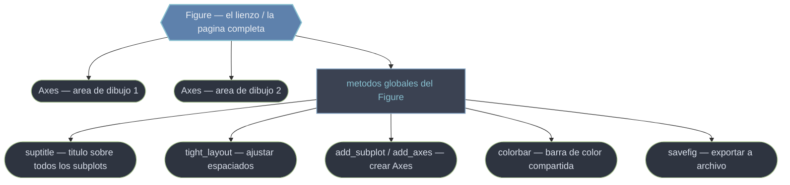

# figure — El objeto Figure, el contenedor global del lienzo

`Figure` es el **lienzo completo** de Matplotlib: la "hoja de papel" sobre la que se dibuja todo. No contiene datos directamente —de eso se encargan los `Axes`—, sino que actúa como **contenedor global**: aloja uno o varios `Axes`, fija el tamaño físico (`figsize`) y la resolución (`dpi`), y posee los elementos que abarcan toda la página: el título global (`suptitle`), las leyendas a nivel de figura, las colorbars compartidas y, sobre todo, el guardado a archivo (`savefig`). La regla mental es clara: lo que afecta a **toda la página** es del `Figure`; lo que ocurre **dentro de un gráfico** es del `Axes`.

## En acción

```python
import matplotlib.pyplot as plt
import numpy as np

x = np.linspace(0, 10, 200)

# 1. Crear el Figure vacío (el lienzo)
fig = plt.figure(figsize=(8, 5))

# 2. Añadir Axes a la rejilla — bajo nivel, uno a uno
ax1 = fig.add_subplot(2, 1, 1)
ax2 = fig.add_subplot(2, 1, 2, sharex=ax1)
ax1.plot(x, np.sin(x))
ax2.plot(x, np.cos(x))

# 3. Operaciones globales: lo que abarca todo el lienzo
fig.suptitle("Seno y coseno", fontsize=14)   # título global
fig.tight_layout()                            # ajustar espaciados

# 4. Exportar la página completa
fig.savefig("trig.png", dpi=150)
```

`add_subplot` devuelve cada `Axes` para que dibujes en él; `suptitle`, `tight_layout` y `savefig` operan sobre el lienzo entero. Esa es la división de trabajo que define al `Figure`.

## El contenedor y sus métodos globales



El `Figure` contiene `Axes` (el contenido) y, en paralelo, expone los **métodos globales** que actúan sobre la página entera. Tanto `Figure` como `Axes` descienden de la clase base `Artist`, por eso comparten atributos como `.set_visible()` o `.set_alpha()`.

## Qué encontrarás aquí

- [[Figure]] — la clase en sí: su constructor (`figsize`, `dpi`, `layout`), sus atributos (`axes`, `dpi`, `number`) y el ciclo de vida crear → dibujar → exportar. Es la nota de referencia del objeto.
- [[metodos/index|metodos]] — la subcarpeta con los métodos del `Figure` desglosados: `savefig`, `add_subplot`, `add_axes`, `suptitle`, `tight_layout`, `constrained_layout`. Cada uno con su firma, parámetros y casos de uso.

## Cómo navegar

| Quiero… | Ir a |
|---------|------|
| Entender el objeto `Figure` completo | [[Figure]] |
| Añadir un Axes a la rejilla (bajo nivel) | [[fig.add_subplot]] |
| Colocar un Axes en posición arbitraria | [[fig.add_axes]] |
| Poner un título global a toda la página | [[fig.suptitle]] |
| Ajustar márgenes para que nada se solape | [[fig.tight_layout]] |
| Motor de layout automático y continuo | [[constrained_layout]] |
| Ver todos los métodos juntos | [[metodos/index\|metodos]] |

> [!tip] Regla de oro
> Reserva los métodos de `fig` para lo que afecta a **todo el lienzo** (título global, layout, guardado); usa los `Axes` para el contenido de cada gráfico.

## Notas relacionadas

- [[plt.subplots]] — la forma idiomática de crear `Figure` + `Axes` en una línea
- [[plt.figure]] — crear el lienzo vacío para construir el layout a mano
- [[plt.savefig]] — el equivalente de estado de `fig.savefig`
- [[concepto_figure_axes]] — la jerarquía contenedora lienzo/subgrafo
