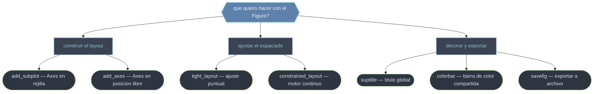

# metodos — Los métodos globales del Figure

Esta carpeta agrupa los **métodos del objeto `Figure`**: las operaciones que actúan sobre el lienzo completo, no sobre un único gráfico. Se reparten en tres familias. **Construir el layout**: `add_subplot` (un Axes en una rejilla) y `add_axes` (un Axes en posición arbitraria). **Ajustar el espaciado**: `tight_layout` (un ajuste puntual) y `constrained_layout` (un motor continuo). **Decorar y exportar a nivel global**: `suptitle` (título sobre todos los subplots), `colorbar` (barra de color compartida) y `savefig` (escribir la página a disco). Saber qué método pertenece al `Figure` —y cuál al `Axes`— es la mitad de dominar la API orientada a objetos.

## En acción

```python
import matplotlib.pyplot as plt
import numpy as np

datos = np.random.rand(20, 20)

fig, ax = plt.subplots(figsize=(6, 5))
im = ax.imshow(datos, cmap="plasma")

fig.suptitle("Mapa de densidad", fontsize=14)   # título sobre toda la figura
fig.colorbar(im, ax=ax, label="densidad")        # barra de color a nivel de figura
fig.tight_layout()                                # reservar espacio, evitar solapes
fig.savefig("mapa.png", dpi=150, bbox_inches="tight")   # exportar la página
```

`suptitle`, `colorbar`, `tight_layout` y `savefig` se llaman todos sobre `fig`, no sobre `ax`: cada uno opera sobre el lienzo entero.

## Las tres familias de métodos



## Los métodos uno a uno

- [[fig.add_subplot]] — crea y añade **un** `Axes` a una rejilla del Figure, devolviéndolo para dibujar. Es la forma de bajo nivel frente a `plt.subplots`; brilla en layouts heterogéneos (mezclar paneles de distinto tamaño). El índice empieza en 1 y recorre por filas.
- [[fig.add_axes]] — coloca un `Axes` en una **posición arbitraria** dada por `rect = [left, bottom, width, height]` en coordenadas de figura (0-1). Sin rejilla: tú das el rectángulo exacto. Es la herramienta para insets manuales y paneles superpuestos.
- [[fig.suptitle]] — pone un **título global** centrado sobre todos los subplots. Distinto de `ax.set_title()` (que titula un panel). Devuelve un `Text` reestilizable; conviene reservar espacio con `tight_layout` para que no se solape.
- [[fig.tight_layout]] — recalcula márgenes y separación entre subplots para que etiquetas, ticks y títulos no se solapen. Es **heurístico y puntual**: se ejecuta una vez. Llámalo al final, tras añadir todas las decoraciones.
- [[constrained_layout]] — el **motor de layout** moderno: un estado de la figura que reajusta el espaciado en cada redibujado. Más robusto que `tight_layout` con colorbars y leyendas externas. Se activa con `layout='constrained'`. No mezclar ambos.

> [!note] `savefig` y `colorbar` son también métodos del `Figure`. Sus notas de referencia detalladas viven en la familia pyplot: ver [[plt.savefig]] y [[plt.colorbar]], cuyos equivalentes OO son `fig.savefig` y `fig.colorbar`.

## Tabla resumen

| Método | Retorna | Familia | Rol |
|--------|---------|---------|-----|
| [[fig.add_subplot]] | `Axes` | layout | Añadir un Axes a una rejilla (bajo nivel) |
| [[fig.add_axes]] | `Axes` | layout | Añadir un Axes en posición arbitraria |
| [[fig.suptitle]] | `Text` | decorar | Título global sobre todos los subplots |
| [[fig.tight_layout]] | `None` | espaciado | Ajuste puntual de márgenes y separación |
| [[constrained_layout]] | `None` | espaciado | Motor de layout automático y continuo |
| `fig.colorbar` | `Colorbar` | decorar | Barra de color compartida (ver [[plt.colorbar]]) |
| `fig.savefig` | `None` | exportar | Guardar la figura a archivo (ver [[plt.savefig]]) |

## Notas relacionadas

- [[Figure]] — el objeto al que pertenecen todos estos métodos
- [[plt.subplots]] — atajo que crea Figure + rejilla de Axes en una línea
- [[plt.savefig]] — referencia del guardado a archivo
- [[plt.colorbar]] — referencia de la barra de color
- [[concepto_figure_axes]] — la jerarquía lienzo/subgrafo
