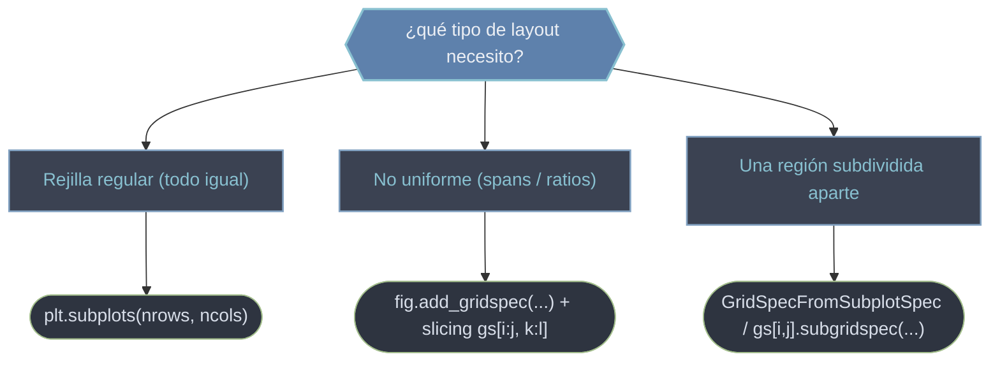

# gridspec — Layout de subgráficos: repartir Axes en una rejilla

`GridSpec` define una **rejilla de celdas** sobre la figura y permite colocar Axes en ella con control fino del **tamaño relativo** de filas y columnas y del **espaciado** entre celdas. Es el motor de layout que usa [[plt.subplots]] por debajo, pero expuesto para lo que `subplots` no puede expresar: disposiciones **no uniformes**, donde un Axes abarca varias celdas (un *span*), o donde unas columnas son más anchas que otras. La idea operativa es: declaras la rejilla (`nrows`, `ncols`) y luego pides cada Axes indexando como si fuera un array (`gs[0:2, 0]`). Esta carpeta cubre la rejilla principal y su anidamiento (una sub-rejilla dentro de una celda).

## En acción

Un dashboard con un panel principal grande (que abarca 2×2 celdas), una columna lateral y una banda inferior, con anchos desiguales mediante `width_ratios`.

```python
import matplotlib.pyplot as plt
import numpy as np

fig = plt.figure(figsize=(8, 6), constrained_layout=True)
gs = fig.add_gridspec(3, 3, width_ratios=[2, 1, 1], height_ratios=[1, 1, 1])

ax_main  = fig.add_subplot(gs[0:2, 0:2])   # abarca un bloque 2x2
ax_lat   = fig.add_subplot(gs[0:2, 2])     # columna derecha, dos filas
ax_abajo = fig.add_subplot(gs[2, :])       # fila inferior completa

x = np.linspace(0, 10, 200)
ax_main.plot(x, np.sin(x))
ax_lat.plot(np.cos(x), x)
ax_abajo.bar(range(8), np.random.rand(8))
ax_main.set_title("panel principal (span 2x2)")
```

Claves: `add_gridspec(...)` declara la rejilla, **el slicing** (`gs[0:2, 0:2]`) crea Axes que abarcan varias celdas, y `width_ratios` da los tamaños **relativos** de las columnas. La rejilla no crea Axes por sí sola: hay que `add_subplot(gs[...])` para cada uno.

## El manejo del layout



| Vía | Cuándo |
|-----|--------|
| `plt.subplots(2, 2)` | rejilla regular simple |
| `gridspec_kw={"width_ratios": [...]}` en `subplots` | rejilla regular con tamaños desiguales |
| `fig.add_gridspec(...)` + slicing | layouts con *spans* (un Axes ocupa varias celdas) |
| `GridSpecFromSubplotSpec` / `subgridspec` | subdividir una celda en su propia rejilla |
| `plt.subplot_mosaic(...)` | layouts con nombres (alto nivel, más legible) |

## Qué hay en esta carpeta

| Nota | Para qué |
|------|----------|
| [[GridSpec]] | La rejilla principal: `width_ratios`/`height_ratios`, `wspace`/`hspace` y los **spans** vía slicing (`gs[0:2, :]`) para layouts no uniformes. |
| [[GridSpecFromSubplotSpec]] | Una **sub-rejilla anidada** dentro de una celda del padre: layouts complejos (p. ej. gráfico + panel de residuales) sin afectar al resto. |

> [!tip] Para rejillas regulares basta plt.subplots
> Reserva `GridSpec` para cuando necesites *spans* o ratios desiguales. `fig.add_gridspec(...)` es la forma moderna recomendada; activa `constrained_layout=True` en la figura para que el espaciado se resuelva solo, sobre todo con sub-rejillas anidadas.

## Notas relacionadas

- [[plt.subplots]] — el atajo de alto nivel para rejillas regulares
- [[figure.add_subplot]] — crear cada Axes a partir de una celda del GridSpec
- [[concepto_figure_axes]] — el modelo Figure / Axes que el layout reparte
- [[Matplotlib/index\|Matplotlib]] — el índice raíz
