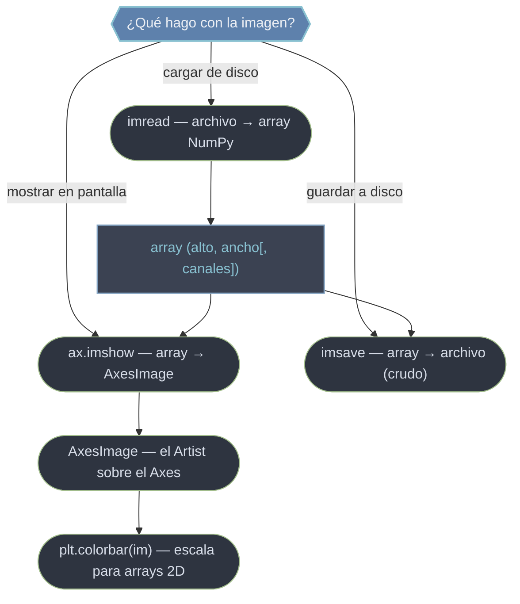

# image — imágenes y arrays como píxeles

El módulo `matplotlib.image` trata las imágenes como lo que son para Matplotlib: **arrays NumPy de píxeles**. Una imagen RGB es un array `(alto, ancho, 3)`, una con transparencia `(alto, ancho, 4)`, y una matriz numérica cualquiera `(alto, ancho)` puede mostrarse como mapa de calor coloreándola con un colormap. El Artist que pinta esos píxeles sobre un Axes es `AxesImage`, y lo crea `ax.imshow`. Igual que las demás primitivas, `AxesImage` es un [[concepto_artist|Artist]] y comparte `.set_alpha`, `.set_zorder` y `.set_visible`. Este módulo aporta además las dos funciones de entrada/salida: `imread` para **cargar** un archivo a un array, e `imsave` para **escribir** un array crudo a disco (sin ejes ni decoración, a diferencia de `fig.savefig`).

## En acción

```python
import matplotlib.pyplot as plt
import numpy as np

# un array 2D escalar (no una foto): valores numéricos a mapear a color
Z = np.random.rand(20, 20)

fig, ax = plt.subplots(figsize=(5, 4))
im = ax.imshow(Z, cmap="viridis", origin="upper")   # → AxesImage
fig.colorbar(im, ax=ax, label="valor")              # leyenda de la escala
ax.set_title("imshow de un array 2D")
plt.show()
```

## El flujo de una imagen



La cadena habitual es `imread → (operar con NumPy) → imshow`, o bien `array → imsave` para exportar. Detalle de formatos que conviene tener presente: PNG vuelve como `float32` en `0..1`, mientras que JPG (vía Pillow) vuelve como `uint8` en `0..255`.

## Las piezas de este módulo

- [[imread]] — **cargar**. Lee un archivo (PNG, JPG...) y devuelve un array `(alto, ancho, canales)`. No dibuja: solo trae los píxeles a memoria. Permite recortar o aislar canales con indexación NumPy antes de mostrar.
- [[imsave]] — **guardar crudo**. Escribe un array a disco como imagen, **solo los datos**, sin ejes ni márgenes. Aplica un `cmap` (con `vmin`/`vmax`) si el array es 2D. Es la inversa de `imread`, y el contrapunto de `fig.savefig`.

| Quiero… | Ir a |
|---------|------|
| Leer una imagen de disco a un array | [[imread]] |
| Guardar un array como imagen (sin ejes) | [[imsave]] |
| Mostrar un array/imagen en unos ejes | [[ax.imshow]] |
| El Artist de imagen sobre el Axes | [[AxesImage]] |
| Guardar la figura completa (con ejes y títulos) | [[fig.savefig]] |

> [!tip] `imsave` vs `fig.savefig`
> `imsave` guarda el **array crudo** píxel a píxel, sin decoración. `fig.savefig` renderiza la **figura completa**: ejes, ticks, título, márgenes. Para exportar un mapa de calor "limpio", usa `imsave`; para una figura presentable, usa `fig.savefig`.

> [!warning] Origen y normalización
> El origen por defecto de `imshow` es la **esquina superior** (`origin='upper'`): la fila 0 va arriba. Y si un mapa de calor sale todo negro/blanco, suele ser por un rango fuera de `0..1` sin normalizar: pasa `vmin`/`vmax` o normaliza el array.

## Notas relacionadas

- [[ax.imshow]] — pintar el array como imagen
- [[concepto_artist]] — la herencia común (`set_alpha`, `set_zorder`, `set_visible`)
- [[Colormaps]] — colorear arrays 2D escalares
- [[Tree Matplotlib]] — mapa completo del vault
