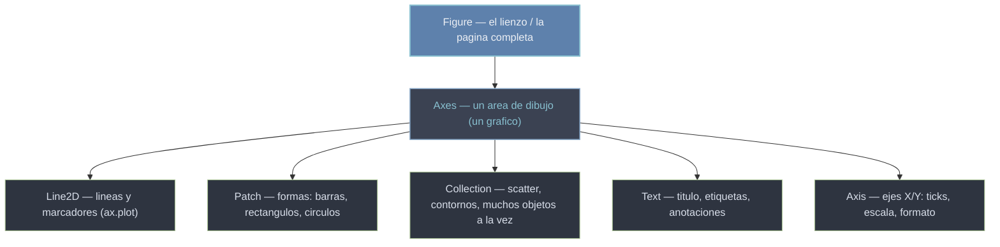

# Matplotlib — visualización con el modelo Figure / Axes / Artists

Matplotlib es la librería de **graficación** de referencia en Python. Su idea central no es "llamar funciones que dibujan", sino **construir un árbol de objetos**: una `Figure` (el lienzo) contiene uno o varios `Axes` (cada área de dibujo), y cada `Axes` contiene los **Artists** que ves —líneas, barras, texto, leyendas—. Entender ese árbol es entender Matplotlib: casi todo lo que quieras cambiar es un atributo de algún objeto de esa jerarquía.

## En acción

```python
import matplotlib.pyplot as plt
import numpy as np

x = np.linspace(0, 10, 200)

fig, ax = plt.subplots(figsize=(8, 4))   # Figure + un Axes
ax.plot(x, np.sin(x), label="sin(x)")    # crea un Line2D dentro del Axes
ax.plot(x, np.cos(x), "--", label="cos(x)")
ax.set_title("Funciones trigonométricas")
ax.set_xlabel("x (radianes)")
ax.legend()                              # leyenda a partir de los label
fig.savefig("grafico.png", dpi=150)      # exportar
plt.show()
```

## El modelo de objetos



Todo Artist desciende de la clase base `Artist` y comparte atributos como `.set_visible()`, `.set_alpha()` o `.set_zorder()`. Por eso, una vez que sabes manipular un objeto, sabes manipularlos casi todos.

## Dos interfaces (elige una)

| Interfaz | Estilo | Cuándo |
|----------|--------|--------|
| **Orientada a objetos** (`ax.plot`, `ax.set_title`) | explícita: trabajas sobre `fig`/`ax` | **recomendada** siempre; obligatoria con varios subgráficos |
| **pyplot / estilo MATLAB** (`plt.plot`, `plt.title`) | implícita: actúa sobre el "axes actual" | scripts rápidos de un solo gráfico |

> [!tip] Regla de oro
> Crea `fig, ax = plt.subplots()` y trabaja siempre sobre `ax`. La interfaz `plt.*` solo conviene para un vistazo rápido. Mezclar ambas (`plt.xlabel` después de `ax.plot`) es la fuente nº1 de confusión.

## Sintaxis base recurrente

| Acción | Código | Parámetros útiles |
|--------|--------|-------------------|
| Línea | `ax.plot(x, y, label="...", marker="o")` | `color`, `linewidth`, `linestyle`, `alpha` |
| Dispersión | `ax.scatter(x, y, c=z, s=20)` | `c` (color), `s` (tamaño), `cmap` |
| Título / ejes | `ax.set_title("...")` · `ax.set_xlabel("...")` | `fontsize`, `fontweight`, `pad` |
| Leyenda | `ax.legend(loc="best")` | `frameon`, `ncol`, `bbox_to_anchor` |
| Cuadrícula | `ax.grid(True, alpha=0.3)` | `axis` (`'x'`, `'y'`, `'both'`) |
| Límites | `ax.set_xlim(0, 10)` · `ax.set_ylim(...)` | — |
| Escala | `ax.set_xscale("log")` | `'linear'`, `'log'`, `'symlog'` |
| Guardar | `fig.savefig("f.png", dpi=150)` | `bbox_inches="tight"`, `transparent` |

## Buenas prácticas

1. **API orientada a objetos siempre**: `fig, ax = plt.subplots()` y luego `ax.*`.
2. **Definir `label` al graficar** (`ax.plot(x, y, label="serie")`) para que `ax.legend()` sea automático.
3. **`figsize`** para controlar proporciones: `plt.subplots(figsize=(10, 4))` (ancho × alto en pulgadas).
4. **`grid(True, alpha=0.3)`** en análisis exploratorio para leer valores.
5. **Cerrar figuras en bucles** (`plt.close(fig)`) tras `savefig` para evitar fugas de memoria.

## Cómo navegar el vault

| Quiero… | Ir a |
|---------|------|
| Los conceptos base (Figure/Axes/Artist, OO vs pyplot) | [[Matplotlib/conceptos_transversales/index\|conceptos_transversales]] |
| Funciones `plt.*` (crear figuras, mostrar, guardar) | [[Matplotlib/pyplot/funciones/index\|pyplot]] |
| Métodos del `Axes` (graficar, formato, anotar) | [[Matplotlib/axes/index\|axes]] |
| El objeto `Figure` (layout global, guardar) | [[Matplotlib/figure/index\|figure]] |
| Primitivas: líneas, formas, texto, colecciones | [[Matplotlib/lines/index\|lines]] · [[Matplotlib/patches/index\|patches]] · [[Matplotlib/text/index\|text]] · [[Matplotlib/collections/index\|collections]] |
| Color y mapas de color | [[Matplotlib/colors/index\|colors]] · [[Matplotlib/cm/index\|cm]] |
| Layout de subgráficos | [[Matplotlib/gridspec/index\|gridspec]] |
| Leyendas y ejes (ticks/formato) | [[Matplotlib/legend/index\|legend]] · [[Matplotlib/ticker/index\|ticker]] |
| Imágenes | [[Matplotlib/image/index\|image]] |
| Estilos, backend y animación | [[Matplotlib/config/index\|config]] · [[Matplotlib/backend/index\|backend]] · [[Matplotlib/animation/index\|animation]] |
| Gráficos 3D | [[Matplotlib/toolkits/mplot3d/index\|mplot3d]] |

## Notas relacionadas

- [[plt.subplots]] — el punto de entrada habitual (`fig, ax = ...`)
- [[ax.plot]] — el gráfico más usado
