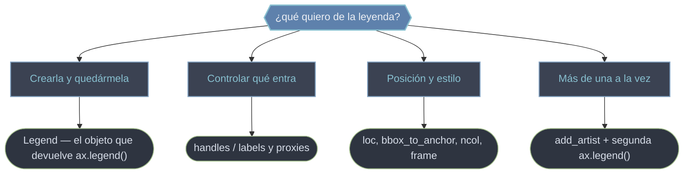

# legend — Leyendas: asociar muestras de color/estilo a etiquetas

Una **leyenda** es el recuadro que asocia cada **handle** (la muestra: una línea, un marcador, un parche) con su **label** (el texto que explica qué representa). El flujo habitual es implícito: das un `label=` a cada elemento al dibujarlo y llamas `ax.legend()`, que lee esos labels y construye el objeto `Legend`. Pero todo es controlable: dónde se coloca (`loc`, `bbox_to_anchor`), cómo se ve (columnas, marco, fuente), qué entradas aparecen (handles/labels explícitos, proxies para cosas que no dibujan un artista) e incluso tener **varias leyendas a la vez** en un mismo Axes. Esta carpeta separa esas cuatro preguntas: el objeto, el control de handles, la personalización y las múltiples leyendas.

## En acción

Una leyenda colocada fuera del Axes con `bbox_to_anchor` y un **proxy** (un handle artificial) para una entrada que no corresponde a ninguna curva real.

```python
import matplotlib.pyplot as plt
from matplotlib.patches import Patch
import numpy as np

x = np.linspace(0, 10, 200)
fig, ax = plt.subplots(figsize=(7, 4))
ax.plot(x, np.sin(x), label="seno")
ax.fill_between(x, np.sin(x) - 0.2, np.sin(x) + 0.2, alpha=0.3)

# handle personalizado (proxy): muestra sin artista real en el Axes
banda = Patch(facecolor="C0", alpha=0.3, label="banda ±0.2")

handles, labels = ax.get_legend_handles_labels()   # los detectados por label=
handles.append(banda)                              # añadir el proxy

ax.legend(
    handles=handles,
    loc="upper left",                # qué esquina de la leyenda se ancla
    bbox_to_anchor=(1.02, 1.0),      # punto de anclaje fuera del Axes
    frameon=True, framealpha=0.6,
)
fig.tight_layout()                    # reserva sitio para la leyenda externa
```

`loc` indica **qué esquina de la leyenda** toca el punto de `bbox_to_anchor`; valores `>1` o `<0` la sacan del Axes. `tight_layout()` evita que quede recortada.

## El manejo de leyendas



| Concepto | Qué resuelve | Llamada típica |
|----------|--------------|----------------|
| Handles + labels | qué muestras y textos aparecen | `ax.legend(handles, labels)` |
| `loc` | posición dentro del Axes | `ax.legend(loc='upper right')` |
| `bbox_to_anchor` | sacar la leyenda fuera del Axes | `ax.legend(bbox_to_anchor=(1.02, 1))` |
| Proxy artist | entrada sin artista real (relleno, categoría) | `Patch(...)` / `Line2D([0],[0], ...)` |
| Varias leyendas | apilar leyendas en un Axes | `ax.add_artist(leg1)` antes de la 2ª |

## Qué hay en esta carpeta

| Nota | Para qué |
|------|----------|
| [[Legend]] | El **objeto** `Legend` que devuelve `ax.legend()`: guardarlo permite reestilizar (`get_frame`, `get_texts`), ocultar o hacerlo arrastrable. |
| [[handles_labels]] | Control **explícito** de handles y labels: reordenar, filtrar y crear **proxies** para entradas sin artista real. |
| [[Personalizacion_Leyendas]] | Catálogo de kwargs de posición, layout y estilo: códigos de `loc`, `bbox_to_anchor`, `ncol`, marco, fuente, título. |
| [[Multiples_Leyendas]] | Mostrar **varias leyendas a la vez** en un mismo Axes con el patrón `ax.add_artist`. |

> [!tip] Cada ax.legend() borra la anterior
> Solo puede haber una leyenda "oficial" por Axes: cada llamada la reemplaza. Para tener dos, crea la primera, re-regístrala con `ax.add_artist(leg1)` y crea la segunda con un `loc` distinto.

## Notas relacionadas

- [[ax.legend]] — el método que construye la leyenda
- [[concepto_artist]] — `Legend` es un `Artist` más: comparte el protocolo `get_*`/`set_*`
- [[Patch]] — el parche típico para un proxy de relleno
- [[Matplotlib/index\|Matplotlib]] — el índice raíz
