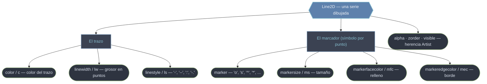

# lines — la línea (Line2D) y su estilo

El módulo `matplotlib.lines` define `Line2D`, el **Artist más básico** de un gráfico: la línea con marcadores que devuelve `ax.plot`. No se trata de "dibujar una línea" y olvidarse, sino de **obtener un objeto** que vive en el árbol de la figura y que puedes recolorear, reanchar, repuntear o reanimar después con sus métodos `set_*` / `get_*`. Todo lo que ves de una serie —el color, el grosor del trazo, el patrón de guiones, la forma del símbolo en cada punto— son propiedades de ese único objeto. Como buen [[concepto_artist|Artist]], comparte `.set_visible`, `.set_alpha`, `.set_zorder` y `.set_color` con el resto de primitivas: lo que aprendes aquí se traslada a patches, text e imágenes.

## En acción

```python
import matplotlib.pyplot as plt
import numpy as np

x = np.linspace(0, 10, 30)

fig, ax = plt.subplots(figsize=(8, 4))
linea, = ax.plot(x, np.sin(x))      # la coma desempaqueta la lista de 1 Line2D

# personalizar la línea como objeto, no como llamada a plot
linea.set_color("crimson")          # color del trazo
linea.set_linewidth(2.5)            # grosor en puntos (alias lw)
linea.set_linestyle("--")           # patrón de guiones (alias ls)
linea.set_marker("o")               # forma del símbolo en cada punto
linea.set_markersize(7)             # tamaño del marcador (alias ms)
linea.set_markerfacecolor("white")  # relleno del marcador (mfc)
linea.set_markeredgecolor("crimson")# borde del marcador (mec)

# atajo equivalente, todo de una vez:
# linea.set(color="crimson", lw=2.5, ls="--", marker="o", ms=7)

ax.set_title("Una Line2D personalizada")
plt.show()
```

## Anatomía de una línea



Cada propiedad se lee con `get_<prop>()` y se escribe con `set_<prop>(valor)`; el atajo `linea.set(color=..., lw=..., ls=...)` agrupa varias en una sola llamada. La última fila del diagrama (`alpha`, `zorder`, `visible`) no es exclusiva de la línea: la hereda de la clase base `Artist`.

## Las piezas de este módulo

- [[Line2D]] — **la clase**. El objeto que devuelve `ax.plot`; cómo guardar su referencia (`linea, = ...`), mutar sus datos con `set_ydata` para animar, y crear líneas "proxy" para leyendas.
- [[marker]] — **el catálogo de marcadores**. Códigos de un carácter (`'o'`, `'s'`, `'^'`, `'*'`), marcadores especiales (texto LaTeX `'$\heartsuit$'`, tuplas `(numsides, style, angle)`) y cómo controlar relleno/borde.
- [[Estilos_Linea]] — **el patrón del trazo**. Los cuatro predefinidos (`'-'`, `'--'`, `':'`, `'-.'`) y patrones de guiones a medida con tuplas `(offset, (on, off, ...))`.
- [[Colores_Nombres]] — **cómo nombrar un color**. Nombres CSS, letras cortas, ciclo `'C0'`–`'C9'`, hex, tuplas RGB(A), grises y paletas `'tab:...'` / `'xkcd:...'`.

| Quiero… | Ir a |
|---------|------|
| El objeto línea, mutarlo, animarlo | [[Line2D]] |
| Elegir la forma del símbolo de cada punto | [[marker]] |
| Cambiar el patrón del trazo (continuo, guiones, puntos) | [[Estilos_Linea]] |
| Especificar un color (nombre, hex, ciclo, RGB) | [[Colores_Nombres]] |
| El formato compacto `'r--o'` (color+estilo+marcador) | [[ax.plot]] |

> [!tip] El `fmt` compacto
> `ax.plot(x, y, "r--o")` combina color (`r`), estilo de línea (`--`) y marcador (`o`) en un solo string. Cómodo para un vistazo rápido; para control fino, usa los kwargs (`color=`, `ls=`, `marker=`) o muta el `Line2D` con `set_*`.

## Notas relacionadas

- [[ax.plot]] — el método que crea las `Line2D`
- [[concepto_artist]] — la herencia común (`set_alpha`, `set_zorder`, `set_visible`)
- [[ax.legend]] — usar el `label` de cada línea
