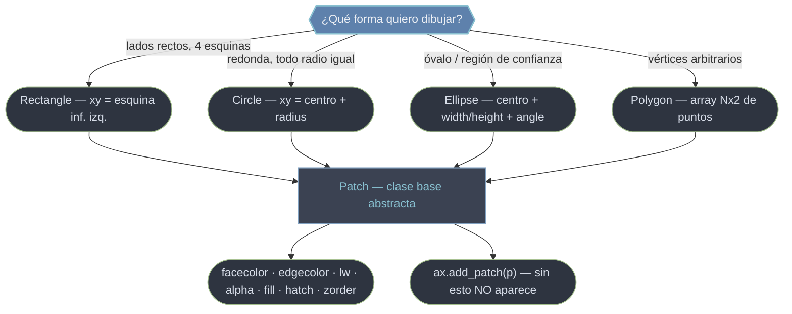

# patches — formas geométricas rellenas

El módulo `matplotlib.patches` contiene las **formas geométricas rellenas**: rectángulos, círculos, elipses, polígonos, cuñas, flechas. Todas heredan de una misma clase base abstracta, `Patch`, que aporta las propiedades de estilo (relleno, borde, transparencia, tramado) y, a su vez, hereda de [[concepto_artist|Artist]] el `.set_visible`, `.set_alpha`, `.set_zorder` y `.set_color` comunes a toda primitiva. Hay un detalle que diferencia a un `Patch` de una línea de `ax.plot`: **no se dibuja solo**. Hay que registrarlo en el Axes con `ax.add_patch(p)`; sin esa llamada, la forma existe en memoria pero no aparece. Internamente, son la materia prima de cosas que usas a diario: cada barra de `ax.bar` es un `Rectangle`.

## En acción

```python
import matplotlib.pyplot as plt
from matplotlib.patches import Rectangle, Circle

fig, ax = plt.subplots(figsize=(5, 5))
ax.set_aspect("equal")          # para que el círculo no salga ovalado

# Rectangle: xy es la ESQUINA inferior izquierda + width + height
rect = Rectangle((0.15, 0.20), 0.5, 0.3,
                 facecolor="lightblue", edgecolor="navy", lw=2)
ax.add_patch(rect)              # ← imprescindible: lo registra en ax.patches

# Circle: xy es el CENTRO + radius
circ = Circle((0.7, 0.7), 0.15,
              facecolor="lightcoral", edgecolor="darkred", alpha=0.6)
ax.add_patch(circ)

plt.show()
```

## ¿Qué forma necesito?



Las propiedades de estilo (`facecolor`/`fc`, `edgecolor`/`ec`, `linewidth`/`lw`, `alpha`, `fill`, `hatch`, `zorder`) **no las define cada forma**: las hereda toda de `Patch`. Por eso, una vez que sabes estilizar un `Rectangle`, sabes estilizar cualquier patch.

## Las piezas de este módulo

- [[Patch]] — **la clase base**. Abstracta: no se instancia sola. Define todos los kwargs de estilo que comparten las subclases y la regla del `ax.add_patch`. Sirve además de "handle" proxy para leyendas.
- [[Rectangle]] — **rectángulo**. Definido por su **esquina inferior izquierda** + `width` + `height` (con `angle` opcional). La pieza con la que se construyen las barras de `ax.bar`; ideal para resaltar bandas.
- [[Circle]] — **círculo**. Definido por **centro** + `radius`. Ojo: el radio está en datos, así que necesita `ax.set_aspect('equal')` para verse redondo.
- [[Ellipse]] — **elipse**. **Centro** + `width`/`height` (diámetros, no semiejes) + `angle`. El caso general del círculo; útil para regiones de confianza por covarianza.
- [[Polygon]] — **polígono**. Array `Nx2` de vértices; `closed=True/False` para cerrar o dejar abierta una polilínea. Triángulos, formas irregulares, áreas a medida.

| Quiero… | Ir a |
|---------|------|
| Entender los kwargs de estilo comunes y `add_patch` | [[Patch]] |
| Una caja o resaltar una banda rectangular | [[Rectangle]] |
| Un disco o un halo alrededor de un punto | [[Circle]] |
| Un óvalo o una región de dispersión | [[Ellipse]] |
| Una forma de vértices arbitrarios | [[Polygon]] |

> [!warning] La trampa del posicionamiento
> `Rectangle` se ancla por la **esquina inferior izquierda**; `Circle` y `Ellipse` por el **centro**. Confundirlos descentra la forma. Y recuerda: las formas no autoajustan los límites del eje —usa `ax.autoscale()` o fija `xlim`/`ylim`.

## Notas relacionadas

- [[ax.add_patch]] — registrar la forma en el Axes
- [[concepto_artist]] — la herencia común (`set_alpha`, `set_zorder`, `set_visible`)
- [[PatchCollection]] — para muchas formas iguales, más eficiente que añadir cientos sueltas
- [[Tree Matplotlib]] — mapa completo del vault
