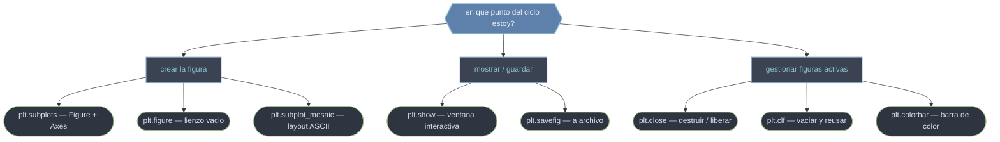

# funciones — Las funciones plt.* para crear, mostrar, guardar y gestionar figuras

Esta carpeta reúne las **funciones de módulo de pyplot** que rodean el ciclo de vida de una figura. Se organizan por la tarea que resuelven. **Crear la figura**: `plt.subplots` (Figure + rejilla de Axes en una línea, el punto de entrada moderno), `plt.figure` (un lienzo vacío de bajo nivel) y `plt.subplot_mosaic` (layouts irregulares descritos con arte ASCII). **Mostrar y guardar**: `plt.show` (render a ventana interactiva) y `plt.savefig` (escribir a disco, sin necesidad de pantalla). **Gestionar las figuras activas**: `plt.close` (destruir una figura y liberar memoria), `plt.clf` (vaciar el contenido conservando la ventana) y `plt.colorbar` (añadir una barra de color a un mappable). Dominar este grupo es dominar el esqueleto de cualquier script de graficación: crear, dibujar, mostrar o guardar, y limpiar.

## En acción

```python
import matplotlib.pyplot as plt
import numpy as np

x = np.linspace(0, 10, 200)
series = [np.sin(x), np.cos(x), np.tan(x / 5)]

for i, y in enumerate(series):
    fig, ax = plt.subplots(figsize=(6, 4))   # crear
    ax.plot(x, y)
    ax.set_title(f"Serie {i}")

    fig.savefig(f"serie_{i}.png", dpi=120)   # guardar a disco
    plt.show()                               # mostrar en ventana
    plt.close(fig)                           # cerrar y liberar memoria
```

El ciclo completo en cuatro funciones: `subplots` crea, `savefig` guarda, `show` muestra y `close` limpia. Cerrar cada figura del bucle es lo que evita el aviso *"More than 20 figures opened"*.

## Las funciones agrupadas por tarea



## Las funciones una a una

### Crear la figura

- [[plt.subplots]] — crea una `Figure` y una rejilla de `Axes` y los devuelve juntos: `fig, ax = plt.subplots()`. El punto de entrada moderno. Controla `nrows`/`ncols`, `sharex`/`sharey` y, vía `**fig_kw`, `figsize`/`dpi`. El parámetro `squeeze` decide si `axs` es un objeto único, un array 1D o 2D.
- [[plt.figure]] — crea (o reactiva) una `Figure` **vacía**, sin Axes, y la convierte en la figura actual. Constructor de bajo nivel: lo usas cuando construyes el layout a mano con `add_subplot`/`add_axes`. El argumento `num` identifica la figura para reabrirla.
- [[plt.subplot_mosaic]] — construye layouts **irregulares** describiéndolos con arte ASCII (`"AB;CC"`) o listas anidadas; devuelve la figura y un `dict {nombre: Axes}`. Usa `constrained_layout` por defecto. Ideal cuando el layout es irregular pero estable.

### Mostrar y guardar

- [[plt.show]] — dispara el render de todas las figuras abiertas y las muestra en ventana interactiva. Con backend interactivo **bloquea** el script (`block=False` lo evita). Requiere entorno gráfico: en un servidor headless no tiene dónde dibujar.
- [[plt.savefig]] — renderiza la figura actual y la escribe a disco; el **formato se deduce de la extensión** (`.png`, `.pdf`, `.svg`). No necesita pantalla. Claves: `dpi` (raster), `bbox_inches='tight'` (recortar márgenes) y `transparent`.

### Gestionar las figuras activas

- [[plt.close]] — cierra una figura, destruye su ventana y libera memoria. Acepta `None` (actual), una `Figure`, un id o `'all'`. **Crítico en bucles** que generan muchas figuras.
- [[plt.clf]] — vacía la figura actual (elimina ejes y Artists) pero **conserva la ventana** para reutilizarla. Punto intermedio entre no hacer nada y `close`. Para un solo Axes existe `plt.cla()`.
- [[plt.colorbar]] — añade una **barra de color** que traduce los colores de un mappable (`imshow`, `scatter`, `contourf`) a valores numéricos. Devuelve un `Colorbar` configurable; conviene pasar el `mappable` explícito.

## Tabla resumen

| Función | Retorna | Tarea | Rol |
|---------|---------|-------|-----|
| [[plt.subplots]] | `(Figure, Axes/ndarray)` | crear | Figure + rejilla de Axes en una línea |
| [[plt.figure]] | `Figure` | crear | Lienzo vacío de bajo nivel |
| [[plt.subplot_mosaic]] | `(Figure, dict)` | crear | Layout irregular con nombres (ASCII) |
| [[plt.show]] | `None` | mostrar | Render a ventana interactiva (bloquea) |
| [[plt.savefig]] | `None` | guardar | Escribir la figura a archivo |
| [[plt.close]] | `None` | gestionar | Destruir figura y liberar memoria |
| [[plt.clf]] | `None` | gestionar | Vaciar la figura conservando la ventana |
| [[plt.colorbar]] | `Colorbar` | gestionar | Barra de color para un mappable |

> [!tip] El orden importa: guarda con [[plt.savefig]] **antes** de [[plt.show]], porque algunos backends interactivos limpian la figura al mostrarla.

## Notas relacionadas

- [[Figure]] — el objeto que estas funciones construyen y manipulan
- [[fig.add_subplot]] — la alternativa OO de bajo nivel a `plt.subplots`
- [[constrained_layout]] — el motor de layout que `subplot_mosaic` usa por defecto
- [[concepto_pyplot_vs_oo]] — la frontera entre estado de pyplot y API OO
