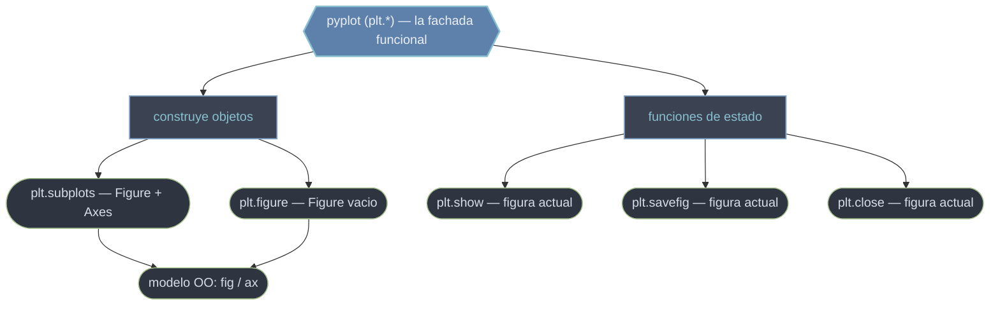

# pyplot — La interfaz funcional plt.* sobre el modelo de objetos

`pyplot` (importado casi siempre como `plt`) es la **interfaz funcional** de Matplotlib: una colección de funciones de módulo —`plt.subplots`, `plt.figure`, `plt.show`, `plt.savefig`, `plt.close`...— que sirven de **fachada** sobre el modelo de objetos `Figure`/`Axes`. Su papel es doble. Por un lado, funciones como `plt.subplots()` o `plt.figure()` **construyen** la jerarquía de objetos y te la devuelven para que trabajes con la API orientada a objetos. Por otro, mantiene un estado implícito —la "figura actual" y el "Axes actual"— sobre el que operan las funciones de estado al estilo MATLAB (`plt.plot`, `plt.title`). Entender pyplot es entender esa frontera: dónde es solo un constructor cómodo y dónde introduce estado global.

## En acción

```python
import matplotlib.pyplot as plt
import numpy as np

x = np.linspace(0, 2 * np.pi, 200)

# plt.subplots: la fachada CONSTRUYE Figure + Axes y te los entrega
fig, ax = plt.subplots(figsize=(8, 4))

# A partir de aquí, trabajo orientado a objetos sobre fig / ax
ax.plot(x, np.sin(x), label="sin(x)")
ax.set_title("Función seno")
ax.legend()

# Funciones de estado finales: actúan sobre la figura actual
plt.savefig("seno.png", dpi=150)   # guardar
plt.show()                         # mostrar en ventana
```

El patrón idiomático es `fig, ax = plt.subplots()`: dejas que pyplot cree los objetos, pero después trabajas con ellos directamente. `plt.savefig` y `plt.show` cierran el ciclo operando sobre la figura actual.

## pyplot como fachada del modelo de objetos



A la izquierda, las funciones constructoras (`subplots`, `figure`) **crean** `Figure`/`Axes` y te los devuelven. A la derecha, las funciones de estado (`show`, `savefig`, `close`) operan sobre la **figura actual** implícita. La recomendación moderna es usar pyplot solo para construir y para las operaciones finales, y trabajar el contenido con la API OO.

## pyplot vs API orientada a objetos

| Interfaz | Estilo | Cuándo |
|----------|--------|--------|
| **pyplot / estilo MATLAB** (`plt.plot`, `plt.title`) | implícita: actúa sobre el "Axes actual" | scripts rápidos de un solo gráfico |
| **Orientada a objetos** (`ax.plot`, `ax.set_title`) | explícita: trabajas sobre `fig`/`ax` | **recomendada** siempre; obligatoria con varios subgráficos |

> [!tip] Regla de oro
> Usa `fig, ax = plt.subplots()` para que pyplot construya los objetos, y trabaja después sobre `ax`. Reserva las funciones `plt.*` de estado (`show`, `savefig`, `close`) para el principio y el final del flujo.

## Qué encontrarás aquí

- [[funciones/index|funciones]] — la subcarpeta con las funciones `plt.*` desglosadas una a una: crear figuras (`subplots`, `figure`), mostrarlas y guardarlas (`show`, `savefig`), y gestionar las figuras activas (`close`, `clf`). Cada función con su firma, parámetros y casos de uso.

## Cómo navegar

| Quiero… | Ir a |
|---------|------|
| Crear Figure + Axes en una línea | [[plt.subplots]] |
| Crear un lienzo vacío para construirlo a mano | [[plt.figure]] |
| Mostrar las figuras en ventana | [[plt.show]] |
| Guardar la figura actual a archivo | [[plt.savefig]] |
| Cerrar figuras y liberar memoria | [[plt.close]] |
| Ver todas las funciones agrupadas por tarea | [[funciones/index\|funciones]] |

## Notas relacionadas

- [[Figure]] — el objeto que las funciones de pyplot construyen y manipulan
- [[plt.subplots]] — el punto de entrada habitual a la librería
- [[concepto_pyplot_vs_oo]] — la frontera entre la interfaz de estado y la API OO
- [[concepto_figure_axes]] — la jerarquía de objetos sobre la que opera pyplot
