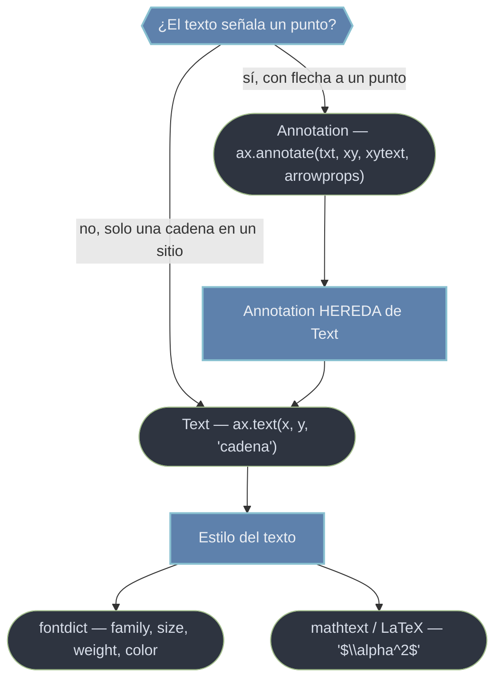

# text — texto, anotaciones y matemáticas

El módulo `matplotlib.text` cubre todo lo escrito sobre un gráfico: títulos, etiquetas de ejes, leyendas, notas sueltas y anotaciones con flecha. La pieza central es `Text`, el [[concepto_artist|Artist]] que representa **una cadena dibujada**; cada vez que llamas a `ax.set_title`, `ax.set_xlabel` o `ax.text` estás creando uno. `Annotation` es una **subclase** de `Text` que añade un punto señalado y una flecha. Como Artists, ambos comparten `.set_visible`, `.set_alpha`, `.set_zorder` y `.set_color` con líneas y formas: se manipulan con `set_*` / `get_*` en lugar de recrearse. El estilo de fuente (familia, tamaño, peso) y las fórmulas matemáticas (`$...$`) son ortogonales al objeto y se documentan aparte.

## En acción

```python
import matplotlib.pyplot as plt
import numpy as np

x = np.linspace(0, 10, 200)
y = np.sin(x)

fig, ax = plt.subplots(figsize=(8, 4))
ax.plot(x, y)

# Text: una cadena suelta colocada en coordenadas de datos
t = ax.text(1.5, 0.9, "región inicial",
            fontsize=12, color="navy",
            bbox=dict(boxstyle="round", facecolor="wheat"))

# Annotation: texto CON flecha que apunta a un punto concreto
imax = y.argmax()
ax.annotate(r"máximo $\sin(x)=1$",
            xy=(x[imax], y[imax]),          # punto señalado
            xytext=(x[imax] + 1, 1.4),      # dónde va la cadena
            arrowprops=dict(arrowstyle="->", color="crimson"))

plt.show()
```

## Text vs Annotation



La diferencia es de **propósito**: `Text` coloca una cadena; `Annotation` la coloca y, además, traza una flecha desde `xytext` (dónde va el texto) hasta `xy` (qué señala). Confundir esos dos puntos invierte la flecha. Si no pasas `arrowprops`, `annotate` se comporta como un `Text` desplazado.

## Las piezas de este módulo

- [[Text]] — **la clase de texto**. El objeto que devuelve `ax.text`; propiedades clave (`set_text`, `set_position`, `ha`/`va` de alineación, `rotation`, caja de fondo `bbox`) y cómo mutarlo en lugar de recrearlo.
- [[Annotation]] — **texto con flecha**. Subclase de `Text` que añade `xy` (punto señalado), `xytext` (posición del texto) y el dict `arrowprops` (`arrowstyle`, `connectionstyle` para curvar). Mezcla coordenadas de datos y de eje.
- [[fontdict]] — **el estilo de fuente**. Familia, tamaño, peso, estilo y color, vía kwargs sueltos, dict `fontdict={...}` o global con `rcParams['font.*']`.
- [[LaTeX_mathtext]] — **matemáticas en el texto**. `mathtext` (subconjunto TeX sin instalar nada, entre `$...$`) frente a LaTeX completo (`text.usetex=True`). Usa siempre raw strings `r'...'`.

| Quiero… | Ir a |
|---------|------|
| Colocar una cadena suelta y darle estilo | [[Text]] |
| Señalar un punto con una flecha | [[Annotation]] |
| Cambiar fuente, tamaño, peso o color del texto | [[fontdict]] |
| Escribir símbolos griegos, fracciones, integrales | [[LaTeX_mathtext]] |

> [!tip] Coordenadas relativas al eje
> Por defecto el texto va en coordenadas de **datos**. Para anclarlo a una posición fija del recuadro (p. ej. esquina superior izquierda), usa `transform=ax.transAxes` en `ax.text`, o `textcoords='axes fraction'` en `ax.annotate`, con valores 0..1.

## Notas relacionadas

- [[ax.text]] — crear un `Text`
- [[ax.annotate]] — crear una `Annotation`
- [[concepto_artist]] — la herencia común (`set_alpha`, `set_zorder`, `set_visible`)
- [[Tree Matplotlib]] — mapa completo del vault
