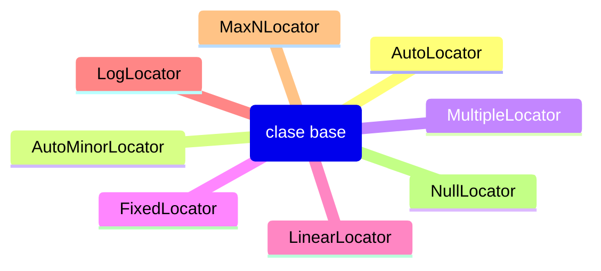

# Locators — Generación automática de ticks

## Idea clave

Los `Locators` son objetos que determinan **automáticamente** las posiciones de los ticks en un eje. Reemplazan a `ax.set_xticks()` cuando se quiere comportamiento dinámico.

```python
import matplotlib.ticker as ticker

ax.xaxis.set_major_locator(ticker.MultipleLocator(2))
ax.xaxis.set_minor_locator(ticker.AutoMinorLocator())
```

## Jerarquía



## Locators principales

### MultipleLocator

Ticks en múltiplos de un valor base.

```python
import matplotlib.ticker as ticker

# Ticks cada 0.5
ax.xaxis.set_major_locator(ticker.MultipleLocator(0.5))

# Ticks cada 10
ax.yaxis.set_major_locator(ticker.MultipleLocator(10))
```

### AutoLocator

Comportamiento por defecto. Elige automáticamente posiciones "agradables".

```python
ax.xaxis.set_major_locator(ticker.AutoLocator())
```

### MaxNLocator

Limita el número máximo de ticks.

```python
import matplotlib.ticker as ticker

# Máximo 5 ticks en el eje X
ax.xaxis.set_major_locator(ticker.MaxNLocator(5))

# Con entero estricto
ax.xaxis.set_major_locator(ticker.MaxNLocator(integer=True))
```

### FixedLocator

Ticks en posiciones fijas (similar a `set_xticks`).

```python
ax.xaxis.set_major_locator(ticker.FixedLocator([0, 2, 4, 6, 8, 10]))
```

### LinearLocator

Divide el rango en N segmentos iguales.

```python
# 10 segmentos (9 ticks internos)
ax.xaxis.set_major_locator(ticker.LinearLocator(10))
```

### LogLocator

Para escalas logarítmicas.

```python
ax.set_xscale('log')
ax.xaxis.set_major_locator(ticker.LogLocator(base=10))
```

### NullLocator

Sin ticks (oculta todos).

```python
ax.xaxis.set_major_locator(ticker.NullLocator())
```

## Ticks menores

### AutoMinorLocator

Genera automáticamente ticks menores.

```python
# 5 subdivisiones entre ticks mayores
ax.xaxis.set_minor_locator(ticker.AutoMinorLocator(5))
```

### MultipleLocator con minor

```python
# Mayores cada 10, menores cada 2
ax.xaxis.set_major_locator(ticker.MultipleLocator(10))
ax.xaxis.set_minor_locator(ticker.MultipleLocator(2))
```

## Casos comunes

### Ticks cada 0.5 en rango [0, 10]

```python
import matplotlib.ticker as ticker

ax.set_xlim(0, 10)
ax.xaxis.set_major_locator(ticker.MultipleLocator(0.5))
```

### Entre 3 y 6 ticks automáticos

```python
ax.xaxis.set_major_locator(ticker.MaxNLocator(6))
ax.xaxis.set_minor_locator(ticker.AutoMinorLocator())
```

### Ticks logarítmicos con base 2

```python
ax.set_xscale('log')
ax.xaxis.set_major_locator(ticker.LogLocator(base=2))
```

### Sin ticks (solo líneas del gráfico)

```python
ax.xaxis.set_major_locator(ticker.NullLocator())
ax.yaxis.set_major_locator(ticker.NullLocator())
```

## Combinación con formatters

Los locators definen **dónde**, los formatters definen **qué texto**.

```python
import matplotlib.ticker as ticker

ax.xaxis.set_major_locator(ticker.MultipleLocator(0.25))
ax.xaxis.set_major_formatter(ticker.PercentFormatter())
```

## Buenas prácticas

1. Usar `MultipleLocator` para intervalos regulares predecibles
2. Usar `MaxNLocator` para evitar sobrecarga de ticks
3. Usar `AutoMinorLocator` para mejorar legibilidad en escalas largas
4. Para escalas logarítmicas, usar `LogLocator` en lugar de `MultipleLocator`
5. Combinar locators con formatters apropiados (porcentajes, fechas, monedas)

## Errores comunes

| Error | Solución |
|-------|----------|
| Locator en escala incorrecta | `LogLocator` solo funciona con `set_xscale('log')` |
| Ticks que no se ven | Verificar que los límites del eje incluyan las posiciones |
| Demasiados ticks | Usar `MaxNLocator` o aumentar el intervalo de `MultipleLocator` |
| Locator y set_xticks conflictúan | Usar uno u otro, no ambos en el mismo eje |

## Notas relacionadas

- [[Formatters]]
- [[ax.set_xticks]]
- [[ax.tick_params]]
- [[DateFormatter]]
- [[FuncFormatter]]
