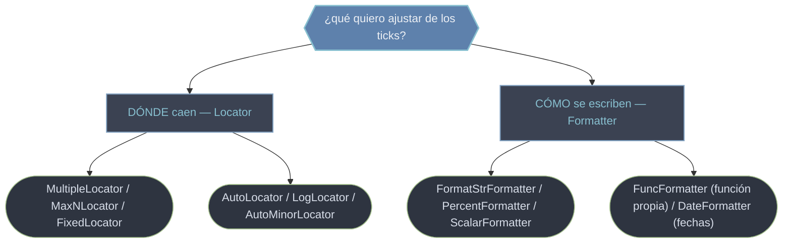

# ticker — Ticks de los ejes: dónde caen (Locator) y cómo se ven (Formatter)

Cada eje (`ax.xaxis`, `ax.yaxis`) controla sus **ticks** mediante dos objetos independientes y complementarios. El **Locator** decide **dónde** caen las marcas (cada 0.5, como máximo 5, en potencias de 10…); el **Formatter** decide **qué texto** lleva cada marca (`3.14`, `90°`, `25%`, `Jun 2026`). Esta separación es la idea central de `matplotlib.ticker`: cambias la posición sin tocar el formato, o el formato sin tocar la posición. Se aplican siempre sobre un eje concreto con `ax.xaxis.set_major_locator(...)` y `ax.xaxis.set_major_formatter(...)`, y cada eje admite además una capa de ticks **menores**. Esta carpeta cubre el catálogo de Locators, el de Formatters y los formateadores especiales por función y por fecha.

## En acción

Combinar un `MaxNLocator` (limita cuántas marcas hay) con un `PercentFormatter` (cómo se escriben). El Locator pone el "dónde", el Formatter el "cómo".

```python
import matplotlib.pyplot as plt
import matplotlib.ticker as ticker
import numpy as np

x = np.linspace(0, 1, 100)
fig, ax = plt.subplots(figsize=(6, 4))
ax.plot(x, x**0.5)

# DÓNDE: a lo sumo 6 marcas "agradables" en el eje X
ax.xaxis.set_major_locator(ticker.MaxNLocator(6))
# CÓMO: el eje X con dos decimales fijos
ax.xaxis.set_major_formatter(ticker.FormatStrFormatter("%.2f"))
# El eje Y como porcentaje, partiendo de proporciones 0–1
ax.yaxis.set_major_formatter(ticker.PercentFormatter(xmax=1.0))   # 0.25 → 25%
```

Regla de oro: el Formatter se aplica a `ax.xaxis`/`ax.yaxis`, **no** a `ax`; si pones `PercentFormatter` sobre datos `0–1`, recuerda `xmax=1.0`.

## Locator (dónde) vs Formatter (cómo se ve)



| Pieza | Responsabilidad | Ejemplos |
|-------|-----------------|----------|
| **Locator** | posición de las marcas | `MultipleLocator(0.5)`, `MaxNLocator(5)`, `LogLocator()`, `AutoMinorLocator()` |
| **Formatter** | texto de las marcas | `FormatStrFormatter('%.2f')`, `PercentFormatter()`, `FuncFormatter(f)`, `DateFormatter('%b %Y')` |

Se aplican por eje y por capa (mayor/menor): `set_major_locator`, `set_minor_locator`, `set_major_formatter`, `set_minor_formatter`.

## Qué hay en esta carpeta

| Nota | Para qué |
|------|----------|
| [[Locators]] | Catálogo de **Locators** (el *dónde*): `MultipleLocator`, `MaxNLocator`, `FixedLocator`, `LogLocator`, `AutoMinorLocator`, `NullLocator`. |
| [[Formatters]] | Catálogo de **Formatters** (el *cómo*): `ScalarFormatter`, `FormatStrFormatter`, `StrMethodFormatter`, `PercentFormatter`, `NullFormatter`. |
| [[FuncFormatter]] | Formatear ticks con una **función propia** `f(valor, pos) -> str`: máxima libertad cuando ningún formatter predefinido alcanza. |
| [[DateFormatter]] | Formatear ticks de **fechas** con patrones `strftime` (`%Y`, `%m`, `%b`…); vive en `matplotlib.dates` pero se aplica igual. |

> [!tip] Empareja siempre Locator y Formatter coherentes
> No tiene sentido un `LogLocator` sin `set_xscale('log')`, ni un `PercentFormatter` con un Locator que oculta las marcas. Decide primero el *dónde* y luego el *cómo*.

## Notas relacionadas

- [[ax.set_xticks]] — fijar ticks a mano (alternativa estática a un Locator)
- [[ax.tick_params]] — estilo de las marcas (tamaño, color, dirección)
- [[Matplotlib/index\|Matplotlib]] — el índice raíz
