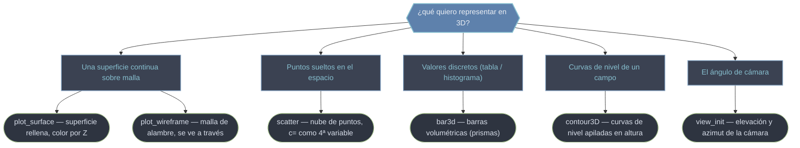

# mplot3d — Gráficos 3D con Axes3D

`mplot3d` es el toolkit que le da a Matplotlib la **tercera dimensión**. Su pieza central es `Axes3D`: la versión tridimensional de un `Axes`, un sistema de coordenadas X/Y/Z donde se dibujan superficies, mallas de alambre, nubes de puntos, barras y contornos en el espacio. Hereda casi toda la API de [[Axes]] (título, etiquetas, leyenda, límites) y añade un eje Z, métodos gráficos propios del 3D y, sobre todo, una **cámara configurable**: como en 3D no hay una única forma de mirar la escena, `view_init(elev, azim)` decide desde qué ángulo se observa. El patrón de entrada es siempre el mismo: se crea el `Axes3D` con `projection='3d'`, se construyen las mallas con `np.meshgrid` y se llama al método de dibujo. Esta carpeta cubre el `Axes3D` y sus tipos de gráfico.

## En acción

Una superficie 3D con `plot_surface`, coloreada por altura y con la cámara orientada para que la cresta se lea bien.

```python
import numpy as np
import matplotlib.pyplot as plt
from mpl_toolkits.mplot3d import Axes3D   # registra la proyección '3d'

x = np.linspace(-5, 5, 80)
y = np.linspace(-5, 5, 80)
X, Y = np.meshgrid(x, y)                   # mallas 2D de coordenadas
Z = np.sin(np.sqrt(X**2 + Y**2))           # alturas en cada punto

fig = plt.figure(figsize=(7, 5))
ax = fig.add_subplot(projection="3d")      # imprescindible: Axes3D
surf = ax.plot_surface(X, Y, Z, cmap="viridis")
fig.colorbar(surf, shrink=0.6)             # barra de color desde el retorno
ax.set_zlabel("z")                          # etiqueta propia del 3D
ax.view_init(elev=40, azim=-60)            # orientar la cámara
```

Claves: `X`, `Y`, `Z` deben ser **arrays 2D de la misma forma** (de ahí `np.meshgrid`); guardar el retorno (`surf`) es lo que alimenta `fig.colorbar`; y `view_init` decide el ángulo desde el que se mira.

## Tipos de gráfico 3D



| Método | Dibuja | Entrada | Retorna |
|--------|--------|---------|---------|
| `plot_surface` | superficie continua rellena | mallas X, Y, Z 2D | `Poly3DCollection` |
| `plot_wireframe` | malla de alambre (sin relleno) | mallas X, Y, Z 2D | `Line3DCollection` |
| `scatter` | nube de puntos 3D | `xs, ys, zs` 1D | `Path3DCollection` |
| `bar3d` | barras volumétricas | posiciones + tamaños 1D | `Poly3DCollection` |
| `contour3D` | curvas de nivel en el espacio | mallas X, Y, Z 2D | `QuadContourSet` |
| `view_init` | (cámara, no dibuja) | `elev`, `azim` | `None` |

## Qué hay en esta carpeta

| Nota | Para qué |
|------|----------|
| [[axes3d]] | El **`Axes3D`**: cómo se obtiene (`projection='3d'`), su API heredada de `Axes` más el eje Z y la cámara; el punto de partida de todo gráfico 3D. |
| [[plot_surface]] | **Superficie** continua sobre malla, coloreada por altura con `cmap`; el gráfico 3D más habitual. |
| [[plot_wireframe]] | Superficie como **malla de alambre**: solo las líneas de la rejilla; ligera y se ve a través de ella. |
| [[scatter3D]] | **Nube de puntos** 3D; `c=` permite codificar una **4ª variable** como color y `s=` como tamaño. |
| [[bar3d]] | **Barras volumétricas** (prismas) para histogramas 3D y matrices representadas como columnas. |
| [[contour3D]] | **Curvas de nivel** flotando en el espacio o proyectadas a un plano base como "sombra" topográfica. |
| [[view_init]] | Fijar el **ángulo de cámara** (elevación, azimut, roll): elige desde dónde se mira la escena. |

> [!tip] El patrón 3D siempre es el mismo
> Crea el `Axes3D` con `projection='3d'`, genera `X`, `Y` con `np.meshgrid` y calcula `Z` vectorizado, dibuja, y ajusta la cámara con `view_init` como último paso. Si ves `Unknown projection '3d'`, importa `mpl_toolkits.mplot3d`.

## Notas relacionadas

- [[Axes]] — el Axes 2D del que `Axes3D` hereda casi toda su API
- [[Colormaps]] — los mapas de color que dan el "mapa de calor" 3D por altura
- [[concepto_figure_axes]] — el modelo Figure / Axes que el 3D extiende
- [[Matplotlib/toolkits/index\|toolkits]] — el agrupador de extensiones
- [[Matplotlib/index\|Matplotlib]] — el índice raíz
