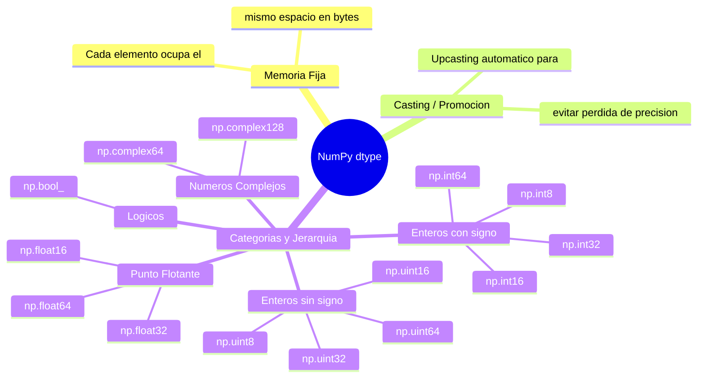

# ndarray — La estructura base de NumPy

## Definicion fundamental

Un `ndarray` es un contenedor de datos homogeneos que representa un grid multidimensional. Toda operacion en NumPy, desde la mas simple hasta la mas compleja, involucra uno o mas `ndarray`.

**Caracteristica esencial:** No es una lista de listas anidadas. Es un bloque lineal de memoria interpretado mediante metadatos.

## Arquitectura interna

Un `ndarray` se compone exactamente de cuatro elementos:

| Componente | Descripcion | Atributo en Python |
|------------|-------------|--------------------|
| Buffer de datos | Bloque contiguo de memoria con los valores brutos | `ndarray.data` |
| Shape | Tupla con tamaño de cada dimension | `ndarray.shape` |
| Dtype | Tipo de dato uniforme de los elementos | `ndarray.dtype` |
| Strides | Tupla con saltos en bytes para cada dimension | `ndarray.strides` |

### El buffer de datos

Es un segmento de memoria RAM que almacena los valores en secuencia lineal. NumPy no anida estructuras; aplana todo.

**Ejemplo concreto:**
```python
import numpy as np
arr = np.array([[1, 2, 3],
                [4, 5, 6]])
# Buffer en memoria (C-order): [1, 2, 3, 4, 5, 6]
```

**Implicancia:** Acceder al elemento en la posicion `[fila, columna]` es un calculo de offset, no una busqueda anidada.

### El shape (forma)

Tupla de enteros no negativos. Su longitud es el numero de dimensiones (rank).

| Expresion | Shape | Dimensiones | Significado |
|-----------|-------|-------------|-------------|
| `np.array([1, 2, 3])` | `(3,)` | 1D | Vector de 3 elementos |
| `np.array([[1,2],[3,4]])` | `(2, 2)` | 2D | Matriz 2×2 |
| `np.array([[[1]]])` | `(1, 1, 1)` | 3D | Tensor 1×1×1 |

**Caso borde:** `shape = ()` representa un array de 0 dimensiones (escalar). Ejemplo: `np.array(5)`.

### El dtype (tipo de dato)

Homogeneidad estricta. Todos los elementos comparten el mismo tipo.

**Jerarquia completa del sistema de tipos:**



**Regla de conversion:** Operaciones entre tipos promueven al tipo mas general siguiendo la jerarquia:

`bool → int → float → complex`

Ejemplo practico:
```python
arr_int = np.array([1, 2, 3], dtype=np.int32)
arr_float = np.array([0.5, 1.5, 2.5], dtype=np.float32)
resultado = arr_int + arr_float
# resultado.dtype es float64 (el mas general de ambos)
```

**Bytes por tipo (memoria fija):**

| Categoria | Tipos | Bytes por elemento |
|-----------|-------|-------------------|
| Logico | `bool_` | 1 |
| Entero (8) | `int8`, `uint8` | 1 |
| Entero (16) | `int16`, `uint16` | 2 |
| Entero (32) | `int32`, `uint32` | 4 |
| Entero (64) | `int64`, `uint64` | 8 |
| Flotante (16) | `float16` | 2 |
| Flotante (32) | `float32` | 4 |
| Flotante (64) | `float64` | 8 |
| Complejo (64) | `complex64` | 8 (2 × float32) |
| Complejo (128) | `complex128` | 16 (2 × float64) |

### Los strides (pasos)

**Definicion:** Tupla que indica, en bytes, cuantos saltar en el buffer para avanzar una posicion en cada dimension.

**Ejemplo de calculo:**
```python
arr = np.array([[1, 2, 3],
                [4, 5, 6]], dtype=np.int64)
# itemsize = 8 bytes por elemento
# shape = (2, 3)
# strides = (24, 8)
#   - Para avanzar 1 fila: saltar 3 elementos × 8 bytes = 24
#   - Para avanzar 1 columna: saltar 1 elemento × 8 bytes = 8
```

**Por que son importantes:**
- Definen si un array es contiguo (C-order vs F-order)
- Permiten crear [[concepto_views_vs_copias]] sin copiar datos
- Afectan drasticamente el rendimiento de iteracion

## Propiedades derivadas

Estos atributos se calculan a partir de los cuatro componentes fundamentales:

| Atributo | Formula | Ejemplo (array 2×3 de int64) |
|----------|---------|------------------------------|
| `ndarray.ndim` | `len(shape)` | `2` |
| `ndarray.size` | `producto(shape)` | `6` |
| `ndarray.itemsize` | `dtype.itemsize` | `8` |
| `ndarray.nbytes` | `size × itemsize` | `48` |
| `ndarray.T` | Transposicion de shape | `(3, 2)` |

## Orden de almacenamiento

NumPy soporta dos ordenes principales:

| Orden | Significado | Strides tipico | Uso comun |
|-------|-------------|----------------|-----------|
| C-order (row-major) | Ultima dimension es contigua | `(m×itemsize, itemsize)` | Por defecto en NumPy |
| F-order (column-major) | Primera dimension es contigua | `(itemsize, n×itemsize)` | Compatibilidad con Fortran |

**Verificacion:**
```python
arr_c = np.array([[1,2],[3,4]])  # C-order por defecto
arr_f = np.array([[1,2],[3,4]], order='F')  # F-order

arr_c.flags.c_contiguous  # True
arr_f.flags.f_contiguous  # True
```

## Modelo mental para operaciones

Para entender cualquier operacion en NumPy, preguntar:

1. **Que pasa con el shape?** Se transforma, se mantiene, se reduce?
2. **Que pasa con el dtype?** Cambia o se preserva?
3. **Se crea una vista o una copia?** Ver [[concepto_views_vs_copias]]
4. **Aplica [[concepto_broadcasting]]?** Como se alinean las dimensiones?

## Limitaciones fundamentales

| Restriccion | Explicacion | Excepcion |
|-------------|-------------|-----------|
| Homogeneidad | No mezclar `int` con `str` | Arrays estructurados (dtype compuesto) |
| Tamaño fijo | No se puede redimensionar como listas | `np.resize` crea copia, no modifica original |
| Memoria contigua por defecto | No es una lista enlazada | Arrays dispersos (scipy.sparse) |

## Relacion con otros conceptos

- [[concepto_shape]]
- [[concepto_dtype_sistema]]
- [[concepto_contiguidad_memoria]]
- [[concepto_broadcasting]]
- [[concepto_vectorizacion]]
- [[concepto_views_vs_copias]]
