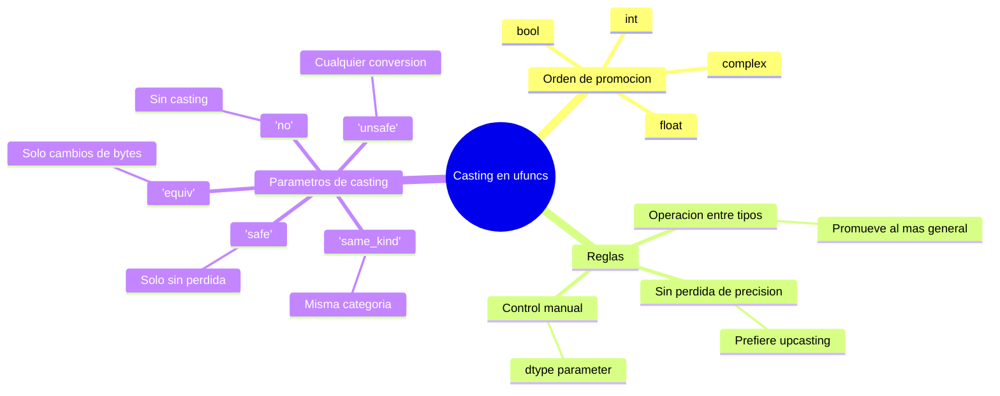

# ufuncs — Universal Functions (el motor de vectorizacion)

## Definicion fundamental

Una **ufunc** (Universal Function) es una funcion que opera elemento a elemento sobre [[concepto_ndarray|arrays de NumPy]], soportando [[concepto_broadcasting|broadcasting]], casting de tipos, y diversas funcionalidades avanzadas como reducciones y acumulaciones.

En esencia, una ufunc es la implementacion en C de una operacion matematica que puede aplicarse a arrays completos sin bucles Python explicitos. Este mecanismo es el que hace posible la [[concepto_vectorizacion|vectorizacion]].

## Clasificacion de ufuncs

### Por numero de argumentos

| Tipo | Entrada | Salida | Ejemplos |
|------|---------|--------|----------|
| Unarias | 1 array | 1 array | `np.sin`, `np.log`, `np.abs` |
| Binarias | 2 arrays | 1 array | `np.add`, `np.multiply`, `np.power` |
| Ternarias | 3 arrays | 1 array | `np.clip`, `np.where` (caso especial) |

### Por operacion matematica

| Categoria | Ejemplos | Dominio |
|-----------|----------|---------|
| Aritmeticas | `add`, `subtract`, `multiply`, `divide` | Algebra basica |
| Potencias y logaritmos | `power`, `sqrt`, `log`, `exp` | Analisis |
| Trigonometricas | `sin`, `cos`, `tan`, `arcsin` | Geometria |
| Hiperbolicas | `sinh`, `cosh`, `tanh` | Calculo |
| Logicas | `greater`, `less`, `equal`, `logical_and` | Comparaciones |
| Bit a bit | `bitwise_and`, `bitwise_or`, `bitwise_xor` | Computacion |
| Especiales | `absolute`, `sign`, `ceil`, `floor` | Redondeo |

## Anatomia de una ufunc

### Estructura interna

```python
import numpy as np

# Cada ufunc tiene metodos y atributos
ufunc = np.add

print(ufunc.nin)      # 2 (numero de inputs)
print(ufunc.nout)     # 1 (numero de outputs)
print(ufunc.ntypes)   # 15 (tipos soportados)
print(ufunc.types)    # ['??->?', 'bb->b', 'BB->B', ...]
```

### Metodos principales de las ufuncs

| Metodo | Descripcion | Ejemplo |
|--------|-------------|---------|
| `reduce` | Aplica acumulativamente | `np.add.reduce([1,2,3])` → `6` |
| `accumulate` | Guarda resultados parciales | `np.add.accumulate([1,2,3])` → `[1,3,6]` |
| `reduceat` | Reduce en intervalos | `np.add.reduceat([1,2,3,4], [0,2])` → `[3,7]` |
| `outer` | Producto cartesiano | `np.add.outer([1,2], [3,4])` → matriz 2×2 |
| `at` | Operacion in-place en indices | `np.add.at(arr, [0,2], 1)` |

## Ejemplos detallados de metodos ufunc

### 1. `reduce` — Reduccion secuencial

```python
# Suma acumulativa (equivalente a sum())
arr = np.array([1, 2, 3, 4])
resultado = np.add.reduce(arr)  # 1+2+3+4 = 10

# Producto acumulativo
resultado = np.multiply.reduce(arr)  # 1*2*3*4 = 24

# Con axis
matriz = np.array([[1, 2, 3],
                   [4, 5, 6]])
resultado = np.add.reduce(matriz, axis=0)  # [5, 7, 9]
```

### 2. `accumulate` — Resultados intermedios

```python
# Sumas parciales
arr = np.array([1, 2, 3, 4])
resultado = np.add.accumulate(arr)  # [1, 3, 6, 10]

# Equivalente a cumsum()
resultado = np.cumsum(arr)  # [1, 3, 6, 10]

# Productos parciales
resultado = np.multiply.accumulate(arr)  # [1, 2, 6, 24]
```

### 3. `outer` — Producto cartesiano

```python
# Suma externa
a = np.array([1, 2, 3])
b = np.array([10, 20, 30])
resultado = np.add.outer(a, b)

# Resultado:
# [[11, 21, 31],
#  [12, 22, 32],
#  [13, 23, 33]]

# Multiplicacion externa (tabla de multiplicar)
resultado = np.multiply.outer(a, b)
# [[10, 20, 30],
#  [20, 40, 60],
#  [30, 60, 90]]
```

### 4. `reduceat` — Reduccion en intervalos especificos

```python
arr = np.array([1, 2, 3, 4, 5, 6])
indices = np.array([0, 2, 4])

# Suma: arr[0:2] + arr[2:4] + arr[4:6]
resultado = np.add.reduceat(arr, indices)  # [3, 7, 11]
# (1+2)=3, (3+4)=7, (5+6)=11
```

### 5. `at` — Operacion in-place en indices especificos

```python
arr = np.array([0, 0, 0, 0, 0])
indices = np.array([0, 2, 4])

# Incrementa en 1 los indices 0, 2, 4
np.add.at(arr, indices, 1)
print(arr)  # [1, 0, 1, 0, 1]

# Multiples operaciones
np.multiply.at(arr, indices, 2)
print(arr)  # [2, 0, 2, 0, 2]
```

## Casting y tipos en ufuncs

### Reglas de casting

Las ufuncs convierten automaticamente los tipos de datos siguiendo una jerarquia. El [[concepto_dtype_sistema|sistema de dtypes]] determina como se promocionan los tipos durante las operaciones.



### Ejemplos de casting

```python
# Promocion automatica
int_arr = np.array([1, 2, 3], dtype=np.int32)
float_arr = np.array([0.5, 1.5, 2.5], dtype=np.float32)
resultado = np.add(int_arr, float_arr)
print(resultado.dtype)  # float64 (el mas general)

# Control de casting
arr = np.array([1, 2, 3], dtype=np.int32)
try:
    np.add(arr, 0.5, casting='no')  # Error: no permite float
except TypeError as e:
    print(e)  # Cannot cast ufunc 'add' input from ...
```

## Creando ufuncs personalizadas

### Con `np.frompyfunc` (generico, retorna objetos Python)

```python
def mi_funcion(x, y):
    return x ** 2 + y ** 2

# Crear ufunc (retorna objetos Python, mas lento)
mi_ufunc = np.frompyfunc(mi_funcion, nin=2, nout=1)

arr1 = np.array([1, 2, 3])
arr2 = np.array([4, 5, 6])
resultado = mi_ufunc(arr1, arr2)
print(resultado)  # [17, 29, 45]
print(resultado.dtype)  # object (no optimizado)
```

### Con `np.vectorize` (wrapper, mas flexible)

```python
def mi_funcion(x, y):
    if x > y:
        return x - y
    else:
        return y - x

# Vectorizar (aun mas lento, pero con firma)
mi_vec = np.vectorize(mi_funcion, otypes=[np.float64])
arr1 = np.array([5, 1, 4])
arr2 = np.array([3, 4, 2])
resultado = mi_vec(arr1, arr2)  # [2, 3, 2]
```

### Nota sobre rendimiento

| Metodo | Velocidad | Uso recomendado |
|--------|-----------|-----------------|
| Ufuncs nativas | 1× (mas rapido) | Siempre que existan |
| `np.frompyfunc` | ~10-50× mas lento | Prototipado rapido |
| `np.vectorize` | ~50-100× mas lento | Compatibilidad con broadcasting |
| Bucle Python | ~100-500× mas lento | Solo cuando no hay alternativa |

## Ufuncs y broadcasting

Las ufuncs integran [[concepto_broadcasting|broadcasting]] automaticamente:

```python
# Broadcasting con ufuncs
matriz = np.array([[1, 2, 3],
                   [4, 5, 6]])
vector = np.array([10, 20, 30])

# add aplica broadcasting implicitamente
resultado = np.add(matriz, vector)
# [[11, 22, 33],
#  [14, 25, 36]]

# Equivalente a matriz + vector
```
