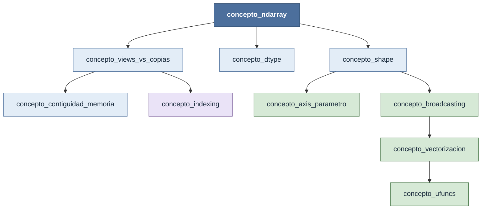

# conceptos_transversales — el modelo mental de NumPy

Esta carpeta es la más importante del vault NumPy. Antes de saber qué funciones existen hay que entender cómo piensa NumPy — porque en este ecosistema los conceptos no son "contexto opcional": son los prerrequisitos que determinan si el resultado de una función tiene sentido o no.

Una llamada como `np.sum(a, axis=1)` parece trivial hasta que se necesita saber: qué forma tiene el resultado, por qué el resultado tiene una dimensión menos, qué pasa si `a` es una vista de otro array, qué diferencia hay con `a.sum(axis=1)`. Ninguna de esas preguntas se puede responder sin entender [[concepto_ndarray]], [[concepto_shape]] y [[concepto_axis_parametro]] primero. El API de NumPy es una superficie pequeña; el modelo mental que lo gobierna es lo que hay que dominar.

## Por qué los conceptos gobiernan

NumPy expone más de 600 funciones en su namespace público. Memorizarlas no es la estrategia correcta. La estrategia correcta es entender las diez ideas de esta carpeta, porque con ellas se puede:

- **Predecir** el shape del resultado de cualquier operación sin ejecutarla
- **Razonar** sobre si una asignación modifica el array original o uno nuevo
- **Diagnosticar** por qué dos arrays con shapes "compatibles" producen un error de broadcasting
- **Optimizar** código identificando dónde hay copias innecesarias o iteración en Python

Los diez conceptos no son independientes — forman un grafo de dependencias. Aprenderlos en el orden correcto evita la confusión de estudiar broadcasting antes de entender shape, o vistas antes de entender el ndarray.

## El grafo de dependencias

El [[concepto_ndarray]] es la raíz: define qué es un array. De él dependen [[concepto_shape]] (cómo está organizado el espacio lógico), [[concepto_dtype]] (cómo se interpretan los bytes) y [[concepto_views_vs_copias]] (si las operaciones comparten o duplican memoria). El [[concepto_broadcasting]] y el [[concepto_axis_parametro]] requieren [[concepto_shape]]. La [[concepto_vectorizacion]] es la consecuencia práctica del broadcasting, y las [[concepto_ufuncs]] son su implementación concreta.

## Los diez conceptos

### [[concepto_ndarray]] — la estructura base

El ndarray es un buffer de bytes contiguo en memoria C más tres metadatos: `shape`, `dtype` y `strides`. Los strides son la clave oculta: dicen cuántos bytes hay que avanzar en el buffer para pasar al siguiente elemento de cada dimensión. Entender esto explica por qué `a.T` no copia datos (solo invierte los strides), por qué las operaciones son rápidas (el buffer ya está en caché de CPU) y por qué mezclar tipos de datos inesperadamente puede duplicar el uso de memoria.

### [[concepto_shape]] — el espacio lógico del array

La shape es una tupla de enteros, uno por dimensión, que indica cuántos elementos hay en esa dimensión. Un array `(3, 4)` tiene 3 filas y 4 columnas; un array `(3,)` es un vector de 3 elementos; un array `(3, 1)` es una columna de 3 elementos — diferente de `(3,)` a efectos de broadcasting. La shape gobierna qué operaciones son válidas, qué significa el parámetro `axis` y cómo se alinean los arrays en broadcasting.

### [[concepto_dtype]] — el tipo de dato homogéneo

Cada array NumPy tiene un único dtype: todos sus elementos ocupan el mismo número de bytes y se interpretan de la misma manera. El dtype determina la precisión de los cálculos, el uso de memoria y las conversiones implícitas. NumPy infiere el dtype al crear arrays y puede sorprender: mezclar una lista de enteros con un float produce `float64`; operar un `int32` con un `float32` produce `float64`. Saber esto previene acumulaciones de error numérico y usos innecesarios de memoria.

### [[concepto_views_vs_copias]] — compartir o duplicar memoria

La mayoría de las operaciones de slicing y reshape devuelven una **vista**: un nuevo objeto ndarray que apunta al mismo buffer de bytes que el original. Modificar la vista modifica el original. Este es el error más frecuente en código NumPy intermedio — y también es una feature de rendimiento cuando se usa deliberadamente. Una copia explícita requiere `.copy()`. La forma de verificar si dos arrays comparten memoria es `np.shares_memory(a, b)`.

### [[concepto_contiguidad_memoria]] — el layout físico del buffer

Un array es **C-contiguo** (row-major) si sus filas están almacenadas de forma consecutiva en memoria; es **F-contiguo** (column-major) si son las columnas. La mayoría de arrays NumPy son C-contiguos. Transponer con `.T` invierte los strides pero no mueve datos, por lo que el resultado es F-contiguo. Esto importa al pasar arrays a código C/Fortran externo, al hacer reshape después de transponer (que fuerza una copia), y al iterar sobre dimensiones en bucles de bajo nivel.

### [[concepto_indexing]] — tres tipos de acceso

NumPy tiene tres mecanismos de indexado con comportamientos distintos. El **indexado básico** (enteros y slices, `a[1:3, :]`) siempre devuelve una vista. El **indexado avanzado** (fancy indexing con arrays de enteros, `a[[0, 2], :]`) siempre devuelve una copia. El **indexado booleano** (máscara, `a[a > 0]`) siempre devuelve una copia. Confundir básico con avanzado es la segunda fuente más común de bugs de modificación inesperada después de las vistas.

### [[concepto_axis_parametro]] — el parámetro más confundido

El parámetro `axis` en funciones como `sum`, `mean`, `max`, `concatenate` especifica la dimensión sobre la que opera la función — no la dimensión que queda en el resultado, sino la que **desaparece**. `axis=0` opera "hacia abajo" (colapsa las filas); `axis=1` opera "hacia los lados" (colapsa las columnas). Para un array `(m, n)`, `a.sum(axis=0)` devuelve `(n,)` y `a.sum(axis=1)` devuelve `(m,)`. La regla es: el axis indicado es el que se consume.

### [[concepto_broadcasting]] — alineación automática de shapes

Cuando dos arrays tienen shapes incompatibles, NumPy intenta alinearlos siguiendo dos reglas: primero rellena con 1s por la izquierda hasta igualar el número de dimensiones, luego estira las dimensiones de tamaño 1 para igualar las de tamaño mayor. Este "estiramiento" es virtual — no se copia memoria. Broadcasting elimina la necesidad de loops explícitos para operar un vector sobre cada fila de una matriz, o una constante sobre todo un array. Entender cuándo dos shapes son compatibles requiere dominar la shape primero.

### [[concepto_vectorizacion]] — operaciones sin bucles Python

Vectorizar significa escribir operaciones sobre arrays enteros en lugar de iterar elemento por elemento con un bucle Python. El código resultante es 10 a 100 veces más rápido porque el bucle ocurre en C, donde no hay overhead de interpretación, boxing de tipos ni llamadas a funciones dinámicas. La habilidad de vectorizar — transformar un bucle en una expresión de arrays — es la competencia central de NumPy. Requiere pensar en formas y en cómo las operaciones se propagan sobre dimensiones, no en índices individuales.

### [[concepto_ufuncs]] — las funciones universales

Las ufuncs (universal functions) son el mecanismo de implementación de la vectorización: funciones compiladas en C que operan element-wise sobre arrays, soportan broadcasting automático y tienen parámetros avanzados como `out=` (escribir el resultado en un array preasignado para evitar una allocation) y `where=` (aplicar la operación solo donde una condición booleana es verdadera). Ejemplos: `np.add`, `np.multiply`, `np.sin`, `np.exp`. Las operaciones `+`, `-`, `*` entre arrays son syntax sugar sobre las ufuncs correspondientes.

## Orden de lectura sugerido

| # | Concepto | Por qué en este orden |
|---|---|---|
| 1 | [[concepto_ndarray]] | Es la base de todo; define qué es un array y cómo está representado en memoria |
| 2 | [[concepto_shape]] | El primer metadato que se usa en cualquier operación; necesario para los siguientes ocho |
| 3 | [[concepto_dtype]] | Complementa la shape; juntos describen completamente el contenido del array |
| 4 | [[concepto_views_vs_copias]] | Antes de hacer cualquier slicing o reshape; evita el bug más frecuente de NumPy |
| 5 | [[concepto_contiguidad_memoria]] | Explica por qué algunos reshape producen copias y otros no; dependiente de vistas |
| 6 | [[concepto_indexing]] | Extiende las vistas al acceso por índices arbitrarios; requiere entender cuándo hay copia |
| 7 | [[concepto_axis_parametro]] | Necesario antes de usar cualquier función de reducción (`sum`, `mean`, `max`…) |
| 8 | [[concepto_broadcasting]] | Requiere dominar shape y axis; explica cómo se combinan arrays de shapes distintas |
| 9 | [[concepto_vectorizacion]] | La consecuencia práctica del broadcasting; cómo pensar en arrays en lugar de bucles |
| 10 | [[concepto_ufuncs]] | El mecanismo concreto que implementa la vectorización; profundiza en el motor interno |

---

- [[Librerias/Numpy/index|NumPy — índice raíz]]
- [[Librerias/Numpy/np/index|np — namespace raíz]]
- [[Librerias/Numpy/np.ndarray/index|np.ndarray — el objeto]]
