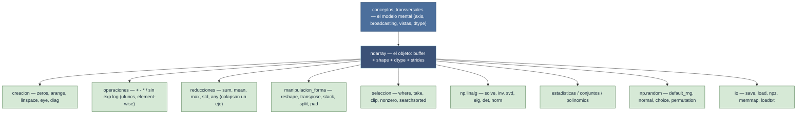

# NumPy — motor de arrays N-dimensionales

NumPy no es simplemente "la librería de arrays": es el sistema que define **cómo Python representa
y transforma datos numéricos en memoria**. Bajo el capó corre código C compilado que llama a BLAS y
LAPACK —las mismas rutinas del cálculo numérico profesional—, así que una operación sobre un array de
un millón de elementos ocurre en microsegundos, no en los cientos de milisegundos de un bucle Python.

Su influencia va más allá de su propio API: Pandas guarda sus columnas como arrays NumPy, SciPy y
scikit-learn construyen sus algoritmos sobre ellos, Matplotlib traza ndarrays directamente. El
**ndarray es el tipo de datos compartido de todo el ecosistema científico de Python**.

## Las dos capas de NumPy

- **El ndarray (el objeto)** — un buffer de bytes contiguo más tres metadatos: `shape` (cuántos
  elementos por dimensión), `dtype` (cómo interpretar los bytes) y `strides` (cuántos bytes avanzar
  para pasar al siguiente elemento de cada eje). Todo el poder descansa en esta representación.
- **Las funciones (las transformaciones)** — cientos de funciones `np.*` que toman ndarrays y
  devuelven ndarrays, implementadas en C y operando sobre el buffer sin que el intérprete intervenga
  elemento a elemento. Eso es la **vectorización**.

## En acción

```python
import numpy as np

A = np.array([[1, 2, 3],
              [4, 5, 6],
              [7, 8, 9],
              [10, 11, 12]], dtype=np.float64)   # (4, 3)

fila_media = A.mean(axis=1)             # reduccion por filas → (4,)
A_centrada = A - fila_media[:, None]    # broadcasting: (4,3) - (4,1) → (4,3)
normas     = np.linalg.norm(A_centrada, axis=1)   # norma de cada fila → (4,)
mascara    = normas > normas.mean()     # indexado booleano → (4,)
print(A[mascara])                       # filas con norma superior a la media
```

Cinco mecanismos centrales actuando juntos —creación, reducción con `axis`, broadcasting, álgebra
lineal e indexado booleano— **sin un solo bucle Python**.

## El mapa de la librería

Los **conceptos** gobiernan: definen cómo se comporta todo lo demás. El **ndarray** es el objeto. Las
**familias de funciones** lo transforman. La pregunta clave de casi cualquier función es su **mapa de
shapes**: $(n_0,\dots,n_{k-1}) \rightarrow$ forma de salida.



## Las ideas que lo gobiernan

Si solo se leyera una carpeta antes de usar NumPy, sería [[Librerias/Numpy/conceptos_transversales/index|conceptos_transversales]]. Estas cinco ideas evitan la mayoría de los bugs sutiles:

| Idea | En una frase | Concepto |
|------|--------------|----------|
| **Vectorización** | describes *qué* operar sobre arrays enteros, no *cómo* iterar | [[concepto_vectorizacion]] |
| **axis / mapa de shapes** | el eje indicado se colapsa o se transforma; el shape de salida es predecible | [[concepto_axis_parametro]] |
| **Broadcasting** | alinea shapes por la derecha y estira los ejes de tamaño 1 sin copiar | [[concepto_broadcasting]] |
| **dtype** | un tipo homogéneo por array; gobierna precisión, memoria y overflow | [[concepto_dtype]] |
| **Vistas vs copias** | slicing/reshape comparten memoria; modificar una vista cambia el original | [[concepto_views_vs_copias]] |

## Cómo navegar el vault

| Carpeta | Qué contiene | Entrada |
|---------|--------------|---------|
| **conceptos_transversales** | los 10 conceptos que gobiernan la librería | [[Librerias/Numpy/conceptos_transversales/index\|conceptos]] |
| **np** | el catálogo operacional del namespace raíz | [[Librerias/Numpy/np/index\|np]] |
| **ndarray** | el objeto: atributos (shape/dtype/strides) y métodos | [[Librerias/Numpy/np.ndarray/index\|np.ndarray]] |
| **np.linalg** | álgebra lineal (solve, svd, eig, det, normas) | [[Librerias/Numpy/np.linalg/index\|np.linalg]] |
| **np.random** | números aleatorios (Generator moderno + distribuciones) | [[Librerias/Numpy/np.random/index\|np.random]] |

Dentro de **np** las familias son: [[Librerias/Numpy/np/creacion/index|creacion]] · [[Librerias/Numpy/np/operaciones/index|operaciones]] (ufuncs) · [[Librerias/Numpy/np/reducciones/index|reducciones]] · [[Librerias/Numpy/np/manipulacion_forma/index|manipulacion_forma]] · [[Librerias/Numpy/np/seleccion/index|seleccion]] · [[Librerias/Numpy/np/estadisticas/index|estadisticas]] · [[Librerias/Numpy/np/conjuntos/index|conjuntos]] · [[Librerias/Numpy/np/polinomios/index|polinomios]] · [[Librerias/Numpy/np/io/index|io]].

## Orden de lectura sugerido

1. **conceptos_transversales** — el modelo mental (`ndarray`, `shape`, `dtype`, `axis`, broadcasting, vistas).
2. **np/creacion** y **np/operaciones** — crear arrays y operarlos element-wise.
3. **np/reducciones** y **np/manipulacion_forma** — colapsar ejes y reorganizar la forma.
4. **np/seleccion** + **np.ndarray** — indexar, filtrar y los métodos del objeto.
5. **np.linalg**, **np.random**, **np/estadisticas/io** — los submódulos especializados.

## Notas relacionadas

- [[concepto_ndarray]] — el objeto base, en profundidad
- [[concepto_vectorizacion]] — por qué NumPy es rápido
- [[Librerias/Numpy/conceptos_transversales/index|conceptos_transversales]] — el modelo mental completo
