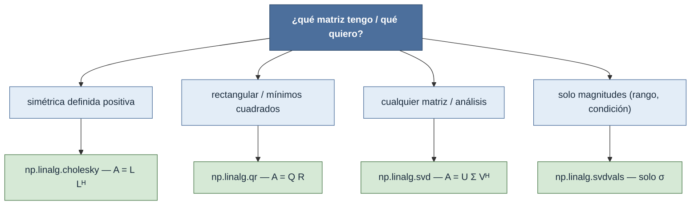

# descomposiciones — factorizar una matriz en producto de matrices con estructura

Esta carpeta reúne las **descomposiciones (factorizaciones) matriciales** de `numpy.linalg`: escribir
una matriz $A$ como el **producto de varias matrices con estructura especial** (triangular, ortonormal,
diagonal). Esa estructura es lo que hace barato lo que sería caro sobre $A$ directamente: resolver
sistemas, calcular el rango, invertir de forma estable o analizar los datos. La regla práctica para
elegir: no preguntes "¿qué descomposición?", pregunta "¿qué **propiedad** tiene mi matriz (SPD,
rectangular, cualquiera) y **qué quiero hacer** (resolver, ortonormalizar, comprimir)?". Todas se
aplican a los **dos últimos ejes** y operan en [[concepto_shape|lote]] sobre los ejes previos.

## Qué descomposición necesito

Por intención: matriz **simétrica definida positiva** (covarianzas, Gram) → [[np.linalg.cholesky]] ·
matriz **rectangular** o **mínimos cuadrados** → [[np.linalg.qr]] · **cualquier** matriz, PCA,
pseudo-inversa, compresión → [[np.linalg.svd]] · solo los **valores singulares** (rango, número de
condición) → [[np.linalg.svdvals]].

## Tabla de descomposiciones

| Descomposición | Factores | Requiere | Uso |
|---|---|---|---|
| [[np.linalg.cholesky]] | $A = L\,L^{*}$ ($L$ triangular inferior) | simétrica/hermítica **definida positiva** | resolver sistemas SPD, muestreo gaussiano, test de SPD |
| [[np.linalg.qr]] | $A = QR$ ($Q$ ortonormal, $R$ triangular sup.) | cualquier $(m, n)$ | mínimos cuadrados, ortonormalizar bases |
| [[np.linalg.svd]] | $A = U\,\Sigma\,V^{H}$ ($U, V$ ortonormales, $\Sigma$ diagonal) | cualquier $(m, n)$ | rango, pseudo-inversa, PCA, compresión |
| [[np.linalg.svdvals]] | solo $\sigma_1 \ge \dots \ge \sigma_k$ | cualquier $(m, n)$ | rango numérico, número de condición, norma 2 |

> [!warning] La descomposición LU **no** está en `numpy.linalg`
> No existe `np.linalg.lu`. La factorización LU ($A = PLU$) vive en **`scipy.linalg.lu`** (o
> `scipy.linalg.lu_factor` + `scipy.linalg.lu_solve`). NumPy la usa **internamente** en
> [[np.linalg.solve]] y [[np.linalg.det]], pero no la expone como función. Si necesitas $P$, $L$, $U$
> explícitos, usa SciPy.

## Mapa de shapes (resumen)

Todas factorizan los **dos últimos ejes** y dejan intactos los de lote `(...)`:

| Función | Mapa de shapes |
|---|---|
| [[np.linalg.cholesky]] | $(\dots, n, n) \to L\,(\dots, n, n)$ |
| [[np.linalg.qr]] | $(\dots, m, n) \to Q\,(\dots, m, k),\ R\,(\dots, k, n)$, $\ k=\min(m,n)$ |
| [[np.linalg.svd]] | $(\dots, m, n) \to U\,(\dots, m, m\|k),\ S\,(\dots, k),\ V\!h\,(\dots, n\|k, n)$ |
| [[np.linalg.svdvals]] | $(\dots, m, n) \to (\dots, \min(m, n))$ |

## Notas relacionadas

- [[concepto_shape]] — el mapa de shapes que gobierna toda la familia (dos últimos ejes + lote)
- [[np.linalg.svd]] — la descomposición universal, eje central de la carpeta
- [[np.linalg.solve]] · [[np.linalg.lstsq]] · [[np.linalg.eig]] — consumidores de estas factorizaciones
- [[Librerias/Numpy/np.linalg/index|np.linalg]] · [[Librerias/Numpy/index|NumPy raíz]]
