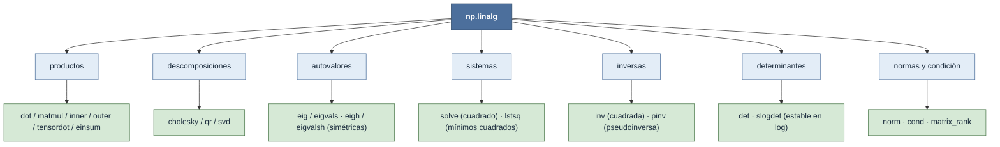

# np.linalg — álgebra lineal sobre matrices y lotes de matrices

`np.linalg` es el submódulo de **álgebra lineal numérica** de NumPy: sistemas de ecuaciones,
descomposiciones, autovalores, inversas, determinantes y normas. La idea rectora es siempre la misma:
una función de `np.linalg` opera sobre los **dos últimos ejes** de un array —ahí vive *la matriz*— y
se aplica en **LOTE** sobre todos los ejes anteriores. El [[concepto_shape|mapa de shapes]] manda: un
array `(..., n, n)` no es "una matriz", es **una pila de matrices** `n×n`, y la operación se ejecuta
de forma independiente sobre cada una. Casi todo delega en **LAPACK** (la biblioteca de referencia en
Fortran), así que el rendimiento es de nivel compilado.

$$ (n_0,\dots,n_{k-1},\,m,\,m)\ \xrightarrow{\ \text{op sobre los 2 últimos ejes}\ }\ (n_0,\dots,n_{k-1},\,\text{resultado}) $$

## En acción

Tres operaciones centrales sobre un **lote** de matrices `(b, n, n)` — observa cómo el eje de lote
`b` se conserva y la operación recae solo sobre los dos últimos ejes:

```python
import numpy as np
A = np.random.rand(5, 3, 3)        # lote de 5 matrices 3×3 → shape (5, 3, 3)
b = np.random.rand(5, 3)           # 5 vectores lado derecho → shape (5, 3)

# Resolver A x = b por lotes (NO inviertas A): una solución por matriz del lote
x = np.linalg.solve(A, b)          # shape (5, 3)

# SVD por lotes: descompone cada matriz en U @ diag(S) @ Vh
U, S, Vh = np.linalg.svd(A)        # U (5,3,3) · S (5,3) · Vh (5,3,3)

# Autovalores de una matriz simétrica (usa eigh, no eig)
M = A[0] @ A[0].T                  # 3×3 simétrica positiva definida
w, V = np.linalg.eigh(M)           # w (3,) autovalores reales · V (3,3) autovectores

# Norma: por defecto Frobenius sobre los dos últimos ejes → una norma por matriz
np.linalg.norm(A, axis=(-2, -1)).shape   # (5,) — una norma por matriz del lote
```

El eje de lote nunca se toca: `solve`, `svd` y `norm` se vectorizan sobre las 5 matrices sin un solo
bucle Python.

## Las familias



## Subcarpetas

| Subcarpeta | Qué resuelve | Notas |
|---|---|---|
| [[Librerias/Numpy/np.linalg/productos/index\|productos]] | Productos punto, matriciales, externos y contracciones | [[np.dot]] · [[np.matmul]] · [[np.inner]] · [[np.outer]] · [[np.tensordot]] · [[np.einsum]] (viven en `np`, no en `np.linalg`) |
| [[Librerias/Numpy/np.linalg/descomposiciones/index\|descomposiciones]] | Factorizar `A` en piezas más simples | [[np.linalg.cholesky]] (`A = LLᵀ`) · [[np.linalg.qr]] (`A = QR`) · [[np.linalg.svd]] (`A = UΣVᵀ`) |
| [[Librerias/Numpy/np.linalg/eigen/index\|eigen]] | Autovalores y autovectores | [[np.linalg.eig]] / [[np.linalg.eigvals]] (general) · [[np.linalg.eigh]] / [[np.linalg.eigvalsh]] (simétrica/hermítica) |
| [[Librerias/Numpy/np.linalg/sistemas_ecuaciones/index\|sistemas_ecuaciones]] | Resolver `A x = b` | [[np.linalg.solve]] (cuadrado exacto) · [[np.linalg.lstsq]] (sobredeterminado, mínimos cuadrados) |
| [[Librerias/Numpy/np.linalg/inversas/index\|inversas]] | Invertir la matriz | [[np.linalg.inv]] (cuadrada no singular) · [[np.linalg.pinv]] (pseudoinversa, vía SVD) |
| [[Librerias/Numpy/np.linalg/determinantes/index\|determinantes]] | Determinante de la matriz | [[np.linalg.det]] (valor) · [[np.linalg.slogdet]] (signo + log, estable) |
| [[Librerias/Numpy/np.linalg/normas_condiciones/index\|normas_condiciones]] | Tamaño, condicionamiento y rango | [[np.linalg.norm]] · [[np.linalg.cond]] · [[np.linalg.matrix_rank]] |

## Reglas de oro

- **Resolver, no invertir.** Para `A x = b` usa [[np.linalg.solve|solve(A, b)]], **nunca** `inv(A) @ b`:
  `solve` es más rápido, más preciso y evita formar la inversa explícitamente.
- **Simétrica → `eigh`.** Si la matriz es simétrica/hermítica, usa [[np.linalg.eigh|eigh]] /
  [[np.linalg.eigvalsh|eigvalsh]] (no [[np.linalg.eig|eig]]): aprovechan la simetría, son más rápidos y
  devuelven autovalores **reales** ordenados.
- **Determinante grande → `slogdet`.** [[np.linalg.det|det]] de una matriz grande **desborda** o
  pierde precisión; [[np.linalg.slogdet|slogdet]] devuelve `(signo, log|det|)`, estable numéricamente.
- **La SVD es el motor.** [[np.linalg.svd|svd]] está debajo de la pseudoinversa
  ([[np.linalg.pinv|pinv]]), el rango ([[np.linalg.matrix_rank|matrix_rank]]), el número de condición
  ([[np.linalg.cond|cond]]) y la norma-2. Si dudas del condicionamiento, mira sus valores singulares.
- **Todo es por lotes.** Cada función opera sobre los **dos últimos ejes** y se vectoriza sobre los
  ejes anteriores: `(b, n, n)` procesa `b` matrices de una sola llamada, sin bucle Python.

## Nota sobre namespaces

Los **productos** (`np.dot`, `np.matmul`, `np.inner`, `np.outer`, `np.tensordot`, `np.einsum`...) no
viven en `np.linalg`, sino en el **namespace raíz `np`**. Aquí se agrupan por tema —porque son la
base del álgebra lineal— pero su ruta real es `np.matmul`, no `np.linalg.matmul`. La excepción son
[[np.linalg.matrix_power]] y [[np.linalg.multi_dot]], que sí están en `np.linalg`.

Y un ausente importante: **la descomposición LU no está en NumPy.** Si la necesitas, vive en
`scipy.linalg.lu`. En general, `np.linalg` cubre lo esencial y `scipy.linalg` lo extiende (LU, `expm`,
solucionadores especializados, Schur...).

## Notas relacionadas

- [[concepto_shape]] — el mapa de shapes: por qué `(..., n, n)` es un lote de matrices
- [[np.matmul]] — el producto matricial por lotes, la operación base sobre la que se monta todo
- [[Librerias/Numpy/index\|NumPy raíz]]
