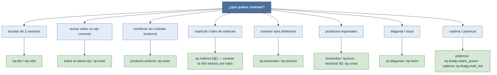

# productos — productos punto, matriciales, externos y contracciones

Esta carpeta reúne la familia de **productos y contracciones** sobre tensores: del producto punto de
dos vectores al producto matricial por lotes, pasando por el producto externo, el de Kronecker y las
contracciones de ejes arbitrarios. Pese a su variedad, todos comparten la **misma idea**: **sumar
sobre un eje compartido** —*contraer* ese eje, que aparece en un sumatorio y **desaparece** del
resultado. Lo que cambia de una función a otra es **qué ejes se contraen y cuáles sobreviven**, y eso
se lee de un vistazo en su [[concepto_shape|mapa de shapes]]. La regla práctica: no preguntes "¿qué
producto es?", pregunta "¿sobre qué eje quiero sumar y qué forma debe tener la salida?".

## Qué producto necesito

Por intención: escalar de dos vectores → [[np.dot]] / [[np.vdot]] · suma sobre el último eje →
[[np.inner]] · producto externo (combinar sin contraer) → [[np.outer]] · matricial o lotes de
matrices → [[np.matmul]] · contracción de ejes arbitrarios → [[np.tensordot]] / [[np.einsum]] ·
producto de Kronecker → [[np.kron]] · producto vectorial 3D → [[np.cross]] · diagonal o traza →
[[np.diagonal]] / [[np.trace]] · potencia matricial → [[np.linalg.matrix_power]] · producto de una
cadena de matrices → [[np.linalg.multi_dot]].

## Tabla de productos

| Función | Mapa de shapes | Suma sobre |
|---|---|---|
| [[np.matmul]] | $(\dots,m,k)\,(\dots,k,n)\to(\dots,m,n)$ | la dim interior $k$ (por lotes) |
| [[np.dot]] | $(\dots,k)\,(\dots,k,\cdot)\to$ contracción último vs penúltimo | último eje de `a` con penúltimo de `b` |
| [[np.vdot]] | $(\dots)\,(\dots)\to()$ | aplana todo y suma (conjuga `a`) |
| [[np.inner]] | $(\dots,t)\,(\dots,t)\to(\dots,\dots)$ | el **último** eje (común, tamaño $t$) |
| [[np.outer]] | $(m,)\,(n,)\to(m,n)$ | **nada** (producto externo, no contrae) |
| [[np.tensordot]] | $(\dots,\textbf{ejes})\,(\textbf{ejes},\dots)\to(\dots,\dots)$ | los ejes elegidos por `axes` |
| [[np.einsum]] | según la cadena de índices | los índices repetidos / no presentes en la salida |
| [[np.kron]] | $(a,b)\,(c,d)\to(ac,bd)$ | **nada** (producto de Kronecker, expande) |
| [[np.cross]] | $(\dots,3)\,(\dots,3)\to(\dots,3)$ | combina componentes (producto vectorial 3D) |
| [[np.diagonal]] | $(\dots,m,m)\to(\dots,m)$ | extrae la diagonal (no suma) |
| [[np.trace]] | $(\dots,m,m)\to(\dots)$ | la diagonal de los dos últimos ejes |
| [[np.linalg.matrix_power]] | $(\dots,m,m)\to(\dots,m,m)$ | $n$ productos matriciales repetidos |
| [[np.linalg.multi_dot]] | $(m,k_1)(k_1,k_2)\cdots(k_{p-1},n)\to(m,n)$ | todas las dims interiores de la cadena |

## Notas relacionadas

- [[concepto_shape]] — el mapa de shapes que gobierna toda la familia
- [[np.matmul]] — el producto matricial, eje central de la carpeta
- [[concepto_vectorizacion]] — por qué el producto por lotes sustituye al bucle
- [[Librerias/Numpy/np.linalg/index|np.linalg]] · [[Librerias/Numpy/index|NumPy raíz]]
