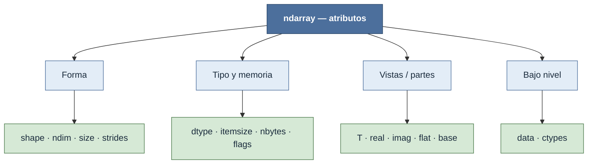

# np.ndarray — atributos

Los atributos de un `ndarray` **describen la estructura del array** —su forma, su tipo y su disposición en memoria— sin calcular nada y, en su mayoría, sin copiar un solo byte. Son la cara legible de los metadatos que componen el objeto: el buffer de datos más `shape`, `dtype` y `strides` (todo el modelo se desarrolla en [[concepto_ndarray]]). Consultarlos es la herramienta básica para depurar shapes inesperadas, razonar sobre vistas y escribir funciones que acepten arrays de cualquier dimensión.

A diferencia de los métodos, un atributo no se "ejecuta": se lee. La mayoría son de solo lectura y derivados de los mismos cuatro componentes —`a.size` es el producto de `a.shape`, `a.nbytes` es `size × itemsize`—, de modo que conocerlos es entender de qué está hecho un array.

## El mapa de los atributos

## Forma

Los metadatos que definen el **espacio lógico** del array: cuántas dimensiones tiene, cuántos elementos por eje y cómo se recorre el buffer. Los strides son el puente entre la forma lógica y la disposición física (ver [[concepto_shape]]).

| Atributo | Tipo | Descripción |
|---|---|---|
| [[ndarray.shape]] | `tuple[int]` | Tupla con el tamaño de cada dimensión. `(3, 4)` significa 3 filas y 4 columnas. Asignarla hace reshape in-place si la nueva forma es compatible. |
| [[ndarray.ndim]] | `int` | Número de dimensiones (longitud de `shape`). Un vector tiene `ndim == 1`; una matriz, `ndim == 2`. |
| [[ndarray.size]] | `int` | Número total de elementos: el producto de todos los valores de `shape`. |
| [[ndarray.strides]] | `tuple[int]` | Bytes que hay que avanzar en memoria para incrementar en 1 el índice de cada eje. La clave de las vistas: un stride negativo indica un eje invertido. |

## Tipo y memoria

Cómo se **interpretan los bytes** del buffer y cuánto ocupan. Determinan la precisión, el consumo de RAM y la compatibilidad con código C/Fortran (ver [[concepto_dtype]]).

| Atributo | Tipo | Descripción |
|---|---|---|
| [[ndarray.dtype]] | `dtype` | Tipo homogéneo de los elementos (`float64`, `int32`, `bool`…). Fija el `itemsize` y qué operaciones son válidas. |
| [[ndarray.itemsize]] | `int` | Bytes que ocupa un solo elemento. `float64 → 8`, `int32 → 4`. |
| [[ndarray.nbytes]] | `int` | Bytes totales del buffer de datos: `size × itemsize`. |
| [[ndarray.flags]] | `flagsobj` | Estado del layout: C-contiguo, F-contiguo, solo lectura, propietario de su memoria, etc. |

## Vistas / partes

Atributos que devuelven **otro `ndarray` sobre el mismo buffer** (o un iterador) sin copiar datos: reinterpretan los strides o exponen una parte del array. Por eso modificarlos suele mutar el original (ver [[concepto_views_vs_copias]]).

| Atributo | Tipo | Descripción |
|---|---|---|
| [[ndarray.T]] | `ndarray` | Array transpuesto (vista): invierte shape y strides. En 1D no hace nada. |
| [[ndarray.real]] | `ndarray` | Parte real. Vista del buffer si el `dtype` es complejo; el propio array si es real. |
| [[ndarray.imag]] | `ndarray` | Parte imaginaria. Vista del buffer si es complejo; array de ceros (mismo shape) si es real. |
| [[ndarray.flat]] | `flatiter` | Iterador 1D que recorre todos los elementos en orden C; permite lectura y escritura por índice plano. |
| [[ndarray.base]] | `ndarray` o `None` | El array del que este es vista, o `None` si es propietario de sus datos. Clave para saber si una escritura se propaga. |

## Bajo nivel

Acceso directo al **buffer de bytes** para interoperar con C o con la memoria cruda. Raramente se usan a mano.

| Atributo | Tipo | Descripción |
|---|---|---|
| [[ndarray.data]] | `memoryview` | Buffer Python con los datos reales. Casi siempre se accede a través de los métodos de serialización o de `ctypes`. |
| [[ndarray.ctypes]] | objeto ctypes | Interfaz para pasar el array a funciones C: expone el puntero al buffer y el shape como tipos compatibles con C. |

## Notas relacionadas

- [[concepto_ndarray]] — buffer + `shape` + `dtype` + `strides`, de donde derivan todos estos atributos
- [[concepto_shape]] — el espacio lógico que describen `shape`, `ndim` y `size`
- [[concepto_views_vs_copias]] — por qué `T`, `real` y `flat` comparten memoria con el original
- [[Librerias/Numpy/np.ndarray/index|np.ndarray — el objeto]]
- [[Librerias/Numpy/np.ndarray/metodos/index|métodos del ndarray]]
