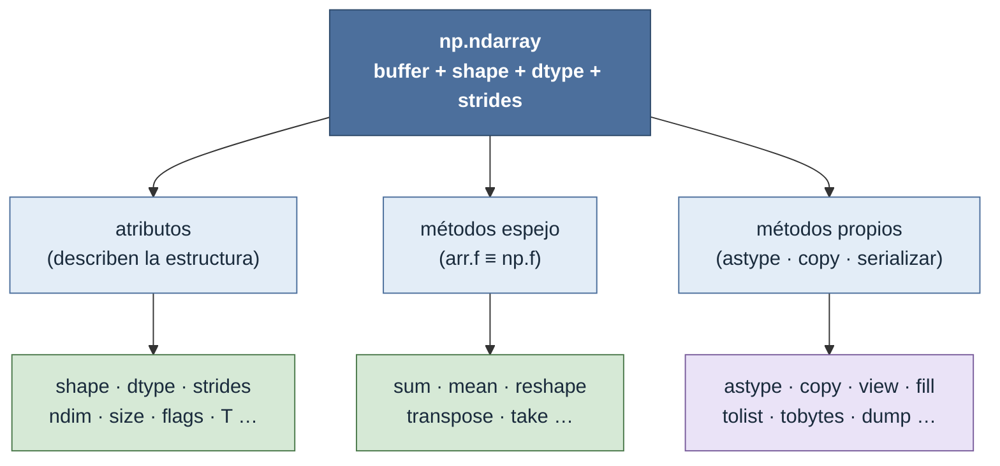

# np.ndarray — objeto array N-dimensional

`np.ndarray` es el objeto central de NumPy: cada vez que una función de NumPy devuelve algo, ese algo es un ndarray. Como objeto, un ndarray no es "una lista de listas": es un **buffer de bytes contiguo** acompañado de tres metadatos —`shape`, `dtype` y `strides`— que le dicen a NumPy cómo interpretar ese buffer como un tensor. Todo el modelo (por qué `a.T` no copia, por qué el acceso es una sola cuenta aritmética) se desarrolla en [[concepto_ndarray]].

Entenderlo *como objeto* importa porque expone dos superficies bien distintas: **atributos** que lo describen sin calcular nada, y **métodos** que le piden transformarse. Y, sin embargo, la mayoría de lo que uno hace con un array no es ninguna de las dos cosas: son funciones de [[Librerias/Numpy/np/index|np]] aplicadas sobre él.

## La anatomía del objeto

La rama de la izquierda **lee** el objeto; las dos de la derecha lo **transforman**. Y dentro de los métodos hay una frontera importante: los **espejo** (`arr.sum()` es solo `np.sum(arr)`) frente a los **propios** (`astype`, `copy`, serializar), que no tienen función equivalente porque actúan sobre el array como objeto.

## Atributos vs métodos vs funciones

| Superficie | Qué hace | Ejemplo | Dónde está la explicación |
|---|---|---|---|
| Atributo | Lee un metadato; no calcula ni copia | `arr.shape`, `arr.dtype`, `arr.T` | [[Librerias/Numpy/np.ndarray/atributos/index\|atributos/]] |
| Método espejo | Operación = a una función `np` | `arr.sum(axis=0)` | la nota de `np.sum` en [[Librerias/Numpy/np/index\|np]] |
| Método propio | Operación sin función espejo | `arr.astype(...)`, `arr.copy()` | [[Librerias/Numpy/np.ndarray/metodos/index\|metodos/]] |
| Función `np.X` | Transformación aplicada al array | `np.sum(arr, axis=0)` | [[Librerias/Numpy/np/index\|np]] |

## Navegación

| Voy a… | Ir a |
|---|---|
| Inspeccionar la estructura (forma, tipo, memoria, vistas) | [[Librerias/Numpy/np.ndarray/atributos/index\|atributos/]] — los 15 atributos agrupados |
| Llamar a un método (`reshape`, `sum`, `astype`, `tolist`…) | [[Librerias/Numpy/np.ndarray/metodos/index\|metodos/]] — espejo vs propios |
| Entender qué es un ndarray por dentro (strides, buffer) | [[concepto_ndarray]] |
| Operar sobre arrays con funciones | [[Librerias/Numpy/np/index\|np — namespace raíz]] |

## Una advertencia de altitud

La mayoría de las "operaciones" sobre un array **no son métodos del objeto**: son funciones de [[Librerias/Numpy/np/index|np]] (`np.concatenate`, `np.where`, `np.dot`…) o métodos espejo que apenas reescriben la sintaxis de esas funciones. El objeto ndarray aporta sobre todo **estructura** (sus atributos) y un puñado de **operaciones propias** (cambiar de tipo, copiar, serializar); el grueso de la potencia vive en el namespace `np`. Pensar primero en "qué función transforma este tensor" y solo después en "¿hay un método espejo más conciso?" es el orden mental correcto.

## Notas relacionadas

- [[concepto_ndarray]] — la estructura: buffer + `shape` + `dtype` + `strides`
- [[concepto_views_vs_copias]] — cuándo una operación comparte memoria con el original
- [[Librerias/Numpy/np.ndarray/atributos/index|atributos del ndarray]]
- [[Librerias/Numpy/np.ndarray/metodos/index|métodos del ndarray]]
- [[Librerias/Numpy/np/index|np — namespace de funciones]]
- [[Librerias/Numpy/index|NumPy — índice raíz]]
