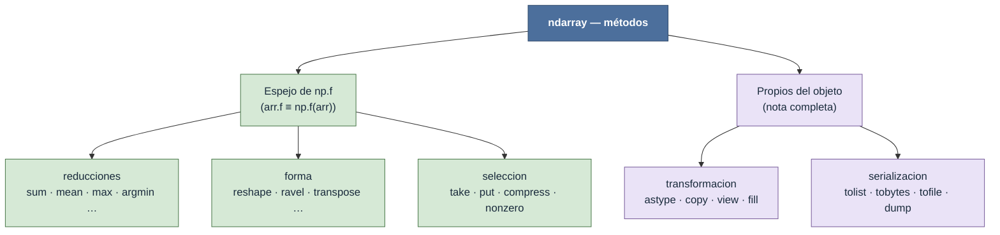

# np.ndarray — métodos

Un método es una operación que el array realiza sobre sí mismo: `arr.metodo()`. Frente a las funciones del namespace `np`, los métodos son más concisos para uso interactivo y permiten encadenar: `arr.reshape(-1).cumsum()`. Pero hay una distinción que conviene tener clara desde el principio, porque cambia *dónde está la explicación* de cada método.

## La regla método ↔ función

La inmensa mayoría de los métodos del ndarray son **espejo** de una función de [[Librerias/Numpy/np/index|np]]: hacen exactamente lo mismo, solo cambia la sintaxis.

$$ \texttt{arr.f(...)} \;\equiv\; \texttt{np.f(arr, ...)} $$

```python
np.sum(arr, axis=0)     # función
arr.sum(axis=0)         # método espejo — mismo resultado, más conciso
```

Por eso el repertorio de métodos se parte en **dos tipos**, y eso decide qué nota leer:

- **Métodos espejo** — la lógica (firma, `axis`, mapa de shapes, vectorización) vive en la **nota de la función** `np.f`. La nota del método solo recuerda la equivalencia y las diferencias de defaults, si las hay.
- **Métodos propios del objeto** — no tienen función espejo: pertenecen al ndarray como objeto (cambiar su `dtype`, copiar su buffer, serializarlo). Aquí la **nota del método es la completa**.

Además, algunos métodos son **in-place**: modifican el array y devuelven `None` (`fill`, `put`, `sort`), en vez de producir uno nuevo. Eso siempre se marca explícitamente.

## El mapa de los métodos



## Métodos espejo — la explicación está en la función

Para estos, `arr.f()` es solo azúcar sobre `np.f(arr)`. Lee la nota de la función para el detalle; aquí está el grupo y para qué sirve.

| Subcarpeta | Qué hace | Equivale a |
|---|---|---|
| [[Librerias/Numpy/np.ndarray/metodos/reducciones/index\|reducciones]] | Colapsan el array o un eje a un resultado menor: `sum`, `mean`, `var`, `std`, `min`, `max`, `argmin`, `argmax`, `cumsum`, `prod`, `clip`, `round`… | `np.sum`, `np.mean`, … |
| [[Librerias/Numpy/np.ndarray/metodos/forma/index\|forma]] | Reorganizan la estructura dimensional sin tocar los datos: `reshape`, `ravel`, `transpose`, `swapaxes`, `squeeze` (la mayoría devuelve vista). | `np.reshape`, `np.transpose`, … |
| [[Librerias/Numpy/np.ndarray/metodos/seleccion/index\|seleccion]] | Extraen o modifican elementos por índices o máscara: `take`, `put` (in-place), `compress`, `nonzero`. | `np.take`, `np.compress`, … |

## Métodos propios del objeto — nota completa

No tienen función espejo: actúan sobre el ndarray *como objeto*. La nota de cada método es la fuente de verdad.

| Subcarpeta | Qué hace | Vista / copia / in-place |
|---|---|---|
| [[Librerias/Numpy/np.ndarray/metodos/transformacion/index\|transformacion]] | Cambian el tipo o el contenido: `astype` (convierte, **copia**), `copy` (copia profunda), `view` (reinterpreta bytes, **vista**), `fill` (**in-place**), `byteswap`. | crítico distinguir las tres |
| [[Librerias/Numpy/np.ndarray/metodos/serializacion/index\|serializacion]] | Exportan el array fuera de NumPy: `tolist`, `tobytes`, `tofile`, `dump`, `dumps`. | producen objetos nuevos (lista, bytes, archivo) |

## Notas relacionadas

- [[concepto_ndarray]] — el objeto sobre el que operan estos métodos
- [[concepto_views_vs_copias]] — la distinción vista/copia/in-place que recorre toda la tabla
- [[Librerias/Numpy/np/index|np — namespace de funciones]] — donde vive la explicación de los métodos espejo
- [[Librerias/Numpy/np.ndarray/atributos/index|atributos del ndarray]]
- [[Librerias/Numpy/np.ndarray/index|np.ndarray — el objeto]]
