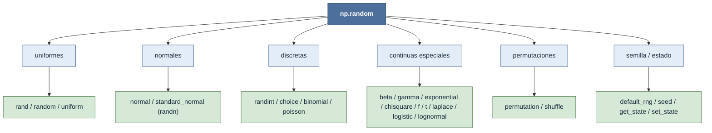

# np.random — generación de números aleatorios

`np.random` es el submódulo de **generación de números pseudoaleatorios** de NumPy: distribuciones
uniformes, normales, discretas, continuas especiales, permutaciones y control de la semilla.
"Pseudoaleatorio" significa que la secuencia es **determinista** pero tiene las propiedades
estadísticas del azar: fijada la semilla se reproduce **idéntica** en cualquier máquina y momento —la
base de la reproducibilidad en ciencia. Toda función acepta `size=` y devuelve un array del
[[concepto_shape|shape]] pedido: pedir números aleatorios es, en el fondo, **rellenar un tensor**.

> [!important] Usa la API moderna
> Hoy se recomienda crear un **objeto Generator** con `rng = np.random.default_rng()` y llamar a sus
> métodos (`rng.normal(...)`, `rng.integers(...)`), **en vez** de las funciones de estado global
> (`np.random.normal`, `np.random.seed`...). Cada `rng` encapsula su propio estado: múltiples
> generadores coexisten sin interferirse, ninguna librería externa puede perturbar tu secuencia, y el
> motor (PCG64) es más rápido y de mejor calidad estadística. Las notas de este directorio documentan
> la **API legacy** —la más vista en tutoriales y libros— pero cada una remite a su equivalente
> `rng.<método>`. Punto de entrada: [[np.random.default_rng]].

## En acción

Un único `rng` siembra todas las distribuciones de forma reproducible. El `size=` controla el shape
de salida hasta cualquier número de dimensiones —incluido un tensor **4D** listo para alimentar una
red (lote × canales × alto × ancho):

```python
import numpy as np
rng = np.random.default_rng(42)            # Generator sembrado → reproducible

rng.random(3)                              # uniforme [0, 1) → shape (3,)
rng.normal(0, 1, size=(2, 4))              # normal(μ=0, σ=1) → shape (2, 4)
rng.integers(0, 10, size=5)                # enteros [0, 10) → shape (5,)
rng.choice(["a", "b", "c"], size=4)        # muestreo categórico → shape (4,)
rng.poisson(3.0, size=6)                   # conteos Poisson(λ=3) → shape (6,)

batch = rng.normal(size=(2, 3, 64, 64))    # tensor 4D (lote, canales, alto, ancho)
batch.shape                                # (2, 3, 64, 64)
```

Una sola semilla gobierna toda la cadena: vuelve a ejecutar el bloque y obtienes exactamente los
mismos arrays.

## Las familias



## Subcarpetas

| Subcarpeta | Qué genera | Notas |
|---|---|---|
| [[Librerias/Numpy/np.random/uniformes/index\|uniformes]] | Distribución uniforme y atajos | [[np.random.rand]] · [[np.random.random]] · [[np.random.uniform]] → `rng.random` / `rng.uniform` |
| [[Librerias/Numpy/np.random/normales/index\|normales]] | Gaussianas (estándar y general) | [[np.random.normal]] · [[np.random.standard_normal]] · [[np.random.randn]] → `rng.normal` / `rng.standard_normal` |
| [[Librerias/Numpy/np.random/discretas/index\|discretas]] | Enteros y categorías | [[np.random.randint]] · [[np.random.choice]] · [[np.random.binomial]] · [[np.random.poisson]] → `rng.integers` / `rng.choice` |
| [[Librerias/Numpy/np.random/continuas_especiales/index\|continuas_especiales]] | Continuas más allá de uniforme/normal | [[np.random.beta]] · [[np.random.gamma]] · [[np.random.exponential]] · [[np.random.chisquare]] · [[np.random.f]] · [[np.random.t]] · [[np.random.laplace]] · [[np.random.logistic]] · [[np.random.lognormal]] |
| [[Librerias/Numpy/np.random/permutaciones/index\|permutaciones]] | Mezcla y reordenamiento | [[np.random.permutation]] (copia) · [[np.random.shuffle]] (in-place) → `rng.permutation` / `rng.shuffle` |
| [[Librerias/Numpy/np.random/semilla_estado/index\|semilla_estado]] | Semilla y estado del generador | [[np.random.default_rng]] (moderno) · [[np.random.seed]] · [[np.random.get_state]] · [[np.random.set_state]] |

## Legacy ↔ moderno

Toda función legacy de estado global tiene un equivalente como **método** del `Generator`. Migrar es
mecánico: crea `rng = np.random.default_rng(seed)` y antepone `rng.` —cuidando dos renombres,
`randn → standard_normal` y `randint → integers`:

| Legacy (estado global) | Moderno (`rng = np.random.default_rng()`) |
|---|---|
| `np.random.seed(s)` | `rng = np.random.default_rng(s)` |
| `np.random.rand(...)` | `rng.random(size=...)` |
| `np.random.randn(...)` | `rng.standard_normal(size=...)` |
| `np.random.randint(lo, hi)` | `rng.integers(lo, hi)` |
| `np.random.normal(μ, σ)` | `rng.normal(μ, σ)` |
| `np.random.choice(a)` | `rng.choice(a)` |

> [!note] Funciones eliminadas
> Varios alias y atajos de la API legacy **ya no existen** o están deprecados: `ranf`, `sample` y
> `random_sample` eran alias de [[np.random.random|random]], y `random_integers` (cerrado en ambos
> extremos) fue reemplazado por [[np.random.randint|randint]] / `rng.integers`. No los uses en código
> nuevo.

## Notas relacionadas

- [[np.random.default_rng]] — el constructor del `Generator`: la puerta a la API moderna
- [[concepto_shape]] — el `size=` que toda función acepta es, literalmente, el shape de salida
- [[Librerias/Numpy/index\|NumPy raíz]]
