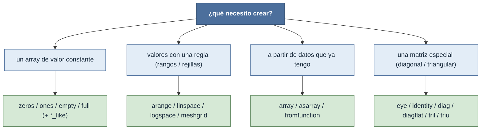

# creación — construir arrays desde cero

Todo flujo de NumPy empieza por **fabricar un `ndarray`**: antes de transformar, reducir o multiplicar
tensores, hay que traerlos a la existencia. Este grupo reúne las rutas para crearlos, y la elección
correcta depende de **de dónde salen los valores**. Definir bien el [[concepto_shape|shape]] y el
[[concepto_dtype|dtype]] desde el principio evita conversiones implícitas costosas y sorpresas
numéricas más adelante.

El eje de decisión es siempre el mismo: **¿de dónde vienen los datos?** ¿Ya los tienes, los generas
con una regla, o necesitas una estructura matricial especial?

## Qué necesito crear

## Las familias

### Constantes — relleno uniforme
Reservan una forma y la rellenan con un único valor. La regla general: fijar `dtype=` si no quieres el
`float64` por defecto. Las variantes `*_like` copian la forma y el tipo de un array existente.

| Función | Rellena con | Notas |
|---|---|---|
| [[np.zeros]] | `0` | inicializar acumuladores o buffers de resultado |
| [[np.ones]] | `1` | escala, máscaras, punto de partida |
| [[np.empty]] | sin inicializar (basura) | el más rápido si vas a sobrescribir todo |
| [[np.full]] | un escalar arbitrario | más legible que `zeros(...) + v` |
| [[np.zeros_like]] · [[np.ones_like]] · [[np.empty_like]] · [[np.full_like]] | igual, copiando shape/dtype de otro | clonar la forma sin clonar datos |

### Rangos y rejillas — valores con una regla
Generan secuencias o mallas a partir de extremos y paso, sin escribir los valores a mano.

| Función | Genera | Notas |
|---|---|---|
| [[np.arange]] | rango con paso fijo | análogo a `range()`; con floats acumula error en el extremo |
| [[np.linspace]] | N puntos equiespaciados entre dos extremos | sin error de punto flotante; ideal para ejes |
| [[np.logspace]] | N puntos equiespaciados en escala log | `start`/`stop` son **exponentes** de la base |
| [[np.meshgrid]] | rejillas de coordenadas desde vectores 1D | evaluar funciones sobre un plano/volumen |

### Desde datos — a partir de algo que ya existe
Convierten estructuras Python (o una función de los índices) en `ndarray`.

| Función | A partir de | Notas |
|---|---|---|
| [[np.array]] | cualquier secuencia (lista, tupla, array) | el constructor universal; **siempre copia** |
| [[np.asarray]] | idem, pero **sin copiar** si ya es ndarray | barato; ideal en fronteras de API |
| [[np.fromfunction]] | una función de los índices | grids matemáticos o kernels sin bucles |

### Matrices especiales — estructura diagonal y triangular
Fabrican o transforman matrices con un patrón de ceros característico. Aquí viven las notas de esta
carpeta con más sustancia matemática (la matriz se muestra siempre en LaTeX `bmatrix`).

| Función | Hace | Notas |
|---|---|---|
| [[np.eye]] | unos en una diagonal (rectangular, `k` desplaza) | la identidad general; base del one-hot |
| [[np.identity]] | identidad cuadrada `(n, n)` | el caso simple de `eye` |
| [[np.diag]] | construye (1D→2D) **o** extrae (2D→1D) | ambivalente según el `ndim` |
| [[np.diagflat]] | construye diagonal desde la entrada **aplanada** | variante de `diag` solo para construir |
| [[np.tril]] | triangular **inferior** (ceros arriba de `k`) | transforma; soporta lotes N-D |
| [[np.triu]] | triangular **superior** (ceros debajo de `k`) | complementaria de `tril`; lotes N-D |

## Cómo elegir, en una frase

- **¿Un valor repetido?** → constantes (`zeros`/`ones`/`full`); `empty` si vas a sobrescribir.
- **¿Una progresión o malla?** → `arange`/`linspace`/`logspace`/`meshgrid`.
- **¿Datos que ya tienes?** → `array` (copia) o `asarray` (sin copiar).
- **¿Una matriz con patrón de ceros?** → `eye`/`identity`/`diag`/`diagflat`/`tril`/`triu`.

## Notas relacionadas

- [[concepto_shape]] — la forma que toda creación debe fijar bien
- [[concepto_dtype]] — el tipo por defecto (`float64`) y cuándo forzarlo
- [[np.diagonal]] — extraer diagonales (vista, lotes N-D), contraste con `np.diag`
- [[Librerias/Numpy/index|NumPy raíz]]
