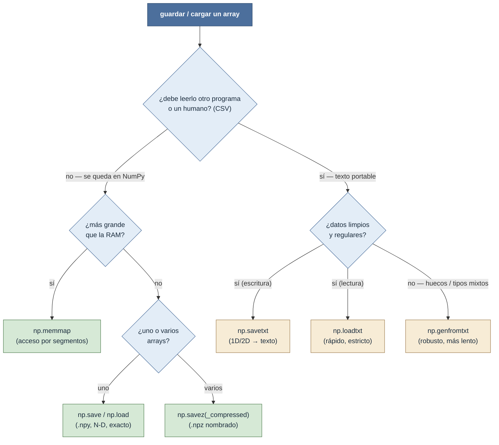
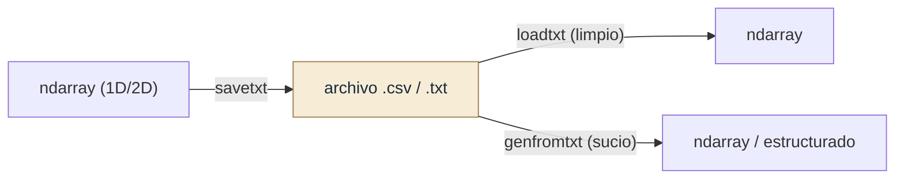

# io — entrada y salida de arrays en disco

Este grupo cubre cómo **persistir y recuperar** `ndarray`s en el sistema de archivos. Todas las
decisiones se reducen a una pregunta: **¿texto o binario?** No es un detalle de implementación, es
la elección que gobierna **portabilidad, precisión, velocidad y qué dimensiones** puedes guardar.

- **Binario** (`.npy`/`.npz`, `memmap`) — el formato propio de NumPy. Conserva `dtype`, `shape` y
  orden de memoria **exactamente**, soporta **N-D**, y es mucho más rápido de leer y escribir. Es la
  opción por defecto cuando los datos se quedan **dentro de NumPy**. Es la cara en disco de la
  [[Librerias/Numpy/np.ndarray/metodos/serializacion/index|serialización del ndarray]].
- **Texto** (`loadtxt`/`savetxt`/`genfromtxt`) — CSV, TSV, columnas legibles. **Portable** (cualquier
  lenguaje, editor u hoja de cálculo lo abre) y **humano**, pero pierde precisión en flotantes, pesa
  más, es más lento y solo maneja **1D/2D**. La opción cuando los datos tienen que **salir** de
  NumPy o ser inspeccionables.

## La decisión

## Tabla de decisión

| Necesito… | Función | Por qué |
|---|---|---|
| Guardar **exacto** para reusar en NumPy (N-D) | [[np.save]] | binario `.npy`: preserva `dtype`/`shape`/orden, rápido |
| Cargar un `.npy` o `.npz` | [[np.load]] | punto de entrada único de ambos binarios |
| Guardar **varios** arrays en un archivo | [[np.savez]] / [[np.savez_compressed]] | `.npz` nombrado (sin / con compresión) |
| Operar sobre un array **más grande que la RAM** | [[np.memmap]] | mapea el archivo y accede solo a los segmentos usados |
| Exportar a **CSV/legible** (1D/2D) | [[np.savetxt]] | texto portable, control de `fmt` y `header` |
| Leer texto **limpio** rápido | [[np.loadtxt]] | parseo veloz, contrato estricto |
| Leer texto **sucio** (huecos, tipos mixtos, nombres) | [[np.genfromtxt]] | tolera faltantes y `dtype` por columna |

## Texto: el trío y su round-trip

Las tres funciones de texto trabajan sobre la misma rejilla legible, repartidas por rol:

- [[np.savetxt]] **escribe** un array 1D/2D a texto; controla la precisión con `fmt=` y la cabecera
  con `header=`/`comments=`.
- [[np.loadtxt]] **lee** texto limpio y regular de vuelta a un array. Rápido pero estricto: si hay un
  hueco o una celda no numérica, falla. Es la pareja directa de `savetxt`.
- [[np.genfromtxt]] **lee** lo que `loadtxt` no puede: valores faltantes (`missing_values`/
  `filling_values`), tipos mixtos (`dtype=None`) y columnas con nombre (`names=True` → array
  estructurado). Más lento, para datos ajenos o irregulares.

## Binario: exacto, N-D y rápido

- [[np.save]] / [[np.load]] — un array en `.npy`; conserva todo y la carga es mucho más veloz que
  cualquier texto.
- [[np.savez]] / [[np.savez_compressed]] — varios arrays en un `.npz` (ZIP), cada uno nombrado por
  keyword; la versión `_compressed` usa DEFLATE (archivos menores, IO más lento).
- [[np.memmap]] — mapea el binario a memoria sin cargarlo entero, para arrays mayores que la RAM.

## Notas relacionadas

- [[Librerias/Numpy/np.ndarray/metodos/serializacion/index|serialización del ndarray]] — la cara
  "método" de lo mismo (`ndarray.tofile`, `tobytes`, `dump`)
- [[concepto_dtype]] — qué se preserva (binario) y qué se pierde (texto) del tipo
- [[Librerias/Numpy/index|NumPy raíz]]
