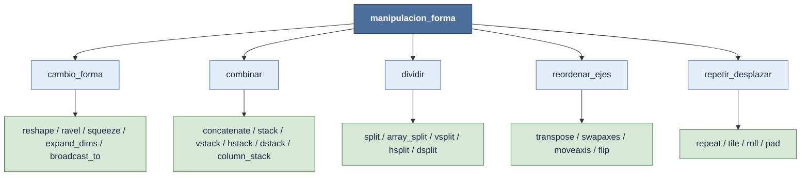

# manipulacion_forma — transformar la forma de un tensor

El **shape** $(n_0,\dots,n_{k-1})$ es el esquema que convierte un buffer plano de bytes en un tensor
navegable (ver [[concepto_shape]]): dice cuántas filas, columnas y capas hay, no los almacena. Esta
familia agrupa todas las funciones que **transforman ese esquema** — reorganizar, combinar, dividir,
permutar o duplicar — la mayoría **sin mover un solo byte** en memoria.

Cada operación se entiende por su **mapa de shapes**: la transformación explícita de la forma de
entrada en la de salida. Unas conservan el `size` y solo reescriben la tupla (`reshape`, `transpose`),
otras lo cambian uniendo, partiendo o repitiendo datos. Saber *qué le pasa al shape* es saber usar la
función.

## El mapa de la familia

## Subcarpetas

| Subcarpeta | Qué hace al shape | Notas |
|---|---|---|
| [[Librerias/Numpy/np/manipulacion_forma/cambio_forma/index\|cambio_forma]] | Reorganiza con $\prod n_i$ constante: `(12,) → (3,4)` | [[np.reshape]] · [[np.ravel]] · [[np.squeeze]] · [[np.expand_dims]] · [[np.broadcast_to]] |
| [[Librerias/Numpy/np/manipulacion_forma/combinar/index\|combinar]] | Une varios arrays a lo largo de un eje (o crea uno nuevo) | [[np.concatenate]] · [[np.stack]] · [[np.vstack]] · [[np.hstack]] · [[np.dstack]] · [[np.column_stack]] |
| [[Librerias/Numpy/np/manipulacion_forma/dividir/index\|dividir]] | Parte un array en subarrays (el inverso de combinar) | [[np.split]] · [[np.array_split]] · [[np.vsplit]] · [[np.hsplit]] · [[np.dsplit]] |
| [[Librerias/Numpy/np/manipulacion_forma/reordenar_ejes/index\|reordenar_ejes]] | Permuta o invierte ejes: $(n_{\pi(0)},\dots)$, mismo `size` | [[np.transpose]] · [[np.swapaxes]] · [[np.moveaxis]] · [[np.flip]] |
| [[Librerias/Numpy/np/manipulacion_forma/repetir_desplazar/index\|repetir_desplazar]] | Duplica, rota o rellena: el eje crece o se conserva | [[np.repeat]] · [[np.tile]] · [[np.roll]] · [[np.pad]] |

## Vistas vs copias — la regla transversal

Muchas de estas funciones **no mueven datos**: solo reescriben el shape y los `strides`, devolviendo
una **vista** sobre el mismo buffer (ver [[concepto_views_vs_copias]]). Es lo que las hace baratas, y
también lo que obliga a tener cuidado: modificar una vista modifica el original.

| Familia | Resultado típico |
|---|---|
| `cambio_forma` | vista (copia si el layout lo exige) |
| `reordenar_ejes` | vista (solo reescribe `strides`) |
| `dividir` | vistas de los trozos |
| `combinar` | siempre copia (materializa el array unido) |
| `repetir_desplazar` | copia (`repeat`, `tile`, `pad`, `roll`) |

Para comprobar si dos arrays comparten memoria: `np.shares_memory(a, resultado)`.

## Tabla de decisión rápida

| Quiero… | Ir a |
|---|---|
| Cambiar la shape total conservando el `size` | [[np.reshape]] |
| Aplanar a 1D | [[np.ravel]] |
| Quitar/añadir ejes de tamaño 1 | [[np.squeeze]] · [[np.expand_dims]] |
| Transponer o permutar ejes | [[np.transpose]] · [[np.moveaxis]] |
| Unir arrays a lo largo de un eje | [[np.concatenate]] |
| Apilar creando un eje nuevo | [[np.stack]] |
| Partir en trozos | [[np.split]] |
| Repetir el array entero (mosaico) | [[np.tile]] |
| Repetir cada elemento | [[np.repeat]] |
| Rotar circularmente | [[np.roll]] |
| Rellenar un borde | [[np.pad]] |

## Notas relacionadas

- [[concepto_shape]] — la tupla que estas funciones transforman
- [[concepto_views_vs_copias]] — cuándo cambiar la forma copia y cuándo no
- [[concepto_broadcasting]] — alinear shapes sin reorganizar físicamente
- [[Librerias/Numpy/index|NumPy raíz]]
