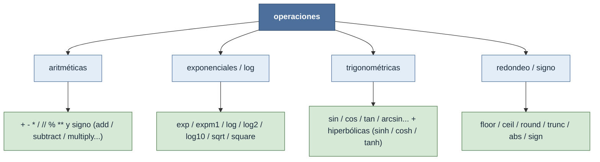

# operaciones — transformaciones elemento a elemento (ufuncs)

Una **operación** aplica una función **elemento a elemento** sobre el tensor: cada posición se
transforma de forma independiente, sin mirar a sus vecinas. Todas son [[concepto_ufuncs|ufuncs]]
compiladas en C que respetan [[concepto_broadcasting|broadcasting]]. A diferencia de las
[[Librerias/Numpy/np/reducciones/index|reducciones]] —que **colapsan un eje** a un resumen—, las
ufuncs **conservan el shape** (las unarias) o lo **broadcastean** (las binarias):

$$ \text{unaria:}\quad (n_0,\dots,n_k)\ \xrightarrow{\ f\ }\ (n_0,\dots,n_k) $$

$$ \text{binaria:}\quad (\dots),\ (\dots)\ \xrightarrow{\ f\ }\ \text{broadcast}(\dots,\dots) $$

El eje nunca desaparece: una operación no resume, **reescribe** cada elemento.

## En acción

Varias ufuncs encadenadas sobre un mismo array N-D — aritméticas, exponenciales y trigonométricas
componen libremente porque todas comparten la interfaz y el shape se conserva en cada paso:

```python
import numpy as np
x = np.arange(24).reshape(2, 3, 4).astype(float)   # shape (2, 3, 4)

np.sqrt(np.square(x) + 1).shape   # (2, 3, 4)  — square (unaria) + suma (binaria) + sqrt (unaria)
np.exp(-x).shape                  # (2, 3, 4)  — exponencial, mismo shape
np.sin(x).shape                   # (2, 3, 4)  — trigonométrica, mismo shape

(x * 2 - 1).shape                 # (2, 3, 4)  — los operadores son azúcar sobre ufuncs
```

Ninguna llamada toca el shape `(2, 3, 4)`: la transformación es local a cada celda.

## Las familias



## Subcarpetas

| Subcarpeta | Qué hace | Notas |
|---|---|---|
| [[Librerias/Numpy/np/operaciones/aritmeticas/index\|aritméticas]] | Las operaciones básicas como ufuncs | `+ - * / // % **` → [[np.add]] · [[np.subtract]] · [[np.multiply]] · [[np.divide]] · [[np.power]] · [[np.mod]] |
| [[Librerias/Numpy/np/operaciones/exponenciales_log/index\|exponenciales_log]] | Exponencial, logaritmo y raíz | [[np.exp]] · [[np.log]] · [[np.log2]] · [[np.log10]] · [[np.sqrt]] · [[np.square]] (+ variantes estables `expm1`/`log1p`) |
| [[Librerias/Numpy/np/operaciones/trigonometricas/index\|trigonométricas]] | Trigonometría e hiperbólicas (en radianes) | [[np.sin]] · [[np.cos]] · [[np.tan]] · [[np.arcsin]] · [[np.arctan]] · `sinh` / `cosh` / `tanh` |
| [[Librerias/Numpy/np/operaciones/redondeo_signo/index\|redondeo_signo]] | Redondeo, valor absoluto y signo | [[np.floor]] · [[np.ceil]] · [[np.round]] · [[np.abs]] · [[np.sign]] |

## ufunc: lo que comparten todas

Por ser [[concepto_ufuncs|ufuncs]], toda la familia hereda la **misma interfaz**:

- **Parámetros** — `out=` (escribe en un buffer preasignado, sin array nuevo), `where=` (máscara
  booleana: solo calcula donde es `True`) y `dtype=`/`casting=` (controlan el tipo y la promoción).
- **Métodos de las binarias** — `reduce` (colapsa un eje, p. ej. `np.add.reduce` ≡ [[np.sum]]),
  `accumulate` (parciales, ≡ [[np.cumsum]]) y `outer` (combina cada par). Detalle en
  [[concepto_ufuncs]].
- **Los operadores son azúcar** — `a + b` invoca `np.add(a, b)`; `*`, `/`, `**`, `%`... mapean cada
  uno a su ufunc. Mismo resultado, misma interfaz `out`/`where` bajo el capó.

## Notas relacionadas

- [[concepto_ufuncs]] — el motor element-wise: aridad, parámetros y métodos
- [[concepto_broadcasting]] — cómo las binarias alinean shapes sin copiar
- [[concepto_vectorizacion]] — por qué la ufunc sustituye al bucle Python
- [[Librerias/Numpy/index|NumPy raíz]]
