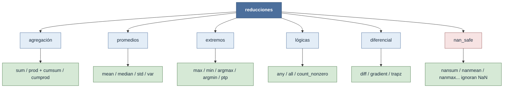

# reducciones — colapsar un eje a un resumen

Una **reducción** colapsa uno o más ejes de un tensor a un resumen: convierte filas, columnas
o el array entero en un único valor (suma, media, máximo, ¿hay algún verdadero?...). El concepto
rector es [[concepto_axis_parametro]] — **el eje indicado desaparece** del resultado, no el que
queda. Toda la familia comparte el mismo mapa de shapes:

$$ (n_0,\dots,n_k)\ \xrightarrow{\ \text{axis}=p\ }\ (n_0,\dots,n_{p-1},\,n_{p+1},\dots,n_k) $$

Con `axis=None` el array se contrae a un escalar `()`; con `keepdims=True` el eje reducido queda
como tamaño $1$ para mantener el [[concepto_broadcasting|broadcasting]] posterior.

## En acción

Un mismo array N-D recorrido por cuatro familias distintas — observa cómo cada `axis` borra una
dimensión del shape:

```python
import numpy as np
T = np.arange(24).reshape(2, 3, 4)   # shape (2, 3, 4)

np.sum(T, axis=0).shape     # (3, 4)  — agregación: colapsa el primer eje
np.mean(T, axis=1).shape    # (2, 4)  — promedios: colapsa el eje medio
np.max(T, axis=2).shape     # (2, 3)  — extremos: colapsa el último eje
np.any(T > 10, axis=(0, 1)) # shape (4,) — lógicas: colapsa dos ejes a la vez

np.sum(T)                   # 276     — axis=None: todo a un escalar
```

## Las familias



## Subcarpetas

| Subcarpeta | Qué reduce | Notas |
|---|---|---|
| [[Librerias/Numpy/np/reducciones/agregacion/index\|agregación]] | Suma y producto de los elementos | [[np.sum]] · [[np.prod]] + acumulados [[np.cumsum]] · [[np.cumprod]] (scan) |
| [[Librerias/Numpy/np/reducciones/promedios/index\|promedios]] | Tendencia central y dispersión | [[np.mean]] · [[np.median]] · [[np.std]] · [[np.var]] |
| [[Librerias/Numpy/np/reducciones/extremos/index\|extremos]] | El valor mayor/menor y su posición | [[np.max]] · [[np.min]] · [[np.argmax]] · [[np.argmin]] · [[np.ptp]] |
| [[Librerias/Numpy/np/reducciones/logicas/index\|lógicas]] | Predicados booleanos sobre el eje | [[np.any]] · [[np.all]] · [[np.count_nonzero]] |
| [[Librerias/Numpy/np/reducciones/diferencial/index\|diferencial]] | Cálculo discreto: derivadas e integrales | [[np.diff]] · [[np.gradient]] · [[np.trapz]] |
| [[Librerias/Numpy/np/reducciones/nan_safe/index\|nan_safe]] | Las anteriores, ignorando `NaN` | [[np.nansum]] · [[np.nanmean]] · [[np.nanmax]]... |

## Reduce vs. scan vs. acorta

No toda esta familia colapsa el eje. Conviene distinguir tres comportamientos por lo que le hacen
al shape:

- **Reduce** ([[np.sum]], [[np.mean]], [[np.max]], [[np.any]]...): el eje **desaparece**.
  $$ (n_0,\dots,n_k)\ \xrightarrow{\ \text{reduce, axis}=p\ }\ (n_0,\dots,n_{p-1},\,n_{p+1},\dots,n_k) $$

- **Scan** ([[np.cumsum]], [[np.cumprod]]): barre el eje guardando los parciales; el **shape se
  conserva** y el último elemento coincide con la reducción.
  $$ (n_0,\dots,n_k)\ \xrightarrow{\ \text{scan, axis}=p\ }\ (n_0,\dots,n_k) $$

- **Acorta** ([[np.diff]]): la diferencia entre vecinos deja **un elemento menos** en el eje
  recorrido (cada orden `n` resta `n`).
  $$ (\dots,n_p,\dots)\ \xrightarrow{\ \text{diff orden }n,\ \text{axis}=p\ }\ (\dots,n_p-n,\dots) $$

## Notas relacionadas

- [[concepto_axis_parametro]] — el eje que se consume (reduce), se barre (scan) o se acorta (diff)
- [[concepto_vectorizacion]] — por qué una reducción sobre un eje sustituye al bucle Python
- [[Librerias/Numpy/index|NumPy raíz]]
