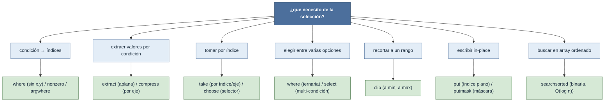

# np/selección — extracción, filtrado y escritura condicional

Este grupo reúne las funciones para **elegir, extraer o reescribir** elementos de un array según
una **condición lógica** o una **lista de índices**. Son la alternativa funcional —con nombre
explícito— al indexado directo `a[...]`: la misma idea de selección, pero como llamadas legibles que
a veces habilitan parámetros extra (`axis=`, `mode=`, `side=`). Casi todas se apoyan en el
[[concepto_indexing|indexado]] booleano o avanzado, así que la frontera vista/copia y la regla del
shape de ese concepto siguen vigentes aquí.

La pregunta que organiza la carpeta no es "¿qué función uso?" sino **"¿qué necesito hacer?"**:
convertir una condición en índices, extraer por condición, tomar por índice, decidir entre varias
opciones, recortar a un rango, escribir en el sitio, o buscar en algo ordenado.

## Qué necesito

## Las familias

| Necesito | Función | Qué hace |
|---|---|---|
| **Condición → índices** | [[np.where]] | sin `x`/`y`, devuelve los índices donde la condición es `True` (≡ `nonzero`) |
| | [[np.nonzero]] | tupla de arrays con los índices de los elementos no nulos / `True` |
| | [[np.argwhere]] | igual pero **agrupado por elemento**: array `(n, ndim)` de coordenadas |
| **Extraer por condición** | [[np.extract]] | extrae los elementos donde la condición es `True`, **aplanando** (≡ `a[cond]`) |
| | [[np.compress]] | selecciona sub-arrays donde un booleano 1D es `True`, **a lo largo de `axis`** |
| **Tomar por índice** | [[np.take]] | extrae por lista de índices a lo largo de un eje (fancy indexing explícito) |
| | [[np.choose]] | construye un array eligiendo, por posición, de un conjunto de fuentes según un selector |
| **Condición múltiple** | [[np.select]] | lista de condiciones + lista de opciones; aplica la primera que coincide (`if/elif/else`) |
| **Recortar** | [[np.clip]] | acota los valores al rango `[a_min, a_max]` |
| **Escribir in-place** | [[np.put]] | escribe `v` en `a` por **índice plano** (`a.flat[ind] = v`); inverso de `take` |
| | [[np.putmask]] | escribe `v` en `a` donde una **máscara** es `True` (con reciclado de `values`) |
| **Búsqueda ordenada** | [[np.searchsorted]] | índices de inserción en un array **ordenado**, por búsqueda binaria $O(\log n)$ |

## El hilo común: booleano y avanzado

La mayoría de estas funciones son **azúcar explícito** sobre el [[concepto_indexing|indexado]]
booleano y avanzado: `np.extract(cond, a)` es `a[cond]`, `np.take(a, ind)` es fancy indexing, y la
asignación `a[mask] = v` está detrás de [[np.putmask]]. Por eso heredan sus reglas: la **selección
por condición devuelve copias 1D**, el **shape de fancy lo dictan los índices**, y la **escritura
es in-place**. Las funciones aportan, sobre eso, legibilidad y parámetros que el corchete no tiene
(`axis`, `mode`, `side`).

## Notas relacionadas

- [[concepto_indexing]] — las tres familias (básica, avanzada, booleana) que gobiernan todo el grupo
- [[concepto_views_vs_copias]] — por qué la selección por condición devuelve copias
- [[Librerias/Numpy/np/reducciones/index|reducciones]] — `mask.sum()` para contar lo seleccionado
- [[Librerias/Numpy/index|NumPy raíz]]
