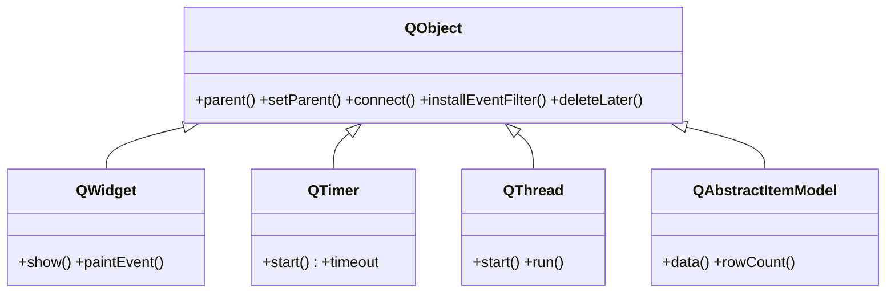

# QObject — la raiz de Qt (parent/child, senales, propiedades, eventos)

`QObject` es la **clase base de casi todo** en Qt: es la raiz de la que cuelgan tanto la rama visual (`QWidget`) como la no visual (`QTimer`, `QThread`, los modelos). No se instancia "tal cual" muy a menudo, pero entenderla es entender Qt, porque aporta las **cuatro capacidades** que el resto hereda. Solo los `QObject` pueden tener senales: si una clase tuya las necesita, tiene que heredar de aqui.

Las cuatro capacidades que aporta:

- **Arbol parent/child** — cada objeto puede tener un padre que **posee su memoria**: al destruir el padre se destruyen los hijos (ver [[concepto_qobject_arbol]]).
- **Senales y slots** — el mecanismo de comunicacion de Qt; declararlas requiere ser `QObject`.
- **Sistema de propiedades** — atributos accesibles por nombre con `property()` / `setProperty()`.
- **Manejo de eventos** — recibir, filtrar e instalar filtros de eventos.

## Importacion

```python
from PyQt6.QtCore import QObject
```

## Herencia

`QObject` es la **raiz**: no hereda de nadie. Casi toda la libreria desciende de aqui, por las dos ramas (visual y no visual):



Como **todo desciende de `QObject`**, todo objeto Qt tiene `parent`/`children` (gestion de memoria), puede emitir senales y filtrar eventos. La rama visual (`QWidget` y sus hijos) anade el dibujado; la no visual (`QTimer`, `QThread`, modelos) usa solo lo que `QObject` ya ofrece.

## Senales

| Senal | Cuando se emite | Argumentos |
|-------|-----------------|------------|
| `destroyed` | justo cuando el objeto se destruye | `obj: QObject` (el objeto que muere) |
| `objectNameChanged` | al cambiar el `objectName` | `name: str` (el nuevo nombre) |

```python
obj.destroyed.connect(lambda o: print("destruido", o))
obj.objectNameChanged.connect(lambda nombre: print("ahora se llama", nombre))
```

## Propiedades

En Qt los "atributos" son **propiedades**: se leen y escriben con getter/setter, no como atributo directo.

| Propiedad | Tipo | Leer \| escribir | Controla |
|-----------|------|------------------|----------|
| `objectName` | `str` | `objectName()` \| `setObjectName(str)` | nombre del objeto, util para buscarlo con `findChild` o estilarlo con QSS |

## Constructor y metodos

```python
QObject(parent: QObject | None = None)
```

El `parent` es opcional; al fijarlo, el padre pasa a **poseer** al objeto y gestiona su memoria.

| Firma | Devuelve | Que hace |
|-------|----------|----------|
| `setParent(parent: QObject)` | `None` | reasigna el padre (y con el, la propiedad de la memoria) |
| `parent()` | `QObject` | el padre actual (o `None`) |
| `children()` | `list[QObject]` | los hijos directos |
| `findChild(tipo, nombre: str = "")` | `QObject` | busca **un** hijo (recursivo) por tipo y, opcional, por `objectName` |
| `findChildren(tipo)` | `list` | busca **todos** los hijos de un tipo (recursivo) |
| `setObjectName(name: str)` | `None` | fija el nombre del objeto |
| `objectName()` | `str` | el nombre actual |
| `installEventFilter(obj: QObject)` | `None` | hace que `obj` intercepte los eventos de este objeto |
| `deleteLater()` | `None` | destruccion **segura diferida**: borra el objeto cuando el bucle de eventos vuelve a control (nunca borres a mano un QObject en uso) |
| `blockSignals(block: bool)` | `bool` | silencia/reactiva las senales; devuelve el estado anterior |
| `setProperty(nombre: str, valor)` | `bool` | fija una propiedad por nombre (incluso una dinamica nueva) |
| `property(nombre: str)` | `object` | lee una propiedad por nombre |
| `sender()` | `QObject` | dentro de un slot, **quien emitio** la senal que lo disparo |

## Casos de uso

```python
from PyQt6.QtCore import QObject

# arbol parent/child y busqueda por nombre
padre = QObject()
hijo = QObject(padre)            # el padre posee al hijo
hijo.setObjectName("config")

print(padre.children())                       # [<hijo>]
print(padre.findChild(QObject, "config"))     # <hijo>

# propiedades dinamicas accesibles por nombre
hijo.setProperty("activo", True)
print(hijo.property("activo"))                # True

# silenciar senales temporalmente
hijo.blockSignals(True)
hijo.setObjectName("otro")       # NO emite objectNameChanged
hijo.blockSignals(False)
```

## Personalizar (subclasear)

Se subclasea `QObject` para objetos **no visuales con senales propias**: un *worker* que corre una tarea, un modelo de datos, un controlador. El requisito es heredar de `QObject`, llamar a `super().__init__()` y declarar las senales con `pyqtSignal`.

```python
from PyQt6.QtCore import QObject, pyqtSignal

class Worker(QObject):
    progreso = pyqtSignal(int)       # senal propia (solo posible por ser QObject)
    terminado = pyqtSignal()

    def __init__(self, parent=None):
        super().__init__(parent)     # imprescindible

    def correr(self):
        for i in range(101):
            self.progreso.emit(i)
        self.terminado.emit()

w = Worker()
w.progreso.connect(lambda p: print(p, "%"))
w.correr()
```

## Errores comunes

| Error | Causa | Solucion |
|-------|-------|----------|
| `pyqtSignal` falla o las senales no funcionan | la clase **no** hereda de `QObject` | hereda de `QObject` (o de un widget, que ya lo es) |
| `RuntimeError: super-class __init__() never called` | olvidaste `super().__init__()` en la subclase | llama a `super().__init__(parent)` lo primero en `__init__` |
| Crash al destruir un objeto en uso | lo borraste a mano mientras el bucle aun lo usaba | usa `deleteLater()`, no `del` |
| `findChild` devuelve `None` | el `objectName` no coincide o el hijo no es de ese tipo | fija `setObjectName` antes y pasa el tipo correcto |

## Notas relacionadas

- [[concepto_qobject_arbol]] — el arbol parent/child y la gestion de memoria
- [[concepto_signals_slots]] — las senales que solo un `QObject` puede emitir
- [[QWidget]] — la rama visual que hereda de `QObject`
