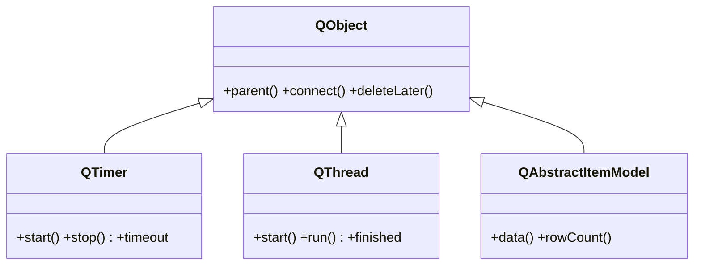

# QtCore — la base no visual de Qt

`QtCore` es la **base NO visual** de Qt: funciona sin GUI, sin pantalla. Aqui vive la maquinaria que el resto de la libreria da por hecha: `QObject` (la raiz de la que todo cuelga), el sistema de **senales y slots**, los **hilos** (`QThread`), los **temporizadores** (`QTimer`) y un cajon de **utilidades** (ajustes con `QSettings`, geometria, fechas, URLs). Si una clase no se dibuja pero emite senales o vive en un hilo, casi seguro esta en `QtCore`.

## En accion

Sin una sola ventana: un [[QObject]] con una senal propia, disparada por un `QTimer`.

```python
from PyQt6.QtCore import QObject, QTimer, QCoreApplication, pyqtSignal
import sys

app = QCoreApplication(sys.argv)     # app SIN GUI (no QApplication)

class Reloj(QObject):
    tic = pyqtSignal(int)            # senal propia (posible por ser QObject)

    def __init__(self):
        super().__init__()
        self.n = 0
        self.tic.connect(lambda v: print("tic", v))

    def avanzar(self):
        self.n += 1
        self.tic.emit(self.n)        # emite la senal
        if self.n >= 3:
            app.quit()

reloj = Reloj()
timer = QTimer()                     # temporizador no visual
timer.timeout.connect(reloj.avanzar)
timer.start(500)                     # cada 500 ms

sys.exit(app.exec())                 # bucle de eventos (sin GUI)
```

## Herencia

Todo `QtCore` cuelga de `QObject`, la raiz:



> [!tip] La rama visual tambien nace aqui
> `QWidget` (en QtWidgets) y, con el, **todos los widgets** tambien heredan de `QObject`. Por eso un boton tiene `parent`, senales y eventos: son capacidades de `QObject`, no del widget.

## Clases y subcarpetas

| Elemento | Hereda de | Rol |
|----------|-----------|-----|
| [[QObject]] | — (raiz) | la base de todo: parent/child, senales, propiedades, eventos |
| `pyqtProperty` | — | declara una propiedad Qt sobre una clase Python (getter/setter expuestos a Qt) |
| [[PyQt6/QtCore/senales/index\|senales]] | — | `pyqtSignal`, `connect`, `pyqtSlot`, `emit`: el mecanismo de comunicacion |
| [[PyQt6/QtCore/temporizadores/index\|temporizadores]] | `QObject` | `QTimer`, `QElapsedTimer`: disparar codigo en el tiempo |
| [[PyQt6/QtCore/hilos/index\|hilos]] | `QObject` | `QThread`, `QRunnable`, `QThreadPool`: trabajo en segundo plano |
| [[PyQt6/QtCore/utilidades/index\|utilidades]] | varia | `QSettings`, geometria, `QDateTime`, `QUrl`: utilidades sin GUI |

## Notas relacionadas

- [[QObject]] — la raiz de la que parte todo `QtCore`
- [[concepto_signals_slots]] — las senales y slots que aqui se definen
- [[PyQt6/QtWidgets/index\|QtWidgets]] — la rama visual, que tambien hereda de `QObject`
